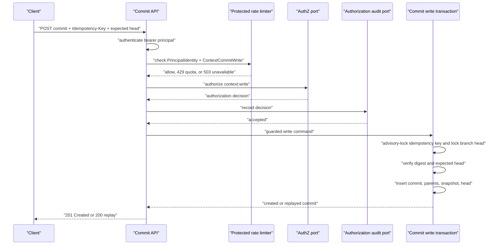

# ADR 0002: Guarded Context Commit Writes / 受控的 Context 提交写入

## Status / 状态

Accepted. The domain, storage, authentication, PostgreSQL-backed fail-closed authorization-decision audit adapter, explicitly opt-in protected HMAC or OIDC REST runtime profiles, and private bounded rate limiter for guarded writes are implemented. Security keys use the validated issuer plus subject as one `PrincipalIdentity`; optional protected OIDC group claims resolve private workspace `reader`/`editor` bindings, while direct membership overrides and the auth domain owns reusable Context role policy. Migration `0008` now adds storage-only audit-retention metadata, but redacted review, a verified restricted purge executor, a shared atomic rate-limit adapter, disposable PostgreSQL CI and migration evidence, and the remaining release gates are still required before the default public mutation catalog can open.

本决策已接受。受控写入的 domain、storage、authentication、PostgreSQL-backed 且 fail-closed 的 authorization-decision audit adapter、显式 opt-in protected HMAC 或 OIDC REST runtime profile，以及 private bounded rate limiter 已实现。安全 key 使用已验证 issuer 与 subject 组成的 `PrincipalIdentity`；可选 protected OIDC group claim 会解析私有 workspace `reader`/`editor` binding，direct membership 会覆盖它们，而 auth domain 拥有可复用的 Context role policy。迁移 `0008` 现已增加仅存储层的 audit-retention metadata，但在默认 public mutation catalog 可以开放前，仍需要 redacted review、经过验证的受限 purge executor、共享原子 rate-limit adapter、disposable PostgreSQL CI 与 migration evidence，以及其余 release gate。

## Context / 背景

ContextLab storage persists one immutable Context commit, its ordered same-Context parents, and its graph snapshot atomically. The repository now also has guarded-write domain contracts, durable branch-head and idempotency records, an in-memory implementation, and a PostgreSQL transaction implementation. Protected HMAC and RS256 OIDC/JWKS runtime profiles authenticate first, then apply private route limiting before authorization audit and the guarded writer. PostgreSQL runtime composition uses an append-only durable audit adapter; the no-op sink remains for preview and in-memory composition. The public API remains intentionally read-only for commits until OIDC discovery, collaboration mapping, audit governance, shared rate-limit state, broader security controls, and release evidence are complete.

ContextLab storage 已能原子持久化一条不可变 Context commit、其有序且同 Context 的 parent，以及对应 graph snapshot。仓库现在也具备 guarded-write domain contract、持久化 branch-head 与 idempotency record、内存实现和 PostgreSQL transaction 实现。protected HMAC 与 RS256 OIDC/JWKS runtime profile 先完成 authentication，再在 authorization audit 与 guarded writer 前执行 private route limiting。PostgreSQL runtime composition 使用 append-only durable audit adapter；no-op sink 保留给 preview 与 in-memory composition。在 OIDC discovery、协作映射、audit governance、共享 rate-limit state、更广泛的 security control 与 release evidence 完成前，公开 API 仍有意保持 commit 只读。

## Decision / 决策

The first planned public write path is a guarded append-only commit endpoint, not a generic graph editor or an arbitrary-parent commit importer.

首条计划公开的写入路径是受控的 append-only commit endpoint，不是通用 graph editor，也不是允许任意 parent 的 commit 导入接口。

1. **Server-owned commit envelope / 服务端持有提交信封。** `POST /api/v1/contexts/{context_id}/commits` accepts a branch name, expected branch head, message, ordered changes, a valid graph snapshot, and its schema version. The server derives the context id from the path, generates the commit id and authoring time, and derives the single normal parent from the branch head. Clients cannot provide commit ids, parent lists, timestamps, author identities, or persistence metadata. Merge commits remain a later explicit workflow.
   This endpoint exists only in the explicitly configured private protected router: the checked-in public OpenAPI has no commit `POST`, and `ContextLabClient` has no commit-creation method.
   该 endpoint 只存在于显式配置的私有 protected router：仓库内 public OpenAPI 不包含 commit `POST`，`ContextLabClient` 也没有创建 commit 的方法。
2. **Authentication-aware protected-route limiting / 认证感知的受保护路由限流。** Protected mode requires `CONTEXTLAB_PROTECTED_RATE_LIMIT_MAX_REQUESTS` (`1..=1000`), `CONTEXTLAB_PROTECTED_RATE_LIMIT_WINDOW_SECONDS` (`1..=3600`), and `CONTEXTLAB_PROTECTED_RATE_LIMIT_MAX_TRACKED_PRINCIPALS` (`1..=100000`). Authentication runs first. The bounded in-process sliding window is keyed by exactly the authenticated `PrincipalIdentity` (validated identity source plus subject) and `ProtectedRouteOperation::ContextCommitWrite`, with no Context-id bucketing. Quota rejection returns `429 rate_limit_exceeded` with an integer `Retry-After`; capacity exhaustion or internal failure closes with `503 rate_limit_unavailable`. Either rejection stops before authorization audit and the commit writer. This adapter is private single-process infrastructure; a shared atomic adapter remains mandatory before multi-replica or public protected writes.
3. **Authorization decision audit before mutation / 写入前记录授权决策。** The HTTP route requires an authenticated principal, workspace membership/role data, and a reusable `context:write` authorization port scoped to the Context's owning workspace/project. Authentication uses the replaceable `PrincipalAuthenticator` port, while the initial production behavior is deny-by-default; preview and anonymous modes never expose the route. Authorization distinguishes a known denial from unavailable authorization state so infrastructure failures are not reported as user permission failures. Every result is converted to a framework-independent authorization decision and sent to an `AuthorizationAuditSink` before a guarded write can start. PostgreSQL composition appends its safe fields and database-generated timestamp to `context_authorization_audit_events`. A sink failure returns `503` and prevents the mutation; the event contains only the principal identity source and subject, Context scope, requested permission, and decision, never bearer credentials. Authentication transport (JWT/OAuth2) is implemented before the public route is installed, rather than trusting a user-supplied actor header.
4. **Idempotency within the write transaction / 事务内幂等。** `Idempotency-Key` is required. A durable idempotency record is keyed by identity source, subject, context, and key, and stores a canonical request digest plus the resulting commit id. A transaction-level advisory lock protects keys that do not yet have a row. A repeated identical request returns the original result; the same key with a different digest returns a conflict without performing another write.
5. **Optimistic branch-head concurrency / 乐观分支头并发。** A `context_branches` record is keyed by context and branch and stores the head commit plus a monotonic revision. Each request includes `expected_head_commit_id`, which may be `null` only when creating the first commit on a branch. The transaction locks the branch row, compares the expected value, atomically creates the commit and graph snapshot, then advances the head and revision. A mismatch returns a structured stale-head conflict with the current head reference.
6. **One storage application boundary / 单一存储应用边界。** The existing atomic snapshot writer is extended or composed behind one command that owns idempotency lookup, head comparison, commit/snapshot creation, and head advancement. API handlers validate and map errors; they never issue partial SQL or compose persistence steps themselves.
7. **Legacy migration namespace / 旧身份迁移命名空间。** Migration `0006_principal_identity_namespace.sql` assigns the reserved `legacy` source only to existing rows. It never represents an accepted authentication issuer or an authorization grant, and the migration does not normalize or guess a source. Operators must reconcile legacy rows to a trusted source; historical invalid subjects remain preserved while new writes receive the stricter byte, collation, and format checks.
   **旧身份迁移命名空间。** 迁移 `0006_principal_identity_namespace.sql` 只向既有行分配保留 source `legacy`。它绝不表示可接受的 authentication issuer 或 authorization grant，迁移也不会规范化或猜测 source。operator 必须把 legacy 行对齐到可信 source；不规范的历史 subject 会被保留，而新写入会接受更严格的字节、collation 与格式校验。
8. **Trusted group assignments / 可信组赋权。** Group-derived authorization is disabled unless protected OIDC config supplies one valid top-level claim name and a maximum token lifetime. After JWT verification, only a bounded array of opaque group IDs becomes principal context; HMAC remains group-free. Migration `0007_workspace_external_group_role_bindings.sql` maps exact identity-source/group pairs to `reader` or `editor` in one workspace. Direct membership overrides every group grant. Both the preflight authorizer and guarded PostgreSQL writer use this rule; the latter locks all active scope and authorization rows with `FOR UPDATE` before mutation. This adds no public binding-management route, OpenAPI operation, SDK method, or GraphDiff behavior.
   **可信组赋权。** 只有 protected OIDC config 同时提供一个合法顶层 claim 名与最大 token lifetime 时，才启用 group-derived authorization。JWT 校验后，只有由有界不透明 group ID 组成的 array 会成为 principal context；HMAC 始终不带 group。迁移 `0007_workspace_external_group_role_bindings.sql` 将精确 identity-source/group 对映射为一个 workspace 中的 `reader` 或 `editor`。direct membership 会覆盖每个 group grant。preflight authorizer 与 guarded PostgreSQL writer 都应用这条规则；后者会在 mutation 前用 `FOR UPDATE` 锁定全部 active scope 和 authorization 行。这不会新增 public binding-management route、OpenAPI operation、SDK method 或 GraphDiff behavior。
9. **Storage-only audit retention foundation / 仅存储层的审计留存基础。** Migration `0008_context_authorization_audit_governance.sql` adds immutable retention-policy revisions, a mutable workspace active-policy pointer, default `hold` disposition for existing and future authorization-decision events, and append-only purge manifests. A non-`hold` event must be tied to a policy revision from its Context workspace and supply `purge_eligible_at`. This preserves the ordinary audit-event `UPDATE`/`DELETE` prohibition and adds no purge procedure, `SECURITY DEFINER` function, audit-review route, OpenAPI operation, SDK method, Web control, or GraphDiff behavior. A future purge contract requires isolated database-role and executor evidence; a `granted` authorization event remains a pre-write decision, not proof that a commit was created.
   **仅存储层的审计留存基础。** 迁移 `0008_context_authorization_audit_governance.sql` 增加不可变的 retention-policy revision、可替换的 workspace active-policy pointer、面向既有和未来 authorization-decision event 的默认 `hold` disposition，以及追加式 purge manifest。非 `hold` event 必须关联其 Context workspace 的 policy revision，并提供 `purge_eligible_at`。这保留普通 audit-event `UPDATE`/`DELETE` 禁止规则，并且不新增 purge procedure、`SECURITY DEFINER` function、audit-review route、OpenAPI operation、SDK method、Web control 或 GraphDiff behavior。未来的 purge contract 需要隔离的 database-role 与 executor evidence；`granted` authorization event 仍是写入前决策，不是 commit 已创建的证明。

## Consequences / 后果

- Commit history remains replayable and its normal parent chain stays deterministic.
- 提交历史保持可回放，普通 parent 链保持确定性。
- Duplicate requests and concurrent writers receive deterministic results rather than duplicate commits or silent lost updates.
- 重复请求与并发写入会得到确定结果，不会产生重复 commit 或静默丢失更新。
- Authentication, workspace membership/RBAC, branch storage, and idempotency storage become required dependencies before the route is public.
- authentication、workspace membership/RBAC、branch storage 与 idempotency storage 在路由公开前成为必需依赖。
- PostgreSQL resolves only the active workspace role for a Context; the reusable authorization policy remains in `contextlab-auth` rather than in a storage adapter.
- PostgreSQL 只解析 Context 对应的 active workspace role；可复用 authorization policy 位于 `contextlab-auth`，而不位于 storage adapter。
- Authorization decisions are recorded before storage mutation. PostgreSQL composition provides a durable append-only adapter; public promotion still requires retention, access control, and release evidence.
- authorization decision 会在 storage mutation 前记录。PostgreSQL composition 已提供持久化 append-only adapter；public promotion 仍需要 retention、access control 与 release evidence。
- The in-process limiter bounds principal-operation state and rejects before authorization audit or mutation, but it cannot coordinate quota across replicas; public or multi-replica protected writes require a shared atomic adapter.
- in-process limiter 会限制 principal-operation state，并在 authorization audit 或 mutation 前拒绝请求，但无法跨 replica 协调 quota；公开或 multi-replica protected write 必须使用共享原子 adapter。
- Graph editing, merge, rollback, replay execution, and client-side write controls remain out of scope for this slice.
- graph editing、merge、rollback、replay execution 与客户端写入控件仍不在本切片范围内。

## API Outcomes / API 结果

| Outcome | HTTP | Error code | 结果 |
| --- | --- | --- | --- |
| Created | `201` | — | 写入新 commit 并推进分支头 |
| Idempotent replay | `200` | — | 返回原写入结果 |
| Missing identity | `401` | `authentication_required` | 缺少有效身份 |
| Forbidden | `403` | `context_write_forbidden` | 无 Context 写权限 |
| Authorization unavailable | `503` | `authorization_unavailable` | 授权状态暂时不可用 |
| Authorization audit unavailable | `503` | `authorization_audit_unavailable` | 审计记录不可用，未开始写入 |
| Rate limit exceeded | `429` | `rate_limit_exceeded` | 配额已用尽，并返回整数 `Retry-After` |
| Rate limit unavailable | `503` | `rate_limit_unavailable` | 容量耗尽或内部状态不可用，未进入授权审计或写入 |
| Invalid request | `400` | `invalid_context_commit_request` | 请求字段或图谱无效 |
| Idempotency mismatch | `409` | `storage_idempotency_conflict` | 同一键对应不同请求 |
| Stale branch head | `409` | `storage_branch_head_conflict` | expected head 已过期 |
| Missing Context | `404` | `storage_scope_unavailable` | Context 不存在或不可见 |

## Evidence / 依据

- `crates/storage/src/commit_snapshot_writer.rs` already validates and atomically writes a commit-bound graph snapshot.
- `crates/storage/src/postgres.rs` locks the active Context, idempotency key, and branch head, then writes commit, snapshot, branch, and idempotency records in one transaction.
- `crates/storage/migrations/0004_guarded_context_commit_scope_constraints.sql` constrains branch and idempotency result references to commits from the same Context.
- The guarded PostgreSQL writer re-resolves and locks the active workspace membership inside that transaction before any idempotency, branch, commit, or snapshot write. A revoked role or soft-deleted workspace therefore fails closed rather than racing a prior API authorization check.
- guarded PostgreSQL writer 会在同一 transaction 内、任何 idempotency、branch、commit 或 snapshot 写入前，重新解析并锁定 active workspace membership。因此被撤销的 role 或 soft-deleted workspace 会 fail closed，而不会与先前 API authorization check 发生竞态。
- `crates/auth` provides bearer extraction, a replaceable authentication port, shared-secret JWT verification, and RS256 OIDC verification against an HTTPS JWKS source. The OIDC cache has a bounded TTL and performs one synchronized refresh for an unknown `kid`; it remains private runtime infrastructure and does not make a public write route eligible for publication.
- `crates/auth` 提供 Bearer 提取、可替换 authentication port、共享密钥 JWT 校验，以及基于 HTTPS JWKS source 的 RS256 OIDC 校验。OIDC cache 具有有界 TTL，并会为未知 `kid` 执行一次同步 refresh；它仍是私有 runtime infrastructure，不能据此将 write route 纳入公开发布。
- `crates/auth` exposes the replaceable `PrincipalAuthenticator` port, and authorization distinguishes `Forbidden` from `Unavailable`; the PostgreSQL adapter maps membership query failures to the latter and the protected API returns `503 authorization_unavailable`.
- `crates/auth` 暴露可替换的 `PrincipalAuthenticator` port，authorization 也区分 `Forbidden` 与 `Unavailable`；PostgreSQL adapter 会把 membership query failure 映射为后者，protected API 返回 `503 authorization_unavailable`。
- `crates/auth/src/rate_limit.rs` defines the replaceable limiter port and bounded in-process sliding-window adapter; its stable key is the authenticated issuer-scoped `PrincipalIdentity` plus `ProtectedRouteOperation::ContextCommitWrite`, never a Context id.
- `crates/auth/src/rate_limit.rs` 定义可替换 limiter port 与有界 in-process sliding-window adapter；其稳定 key 是认证后、按 issuer 分区的 `PrincipalIdentity` 加 `ProtectedRouteOperation::ContextCommitWrite`，不包含 Context id。
- `crates/auth` exposes `AuthorizationAuditEvent` and `AuthorizationAuditSink`; `NoopAuthorizationAuditSink` supports preview/test composition but is not presented as a durable audit log.
- `crates/auth` 暴露 `AuthorizationAuditEvent` 与 `AuthorizationAuditSink`；`NoopAuthorizationAuditSink` 支持 preview/test composition，但不被表述为持久化 audit log。
- `crates/storage/migrations/0005_context_authorization_audit_events.sql` creates the append-only audit table with safe enum checks, a Context foreign key, database timestamps, scoped indexes, and a trigger that rejects updates and deletes; `PostgresContextGraphRepository` implements the sink without disclosing SQL errors.
- `crates/storage/migrations/0005_context_authorization_audit_events.sql` 创建 append-only audit table，包含安全 enum check、Context foreign key、数据库时间戳、scoped index，以及拒绝 update/delete 的 trigger；`PostgresContextGraphRepository` 实现该 sink，且不泄露 SQL error。
- `server/api/src/lib.rs` composes the durable adapter only when `CONTEXTLAB_GRAPH_REPOSITORY` selects PostgreSQL; memory and preview composition retain the no-op sink.
- `server/api/src/lib.rs` 只在 `CONTEXTLAB_GRAPH_REPOSITORY` 选择 PostgreSQL 时组合持久化 adapter；memory 与 preview composition 保留 no-op sink。
- `server/api/src/routes.rs` records the authorization decision before it constructs or invokes the guarded-write command, and maps an unavailable audit sink to `503 authorization_audit_unavailable`.
- `server/api/src/routes.rs` 在构造或调用 guarded-write command 前记录 authorization decision，并将不可用的 audit sink 映射为 `503 authorization_audit_unavailable`。
- `server/api/src/routes.rs` authenticates before checking quota and returns limiter rejections before authorization, audit recording, or writer invocation; `server/api/src/lib.rs` requires all three bounded rate-limit settings in protected mode.
- `server/api/src/routes.rs` 先 authentication、后 quota check，并在 authorization、audit recording 或 writer invocation 前返回 limiter rejection；`server/api/src/lib.rs` 要求 protected mode 提供三个有界 rate-limit setting。
- `server/api/src/lib.rs` keeps the public route catalog read-only for commits and exposes the guarded commit mutation only through an explicitly configured protected router.
- `server/api/src/lib.rs` 保持 public route catalog 的 commit surface 为只读，并且只有在显式配置 protected router 时才暴露 guarded commit mutation。
- `crates/versioning/src/commit.rs` has no branch-head or idempotency abstraction, so these concerns must not be improvised in an API handler.
