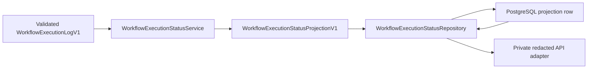

# Private Workflow Execution Status PostgreSQL Boundary / 私有 Workflow 执行状态 PostgreSQL 边界

## Purpose / 目的

This document records the durable storage boundary for the private, provider-free
`WorkflowExecutionStatusProjectionV1`. It does not make workflow execution a public write
surface or claim production readiness.

本文记录私有、无 provider 依赖的 `WorkflowExecutionStatusProjectionV1` 持久化边界。不因此把
Workflow execution 变成 public write surface，也不宣称 production readiness。

## Data Flow / 数据流

The workflow crate validates replay and capability provenance before the storage port is called.
The PostgreSQL adapter stores the serialized projection only. Raw events, failure payloads,
provider output, credentials, and execution-start commands are outside this boundary.

Workflow crate 会在调用 storage port 前校验 replay 与 capability provenance。PostgreSQL adapter
只保存 projection 序列化结果。raw events、failure payload、provider output、credentials 与
execution-start command 均不属于此边界。

## Invariants / 不变量

1. The storage key is exact `(context_id, run_id)`; the stored `context_commit_id` is checked against the same Context scope.
2. `schema_version` is fixed to `v1`; unknown or malformed stored projection JSON fails closed.
3. A first write returns `Created`; an identical immutable row returns `Replayed`; a different projection for the same key returns `Conflict`.
4. Inserts and conflict reads use one transaction. The append-only trigger rejects update and delete, while the unique key makes concurrent replay deterministic.
5. Reads validate requested Context/run identifiers before querying. Missing rows are safe empty reads; database failures map to the existing unavailable persistence error.
6. The default application adapter remains `UnavailableWorkflowExecutionStatusAdapter` until a repository is explicitly injected.

1. 存储 key 是 exact `(context_id, run_id)`；保存的 `context_commit_id` 必须与同一 Context scope 一致。
2. `schema_version` 固定为 `v1`；未知或格式错误的 projection JSON 必须 fail closed。
3. 首次写入返回 `Created`；同一不可变 row 返回 `Replayed`；同 key 的不同 projection 返回 `Conflict`。
4. insert 与冲突读取在同一 transaction 内完成。append-only trigger 拒绝 update/delete，unique key 使并发 replay 具有确定性。
5. read 会先校验请求的 Context/run identifier。缺失 row 是安全空读；数据库失败映射为既有 unavailable persistence error。
6. 应用默认仍使用 `UnavailableWorkflowExecutionStatusAdapter`，只有显式注入 repository 后才启用存储。

## Scope and Evidence / 范围与证据

The migration and adapter are private `contextlab-storage` infrastructure. No REST route,
OpenAPI operation, public SDK write method, Web mutation, scheduler, operator transport, or
second graph-diff implementation is added. The local in-memory tests prove domain semantics;
static SQL tests prove the asset contract; a live PostgreSQL test is separate evidence and is
recorded as `unobserved` when no non-Docker runtime is available.

migration 与 adapter 属于私有 `contextlab-storage` infrastructure。不新增 REST route、OpenAPI
operation、public SDK write method、Web mutation、scheduler、operator transport 或第二个 graph-diff
实现。local in-memory tests 证明 domain semantics；static SQL tests 证明 asset contract；live
PostgreSQL test 是独立证据，没有非 Docker runtime 时记录为 `unobserved`。

## Observed Local Receipt / 已观测本地回执

The first empty-cluster rehearsal exposed a duplicate `uq_contexts_project_id_id` declaration in
migrations `0016` and `0022`. Removing the duplicate from `0022` and asserting one migration owner
made the composed schema apply cleanly. PostgreSQL 16.14 then passed the private integration test
for create, identical replay, cross-connection read, and immutable conflict. The transaction
conflict path explicitly rolls back before returning `Conflict`, so the pool closes without an
open transaction. This is local non-Docker evidence only.

首次空集群演练暴露了 migration `0016` 与 `0022` 重复声明 `uq_contexts_project_id_id`。从 `0022` 删除重复声明并
断言只有一个 migration owner 后，composed schema 可以正常应用。PostgreSQL 16.14 随后通过私有 integration
test，覆盖 create、相同 replay、跨连接读取与 immutable conflict。transaction conflict path 在返回 `Conflict`
前显式 rollback，因此 pool 关闭时不会留下 open transaction。这只是 local non-Docker evidence。
