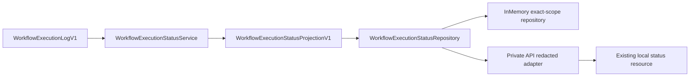

# Private Workflow Execution Status / 私有 Workflow 执行状态

## Scope / 范围

This document describes the local, private, provider-free execution-status boundary added for
Criteria 1 and 5. It is an implementation boundary, not a public REST, OpenAPI, SDK, execution
start, or production-readiness contract.

本文说明服务条件 1 与 5 的本地、private、provider-free execution-status boundary。这是实现边界，不是 public REST、OpenAPI、SDK、execution start 或 production-readiness contract。

## Data Flow / 数据流

The service is the only admitted producer path in this slice. It validates root or replay logs
through the existing Workflow domain projection before calling the storage port. The repository
stores only the projection keyed by `(ContextId, WorkflowRunId)`; it never stores raw events,
failure payloads, provider output, or credentials. The API adapter maps the projection into the
existing redacted resource and preserves exact request scope.

本切片只准入 service 这一条 producer path。service 先通过既有 Workflow domain projection 校验 root/replay log，再调用 storage port。repository 只保存以
`(ContextId, WorkflowRunId)` 为 key 的 projection；不保存 raw event、failure payload、provider output 或 credential。API adapter 将 projection 映射为既有脱敏 resource，并保持请求 exact scope。

## Invariants / 不变量

1. The projection schema is explicitly V1 and is constructed only by the validated Workflow
   domain projection functions.
2. A first immutable write returns `Created`; an identical write returns `Replayed`; reuse of
   the same exact Context/run key with different facts returns a typed conflict.
3. A missing exact Context/run returns an empty read. Nil identifiers and invalid returned scope
   fail closed.
4. Application defaults retain `UnavailableWorkflowExecutionStatusAdapter`; a repository must be
   explicitly injected through `with_workflow_execution_status_storage_repository`.
5. `GraphDiff::between` remains the sole graph-diff calculator; this contract does not calculate
   or persist any graph diff.

1. projection schema 明确为 V1，并且只能由经过校验的 Workflow domain projection function 构造。
2. 首次不可变写入返回 `Created`；相同写入返回 `Replayed`；相同 exact Context/run key 被不同 fact 复用时返回 typed conflict。
3. 缺失 exact Context/run 返回空读；nil identifier 与错误 returned scope fail closed。
4. 应用默认继续使用 `UnavailableWorkflowExecutionStatusAdapter`；必须通过 `with_workflow_execution_status_storage_repository` 显式注入 repository。
5. `GraphDiff::between` 仍是唯一 graph-diff calculator；本 contract 不计算或持久化任何 graph diff。

## Evidence Boundary / 证据边界

Fresh local evidence is the storage producer/repository suite (`3 passed`), API adapter suite
(`6 passed`), workspace Rust (`storage 215 passed, 39 ignored`), format, strict offline Clippy,
locked Rust 1.85, Web (`15/135/284` plus production build), scoped contract verification, and
`GRAPH_DIFF_IMPL_COUNT=1`. The verifier remains `overall=unobserved` because no unified diff was
provided.

新鲜本地证据包括 storage producer/repository suite（`3 passed`）、API adapter suite（`6 passed`）、workspace Rust（`storage 215 passed, 39 ignored`）、format、strict offline Clippy、锁定 Rust 1.85、Web（`15/135/284` 与 production build）、scoped contract verification 与 `GRAPH_DIFF_IMPL_COUNT=1`。verifier 因未提供 unified diff 保持 `overall=unobserved`。

This slice does not prove PostgreSQL persistence, Docker/virtualization runtime, authenticated
browser or visual E2E, Git change-set state, remote CI, operator rehearsal, release, or
production. Those remain `unobserved` or `deferred` and must not be inferred from in-memory
evidence.

本切片不证明 PostgreSQL persistence、Docker/virtualization runtime、authenticated browser 或 visual E2E、Git change-set、remote CI、operator rehearsal、release 或 production。上述事实继续为 `unobserved` 或 `deferred`，不得从 in-memory evidence 推断。
