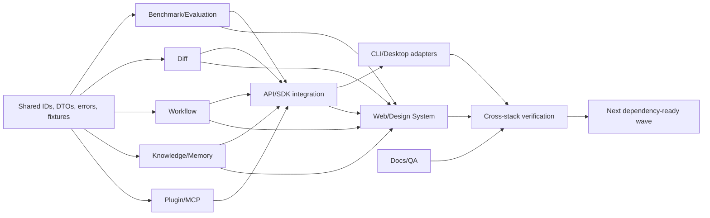

# Parallel Development Plan / 并行开发计划

## Objective / 目标

ContextLab remains an active, bilingual, Context-first open-source platform program. This plan switches local engineering to parallel integration delivery: each bounded agent owns code, tests, boundary notes, and observed verification within a disjoint file set; the Integration Lead owns shared contracts, root manifests, cross-domain adapters, and final evidence.

ContextLab 长期目标保持 active，并继续建设为中英双语、Context-first 的开源平台。本计划将本地工程切换到并行集成交付：每个有界 Agent 负责互不冲突文件集内的代码、测试、边界说明与已观测验证；Integration Lead 独占共享契约、根 manifest、跨领域适配与最终证据。

Remote CI, operator rehearsal, public protected-write, release, and production promotion remain deferred external deployment work. Docker-backed PostgreSQL runtime and authenticated browser E2E remain unobserved unless a command in this worktree actually observes them.

远端 CI、operator 演练、public protected-write、release 与生产推广仍是延期的外部部署工作。除非本工作树中的命令确实观测到，Docker-backed PostgreSQL runtime 与 authenticated browser E2E 均保持未观测。

## Latest Integration Record / 最新集成记录

### 2026-08-01 Private Branch-Head Error Redaction / 2026-08-01 私有 Branch-Head 错误脱敏

`completed / verified locally` for the bounded Criterion 4 Web adapter hardening. A Luna
implementation dispatch owned the two permitted Web files but stopped after timeouts without a
final report; the Integration Lead audited and completed the bounded changes. The adapter keeps
typed status/code and replaces unknown-status upstream messages with one stable bilingual local
message. No shared presenter/screen, Rust, API, SDK, or transport boundary changed.

本次有界条件 4 Web adapter hardening 标记为 `completed / verified locally`。Luna implementation dispatch 负责两个允许的 Web 文件，但在超时后停止且没有 final report；Integration Lead 审查并完成有界改动。adapter 保留 typed status/code，将 unknown-status upstream message 替换为稳定双语本地文案。shared presenter/screen、Rust、API、SDK 与 transport boundary 均未改变。

Observed / 已观测：red focused branch-head run `6 passed, 2 failed`; green run `8 passed`; `cargo fmt --all -- --check`; workspace Rust with storage `212 passed, 39 ignored`; strict offline Clippy; locked Rust `1.85.0`; `pnpm check:web` `15/135/284 + production build`; scoped local verifier; and `GRAPH_DIFF_IMPL_COUNT=1` passed. The verifier remains `overall=unobserved` without unified diff input.

No public route, OpenAPI/SDK method, Web mutation, Rust/API/storage change, migration, provider,
secret access, second `GraphDiff` calculator, Docker/PostgreSQL runtime, authenticated browser,
visual smoke, Git, remote CI, operator rehearsal, release, or production claim was added. Keep the
long-term goal active; before the next implementation, create a new bilingual Necessity Record.

已观测：red focused branch-head run `6 passed, 2 failed`；green run `8 passed`；`cargo fmt --all -- --check`；workspace Rust（storage `212 passed, 39 ignored`）；strict offline Clippy；锁定 Rust `1.85.0`；`pnpm check:web` `15/135/284 + production build`；范围化 local verifier；以及 `GRAPH_DIFF_IMPL_COUNT=1` 通过。verifier 因未提供 unified diff input 继续为 `overall=unobserved`。

未新增 public route、OpenAPI/SDK method、Web mutation、Rust/API/storage change、migration、provider、secret access、第二个 `GraphDiff` calculator、Docker/PostgreSQL runtime、authenticated browser、visual smoke、Git、remote CI、operator rehearsal、release 或 production 声明。保持长期目标 active；下一次实现前先新增双语 Necessity Record。

### 2026-08-01 Private Memory Writer-to-Review Composition / 2026-08-01 私有 Memory Writer-to-Review 组合

`completed / verified locally`. Luna implementation worker owned only `server/api/src/lib.rs` and
added the red-to-green writer/review regression; a second Luna reviewer independently confirmed
the one-line Memory adapter reuse and its boundary. The Memory adapter now returns the shared
`InMemoryContextGraphRepository` clone, preserving the same `commit_snapshot_state` for guarded
commit writes and diff reads.

`completed / verified locally`。Luna implementation worker 仅负责 `server/api/src/lib.rs` 并增加 red-to-green writer/review regression；第二个 Luna reviewer 独立确认了 one-line Memory adapter reuse 与边界。
Memory adapter 现返回共享的 `InMemoryContextGraphRepository` clone，使 guarded commit write 与 diff read 保持同一 `commit_snapshot_state`。

Observed / 已观测：API lib `215 passed`、storage snapshot repository `4 passed`、workspace Rust API `215 passed`、storage `212 passed, 39 ignored`；format、strict offline Clippy、locked Rust `1.85.0`、
`pnpm check:web`（public SDK `15`、local SDK `134`、Web `272` 与 production build）、local contract verifier scoped checks 与 `GRAPH_DIFF_IMPL_COUNT=1` 均通过。verifier 因未提供 unified diff input 报告 `overall=unobserved`。

This is local in-memory composition evidence only. The generic fixture constructor remains test-
composed and protected runtime uses PostgreSQL; no PostgreSQL runtime, browser/visual, Git, remote
CI, operator, release, or production evidence is claimed. No public write, OpenAPI/public SDK write,
Web mutation, migration, provider, secret, operator transport, or second `GraphDiff` calculator was
added. The long-term goal remains active and the next wave requires a new bilingual Necessity Record.

这是 local in-memory composition evidence。通用 fixture constructor 仍由 test 组合，protected runtime 使用 PostgreSQL；不声称 PostgreSQL runtime、browser/visual、Git、remote CI、operator、release 或 production evidence。
没有新增 public write、OpenAPI/public SDK write、Web mutation、migration、provider、secret、operator transport 或第二个 `GraphDiff` calculator。长期目标保持 active，下一 wave 必须新增双语 Necessity Record。

### 2026-08-01 Private Versioned Context Diff Boundary Witness / 2026-08-01 私有版本化 Context Diff 边界见证

`completed / verified locally` for the bounded API/SDK read-contract evidence wave. Luna API
worker owned only `server/api/tests/commit_graph_snapshot_scope_contract.rs`; Luna SDK worker owned
only `packages/local-sdk/src/persisted-context-diff-review.test.ts`; the Integration Lead owned the
plan and receipt. The API worker added protected black-box scope/authentication evidence, and the
SDK worker added the six semantic/behavior/evaluation `added`/`removed` parser cases. No ownership
overlap or production-code change occurred.

本有界 API/SDK 读取契约证据 wave 标记为 `completed / verified locally`。Luna API worker 仅负责 `server/api/tests/commit_graph_snapshot_scope_contract.rs`；Luna SDK worker 仅负责
`packages/local-sdk/src/persisted-context-diff-review.test.ts`；Integration Lead 负责计划和回执。API worker 增加 protected black-box scope/authentication evidence，SDK worker 增加六个
semantic/behavior/evaluation `added`/`removed` parser case。没有 ownership overlap 或 production-code change。

Observed / 已观测：protected API `3 passed`、local SDK parser `10 passed`；workspace Rust API `214 passed`、storage `212 passed, 39 ignored`；format、strict offline Clippy、locked Rust `1.85.0`、
`pnpm check:web`（public SDK `15`、local SDK `134`、Web `272` 与 production build）、local contract verifier scoped checks 与 `GRAPH_DIFF_IMPL_COUNT=1` 均通过。
verifier 因未提供 unified diff input 报告 `overall=unobserved`。

The API/SDK receipts are fixture-backed local contract evidence. They do not prove Memory
writer-to-review repository identity, PostgreSQL runtime, browser/visual E2E, Git, remote CI,
operator rehearsal, release, or production. No public write, OpenAPI/public SDK write method, Web
mutation, migration, provider, secret, operator transport, or second `GraphDiff` calculator was
added. The next admitted wave is the local repository-composition correction and requires its own
bilingual Necessity Record.

API/SDK 回执是 fixture-backed local contract evidence，不能证明 Memory writer-to-review repository identity、PostgreSQL runtime、browser/visual E2E、Git、remote CI、operator rehearsal、release 或
production。没有新增 public write、OpenAPI/public SDK write method、Web mutation、migration、provider、secret、operator transport 或第二个 `GraphDiff` calculator。下一准入 wave 是本地
repository-composition correction，必须拥有自己的双语 Necessity Record。

### 2026-08-01 Private Context Diff V1 Read-Scope Hardening / 2026-08-01 私有 Context Diff V1 读取范围硬化

`completed / verified locally` for the bounded storage contract hardening; the long-term goal
remains active. Integration Lead added an explicit V1 schema predicate to the PostgreSQL exact
commit read and a disjoint Memory regression that changes project, Context, and commit identities
one at a time. No API, SDK, Web, OpenAPI, migration, or public catalog ownership changed.

本有界 storage contract hardening 标记为 `completed / verified locally`；长期目标保持 active。Integration Lead 为 PostgreSQL exact commit read 增加显式 V1
schema predicate，并在互斥 Memory regression 中逐一替换 project、Context 与 commit identity。API、SDK、Web、OpenAPI、migration 与 public catalog ownership 均未改变。

Observed / 已观测：Memory scope `4 passed`、PostgreSQL SQL contract `1 passed`；workspace Rust API `214 passed`、storage `212 passed, 39 ignored`；format、strict
offline Clippy、locked Rust `1.85.0`、`pnpm check:web`（public SDK `15`、local SDK `134`、Web `272`、TypeScript/lint 与 production build）、local verifier scoped checks
与 `GRAPH_DIFF_IMPL_COUNT=1` 均通过。verifier 因未提供 unified diff input 报告 `overall=unobserved`。

已观测：Memory scope `4 passed`、PostgreSQL SQL contract `1 passed`；workspace Rust API `214 passed`、storage `212 passed, 39 ignored`；format、strict offline Clippy、锁定 Rust
`1.85.0`、`pnpm check:web`（public SDK `15`、local SDK `134`、Web `272`、TypeScript/lint 与 production build）、local verifier scoped checks 与 `GRAPH_DIFF_IMPL_COUNT=1` 均通过。
verifier 因未提供 unified diff input 报告 `overall=unobserved`。

No public route, OpenAPI/public SDK method, Web mutation, migration, provider, secret, operator
transport, release, or production claim was added. PostgreSQL/Docker runtime, authenticated browser,
visual smoke, Git, remote CI, operator rehearsal, release, and production remain `unobserved` or
`deferred`; `GraphDiff::between` remains the sole calculator and the next wave requires a new
bilingual Necessity Record.

没有新增 public route、OpenAPI/public SDK method、Web mutation、migration、provider、secret、operator transport、release 或 production 声明。PostgreSQL/Docker runtime、
authenticated browser、visual smoke、Git、remote CI、operator rehearsal、release 与 production 继续为 `unobserved` 或 `deferred`；`GraphDiff::between` 仍是唯一 calculator，
下一 wave 必须新增双语 Necessity Record。

### 2026-08-01 Private Persisted Context Diff Writer and BFF Evidence / 2026-08-01 私有持久化 Context Diff Writer 与 BFF 证据

`completed / verified locally` for the bounded persisted-review convergence slice; the long-term
goal remains active. Integration Lead repaired the root cause found by the independent Luna
storage/API reviews: `CreateContextCommitSnapshot` derives one validated V1 diff input from the
same immutable graph, and Memory/PostgreSQL normal plus guarded writers persist it in the existing
commit transaction. The storage test now reads the derived record after normal write and after
guarded idempotent replay. API and BFF fixtures explicitly carry redacted behavior/evaluation
producer facts and assert non-empty semantic, behavior, and evaluation sections.

本有界 persisted-review 收束切片标记为 `completed / verified locally`；长期目标保持 active。Integration Lead 根据 Luna storage/API 独立审查发现的
根因完成修复：`CreateContextCommitSnapshot` 从同一不可变 graph 派生一个经过校验的 V1 diff input，Memory/PostgreSQL 普通与 guarded writer 在既有
commit transaction 中一起持久化。storage test 现验证普通写入与 guarded 幂等 replay 后均可读回该 record。API 与 BFF fixture 明确携带脱敏
behavior/evaluation producer facts，并断言 semantic、behavior、evaluation 三段均非空。

Observed / 已观测：workspace Rust API `214 passed`、storage `212 passed, 39 ignored`；focused storage guarded replay `1 passed`、storage review `8 passed`、
direct API review `1 passed`、protected API review `3 passed`；`cargo fmt --all -- --check`、strict offline Clippy、locked Rust `1.85.0` check passed；
`pnpm check:web` public SDK `15`、local SDK `134`、Web `272`、TypeScript/lint 与 production build passed；local verifier scoped checks passed with
`graph_diff_application=passed count=1`, while `overall=unobserved` because no unified diff input was supplied; `GRAPH_DIFF_IMPL_COUNT=1` passed。

已观测：workspace Rust API `214 passed`、storage `212 passed, 39 ignored`；focused storage guarded replay `1 passed`、storage review `8 passed`、direct API review `1 passed`、
protected API review `3 passed`；`cargo fmt --all -- --check`、strict offline Clippy、锁定 Rust `1.85.0` check 通过；`pnpm check:web` 通过（public SDK `15`、local SDK `134`、
Web `272`、TypeScript/lint 与 production build）；local verifier scoped checks 通过，`graph_diff_application=passed count=1`，但因未提供 unified diff input 整体为
`overall=unobserved`；`GRAPH_DIFF_IMPL_COUNT=1` 通过。

No public REST/OpenAPI/public SDK write, Web mutation, operator transport, provider, secret,
migration, release, or production claim was added. PostgreSQL/Docker runtime, authenticated browser,
visual smoke, Git change-set, remote CI, operator rehearsal, release, and production remain
`unobserved` or `deferred`. `GraphDiff::between` remains the sole graph-diff calculator; the next
wave requires a new bilingual Necessity Record.

没有新增 public REST/OpenAPI/public SDK write、Web mutation、operator transport、provider、secret、migration、release 或 production 声明。PostgreSQL/Docker runtime、
authenticated browser、visual smoke、Git change-set、remote CI、operator rehearsal、release 与 production 继续为 `unobserved` 或 `deferred`。`GraphDiff::between` 仍是唯一
graph-diff calculator；下一 wave 必须新增双语 Necessity Record。

### 2026-07-30 Private Workflow Execution Status and Replay Provenance Read Closure / 2026-07-30 私有 Workflow 执行状态与回放 provenance 读取收束

`completed / verified locally`. The Workflow execution-status wave is closed across its disjoint
Rust, API, local SDK, BFF, and Web ownership. The projection is exact-scope, schema-versioned,
deterministic, redacted, and validated through the existing replay core. The default runtime has
no execution repository and returns typed `unavailable`; no execution producer or persistence
path was introduced.

`completed / verified locally`。Workflow execution-status wave 已在互斥的 Rust、API、local SDK、BFF 与 Web ownership 上收束。projection
保持 exact-scope、schema-versioned、确定性、脱敏，并通过既有 replay core 校验。默认运行时没有 execution repository，因此返回 typed
`unavailable`；没有引入 execution producer 或持久化路径。

Observed / 已观测：Workflow projection `5 passed`、protected API route `1 passed`、local SDK `111 passed`、execution-status BFF route `4 passed`、Web
data/presenter/screen `7 passed`；`pnpm check:web` public SDK `15`、local SDK `111`、Web `229`、TypeScript/lint 与 production build；
workspace Rust storage `204 passed, 39 ignored`；format、strict offline Clippy、locked Rust `1.85.0`、`GRAPH_DIFF_IMPL_COUNT=1` 与
public workflow/plugin capability surface hits `0` 均通过。

已观测：Workflow projection `5 passed`、protected API route `1 passed`、local SDK `111 passed`、execution-status BFF route `4 passed`、Web data/presenter/screen `7 passed`；
`pnpm check:web` 通过 public SDK `15`、local SDK `111`、Web `229`、TypeScript/lint 与 production build；workspace Rust storage `204 passed,
39 ignored`；format、strict offline Clippy、锁定 Rust `1.85.0`、`GRAPH_DIFF_IMPL_COUNT=1` 与 public workflow/plugin capability surface hits `0`
均通过。

No public REST/OpenAPI/public SDK method, execution start route, mutation, provider, migration,
operator transport, secret, or production claim was added. Docker/PostgreSQL, authenticated
browser, visual, Git, remote CI, operator rehearsal, release, and production remain
`unobserved` or `deferred`. The long-term goal remains active; the next wave requires its own
bilingual Necessity Record.

没有新增 public REST/OpenAPI/public SDK method、execution start route、mutation、provider、migration、operator transport、secret 或
production 声明。Docker/PostgreSQL、authenticated browser、visual、Git、remote CI、operator rehearsal、release 与 production 继续为
`unobserved` 或 `deferred`。长期目标保持 active；下一 wave 必须拥有独立的双语 Necessity Record。

The broader `scripts/verify-local-contracts.ps1` baseline stops at the unrelated
`benchmark-workspace-route-method-count:2` check and is not claimed as a green receipt; the
narrower Workflow/Plugin public-surface and GraphDiff checks passed.

更宽的 `scripts/verify-local-contracts.ps1` baseline 在无关的
`benchmark-workspace-route-method-count:2` 检查处停止，不声称其为绿色回执；更窄的 Workflow/Plugin public-surface 与 GraphDiff check 已通过。

### 2026-07-30 Private Plugin/MCP Capability Availability Read Closure / 2026-07-30 私有 Plugin/MCP 能力可用性读取收束

`completed / verified locally`. The private Context-scoped Plugin/MCP availability read now
composes the existing Rust projection through the protected API, non-public local SDK, same-origin
BFF, and shared bilingual Web capability-state screen. It exposes only stable IDs, versions,
availability, compatibility, and safe diagnostic codes; it remains provider-free, redacted,
deterministic, request-scoped, and `no-store`. No public Plugin/MCP API/OpenAPI/SDK method,
registry mutation, dynamic loading, provider call, secret, or second GraphDiff calculator changed.

`completed / verified locally`。private Context-scoped Plugin/MCP availability read 现已将既有 Rust projection 贯通 protected API、
非公开 local SDK、同源 BFF 与 shared 双语 Web capability-state screen。它只暴露 stable ID、version、availability、compatibility
与安全 diagnostic code；继续保持 provider-free、脱敏、确定性、request-scoped 与 `no-store`。没有修改 public Plugin/MCP
API/OpenAPI/SDK method、registry mutation、dynamic loading、provider call、secret 或第二个 GraphDiff calculator。

Observed / 已观测：focused MCP `8 passed`、plugin-runtime `9 passed`、API `2 passed`、local SDK `3 passed`、Web BFF/inspector
`5 passed`；`pnpm check:web` passed public SDK `15`、local SDK `107`、Web `218`、TypeScript/lint 与 production build；workspace Rust
passed with storage `204 passed, 39 ignored`；locked Rust `1.85.0` check passed；`GRAPH_DIFF_IMPL_COUNT=1`；public Plugin/MCP capability
surface hits `0`。

已观测：focused MCP `8 passed`、plugin-runtime `9 passed`、API `2 passed`、local SDK `3 passed`、Web BFF/inspector `5 passed`；
`pnpm check:web` 通过（public SDK `15`、local SDK `107`、Web `218`、TypeScript/lint 与 production build）；workspace Rust 通过，
其中 storage `204 passed, 39 ignored`；锁定 Rust `1.85.0` check 通过；`GRAPH_DIFF_IMPL_COUNT=1`；public Plugin/MCP capability
surface 命中 `0`。

Repository-wide `cargo fmt --all -- --check` and strict offline Clippy were `failed` by unrelated
Workflow drift in `crates/workflow/src/execution_status.rs` (formatting diff and two `missing_docs`
errors). This is recorded as a quality follow-up, not a Plugin/MCP product blocker. PostgreSQL/
Docker runtime, browser, Git, remote CI, operator, release, and production remain `unobserved` or
`deferred`. Two failed coding-worker dispatches occurred before any worker patch was accepted;
they are execution provenance only, not product blockers.

Repository-wide `cargo fmt --all -- --check` 与 strict offline Clippy 因无关的 `crates/workflow/src/execution_status.rs` drift 而
`failed`（formatting diff 与两个 `missing_docs` error）。这里记录为 quality follow-up，不是 Plugin/MCP product blocker。
PostgreSQL/Docker runtime、browser、Git、remote CI、operator、release 与 production 继续为 `unobserved` 或 `deferred`。两次
coding-worker dispatch 在接受任何 worker patch 前失败；它们仅是 execution provenance，不是 product blocker。

### 2026-07-30 Private Workflow Binding Availability Closure / 2026-07-30 私有 Workflow Binding 可用性收束

`completed / verified locally`. The existing Workflow binding inspector now maps only a typed
upstream `503` to the shared `unavailable` state; 403, 429, protocol, and transport failures stay
`error`. The successful lifecycle test renders the selected redacted row through the shared Screen.
The shared local SDK request helper also sets `cache: "no-store"` while retaining request-scoped
Bearer credentials and cookie omission. Ownership is limited to the inspector, its focused test,
the shared local SDK helper/test, and this receipt. No route, schema, public SDK/OpenAPI method,
mutation, provider, secret, or second `GraphDiff` calculator changed.

`completed / verified locally`。现有 Workflow binding inspector 现仅将 typed upstream `503` 映射为 shared `unavailable` state；
403、429、protocol 与 transport failure 继续保持 `error`。成功 lifecycle test 会通过 shared Screen 渲染选定的脱敏 row。
共享 local SDK request helper 还会在保留 request-scoped Bearer credential 与 cookie omission 的同时设置 `cache: "no-store"`。
Ownership 仅限 inspector、focused test、shared local SDK helper/test 与本回执。未修改 route、schema、public SDK/OpenAPI method、
mutation、provider、secret 或第二个 `GraphDiff` calculator。

Observed: focused Web Workflow `11/11`; focused local SDK Workflow `7/7`; `pnpm check:web` with
public SDK `15`, local SDK `99`, Web `202`, TypeScript/lint, and production build; workspace Rust
with storage `193 passed, 39 ignored`; API Workflow binding `4 passed`; format; strict offline
Clippy; and locked Rust `1.85.0` check. Docker/PostgreSQL runtime, authenticated browser, Git
change-set, remote CI, operator rehearsal, release, and production remain `unobserved` or
`deferred`. The long-term goal remains active; the next implementation requires a new bilingual
Necessity Record.

已观测：focused Web Workflow `11/11`；focused local SDK Workflow `7/7`；`pnpm check:web`（public SDK `15`、local SDK `99`、Web `202`、
TypeScript/lint 与 production build）；workspace Rust（storage `193 passed, 39 ignored`）；API Workflow binding `4 passed`；format；
strict offline Clippy；以及锁定 Rust `1.85.0` check。Docker/PostgreSQL runtime、authenticated browser、Git change-set、remote CI、
operator rehearsal、release 与 production 仍为 `unobserved` 或 `deferred`。长期目标保持 active；下一项实现必须先新增双语 Necessity Record。

### 2026-07-30 Private Context Lifecycle Graph-Diff Review / 2026-07-30 私有 Context 生命周期 Graph-Diff 审阅

`completed / verified locally`. The Web lifecycle success path now captures the exact selected
pre-commit head and returned commit for create, content update, removal, and relationship commits.
Empty and same-commit replay pairs are rejected, while stale/conflict failures do not request a
graph diff. `ContextLifecycleGraphReviewBridge` composes the existing branch-head review and
`composeCommittedGraphReview` selects the exact old-head/new-commit pair, resets any prior result,
and remounts when its identity changes. Ownership is limited to the lifecycle editor, bridge,
existing graph-review composition, focused tests, and this receipt; GraphDiff remains domain-owned.

`completed / verified locally`。Web lifecycle success path 现会为 create、content update、removal 与 relationship commit 捕获精确的
commit 前 head 与返回 commit。空 pair 与 same-commit replay 会被拒绝，stale/conflict failure 不会请求 graph diff。
`ContextLifecycleGraphReviewBridge` 组合既有 branch-head review，`composeCommittedGraphReview` 选择 exact old-head/new-commit pair、
清除旧 result，并在 identity 变化时重新挂载。Ownership 仅限 lifecycle editor、bridge、既有 graph-review composition、focused tests
与本回执；GraphDiff 仍由 domain 持有。

Fresh local evidence passed `context-lifecycle-editor.test.tsx` `7/7`,
`local-branch-heads-graph-review.test.tsx` `5/5`, `pnpm check:web` with public SDK `15`, local SDK
`99`, Web `207`, TypeScript/lint, and
production build, workspace Rust with storage `193 passed, 39 ignored`, `cargo fmt --all -- --check`,
strict offline workspace Clippy, locked Rust `1.85.0` check, and static `impl GraphDiff count=1`.

新鲜本地 evidence 已通过 `context-lifecycle-editor.test.tsx` `7/7`、`local-branch-heads-graph-review.test.tsx` `5/5`、
`pnpm check:web`（public SDK `15`、local SDK `99`、Web `207`、TypeScript/lint 与 production build）、workspace Rust（storage
`193 passed, 39 ignored`）、`cargo fmt --all -- --check`、strict offline workspace Clippy、锁定 Rust `1.85.0` check，以及
static `impl GraphDiff count=1`。

No public REST/OpenAPI/SDK write method, operator transport, migration, provider, secret, Web
mutation, or second GraphDiff calculator was added. Docker/PostgreSQL runtime, authenticated
browser, Git change-set, remote CI, operator rehearsal, release, and production remain
`unobserved` or `deferred`; the long-term goal remains active. The next implementation requires a
new bilingual Necessity Record.

没有新增 public REST/OpenAPI/SDK write method、operator transport、migration、provider、secret、Web mutation 或第二个 GraphDiff
calculator。Docker/PostgreSQL runtime、authenticated browser、Git change-set、remote CI、operator rehearsal、release 与 production
继续为 `unobserved` 或 `deferred`；长期目标保持 active。下一项实现必须先新增双语 Necessity Record。

### 2026-07-29 Private Capability Availability Schema Hardening / 2026-07-29 私有 Capability Availability Schema 硬化

`completed / verified locally`. This bounded sidecar hardens only
`apps/web/src/app/local-capability-availability-data.ts` and its existing focused test. The
numeric V1 parser now rejects unknown outer fields and unknown nested bilingual fields before the
shared capability presenter/screen receives them. The DTO, `data -> presenter -> screen` boundary,
transport, and all public surfaces remain unchanged.

`completed / verified locally`。本有界 sidecar 仅硬化
`apps/web/src/app/local-capability-availability-data.ts` 与其既有 focused test。numeric V1 parser 现会在 shared capability
presenter/screen 接收前拒绝 unknown outer field 与 nested bilingual field。DTO、`data -> presenter -> screen` boundary、
transport 与所有 public surface 均保持不变。

Observed: red focused test reproduced `Missing expected exception`; green focused parser test
passed `3`; `pnpm check:web` passed public SDK `15`, local SDK `99`, Web `201`, TypeScript/lint,
and production build; Rust format and workspace tests passed with storage `193 passed, 39 ignored`;
strict offline Clippy and locked Rust `1.85.0` check passed; static `impl GraphDiff` count `1`,
public SDK branch-head hits `0`, and retired public commit-graph-diff read hits `0`.

已观测：red focused test 复现 `Missing expected exception`；green focused parser test 通过 `3`；`pnpm check:web` 通过
public SDK `15`、local SDK `99`、Web `201`、TypeScript/lint 与 production build；Rust format 与 workspace test 通过且
storage `193 passed, 39 ignored`；strict offline Clippy 与锁定 Rust `1.85.0` check 通过；static `impl GraphDiff` count `1`、
public SDK branch-head hit `0`、retired public commit-graph-diff read hit `0`。

No API/OpenAPI/public SDK/local transport method, mutation, provider, migration, secret,
Docker/PostgreSQL runtime, authenticated browser, Git change-set, remote CI, operator rehearsal,
release, or production work was added. The long-term goal remains active; the next wave requires a
new bilingual Necessity Record. Runtime and external release evidence remain `unobserved/deferred`.

没有新增 API/OpenAPI/public SDK/local transport method、mutation、provider、migration、secret、Docker/PostgreSQL runtime、
authenticated browser、Git change-set、remote CI、operator rehearsal、release 或 production work。长期目标保持 active；下一
波必须先新增双语 Necessity Record。runtime 与 external release evidence 继续为 `unobserved/deferred`。

### 2026-07-29 Private Branch-Head Graph Review Selection / 2026-07-29 私有 Branch-Head 图谱审阅选择

`completed / verified locally`. Integration Lead ownership is limited to the Web composition,
the existing inspector callback boundary, focused tests, and this receipt. The selected
server-owned non-null branch head is passed as the exact revised graph-review candidate; existing
candidates remain unique, unborn/null heads preserve defaults, and the keyed review composition
resets review state when Context or selected head changes. The existing `data -> presenter ->
screen` boundary, strict local SDK parser, request-memory Bearer transport, cookie omission,
`credentials: "omit"`, and `cache: "no-store"` remain unchanged.

`completed / verified locally`。Integration Lead 的 ownership 仅限 Web composition、既有 inspector callback boundary、focused
tests 与本回执。选中的 server-owned 非 null branch head 会作为 exact revised graph-review candidate 传入；既有 candidate
保持唯一，unborn/null head 保持 defaults，带 key 的 review composition 会在 Context 或 selected head 变化时重置 review
state。既有 `data -> presenter -> screen` boundary、strict local SDK parser、request-memory Bearer transport、cookie omission、
`credentials: "omit"` 与 `cache: "no-store"` 均保持不变。

Observed in this integration wave: focused Web selection and branch-head tests `8 passed`; full
`pnpm check:web` public SDK `15`, local SDK `99`, Web `200`, TypeScript/lint, and production build;
Rust format; workspace tests with storage `193 passed, 39 ignored`; strict offline workspace
Clippy; locked Rust `1.85.0` check; `impl GraphDiff` count `1`; public SDK branch-head hits `0`;
retired public commit-graph-diff read hits `0`.

本集成波次已观测：focused Web selection 与 branch-head test `8 passed`；完整 `pnpm check:web` public SDK `15`、local SDK `99`、
Web `200`、TypeScript/lint 与 production build；Rust format；workspace test（storage `193 passed, 39 ignored`）；strict offline
workspace Clippy；锁定 Rust `1.85.0` check；`impl GraphDiff` count `1`；public SDK branch-head hit `0`；retired public
commit-graph-diff read hit `0`。

No public REST/OpenAPI/public SDK method, branch mutation, merge/rollback, Web mutation, provider,
migration, secret, Docker/PostgreSQL runtime, authenticated browser, Git change-set, remote CI,
operator rehearsal, release, or production evidence was added. The long-term goal remains active;
the next implementation requires a new bilingual Necessity Record. Runtime and external release
evidence remain `unobserved` or `deferred`.

没有新增 public REST/OpenAPI/public SDK method、branch mutation、merge/rollback、Web mutation、provider、migration、secret、
Docker/PostgreSQL runtime、authenticated browser、Git change-set、remote CI、operator rehearsal、release 或 production evidence。
长期目标保持 active；下一项实现必须先新增双语 Necessity Record。runtime 与 external release evidence 继续为
`unobserved` 或 `deferred`。

### 2026-07-27 Diff Contract Wave / 2026-07-27 Diff Contract 波次

The latest local wave completed the private typed version-bound Context diff contract. Diff ownership
remained entirely in `crates/diff-engine`: `VersionedContextScopeV1` supplies exact project/Context/
commit identity, the review contract fails closed on scope mismatch or self-comparison, and the
versioned wrapper delegates graph changes only through the existing unified service and
`GraphDiff::between`. An EOF-newline regression was fixed within the same admitted deterministic
 review boundary. The wave did not promote a public REST/OpenAPI/public SDK graph-diff read. It did
 add the protected local commit graph-diff read boundary and its non-public local SDK contract; the
 public graph-diff POST remains a separate public operation.

最新本地波次完成了 private typed version-bound Context diff contract。Diff ownership 全部保留在
`crates/diff-engine`：`VersionedContextScopeV1` 提供精确 project/Context/commit identity，review contract 对
scope mismatch 或 self-comparison fail closed，versioned wrapper 仅通过既有 unified service 与
`GraphDiff::between` 委托 graph change。同一已准入的 deterministic review boundary 内还修复了 EOF-newline 回归。
本波没有把 graph-diff read 提升为 public REST/OpenAPI/public SDK surface；但新增了 protected local commit
graph-diff read boundary 及其非公开 local SDK contract。public graph-diff POST 仍是独立的 public operation。

Observed verification: diff-engine `20/20`; workspace Rust API `184 passed`, storage `179 passed,
39 ignored`; format; strict offline Clippy; Rust `1.85.0` check; `pnpm check:web` with public SDK
`14`, local SDK `85`, Web `179`, and production build. The static verifier observed one graph-diff
application call and left Git/browser/production evidence `unobserved`. PostgreSQL runtime,
Docker/virtualization, remote CI, operator, release, and production remain `unobserved` or
`deferred`. The next queue is a separately admitted access-governance decision for the existing
version-backed graph-diff read path, followed by exact persistence bridges only when their inputs
exist.

已观测验证：diff-engine `20/20`；workspace Rust API `184 passed`、storage `179 passed, 39 ignored`；format；
strict offline Clippy；Rust `1.85.0` check；`pnpm check:web`（public SDK `14`、local SDK `85`、Web `179`，并完成
production build）。静态 verifier 观测到一处 graph-diff application call，并将 Git/browser/production evidence 保持为
`unobserved`。PostgreSQL runtime、Docker/virtualization、remote CI、operator、release 与 production 仍为
`unobserved` 或 `deferred`。下一队列是为既有 version-backed graph-diff read path 单独准入 access-governance 决策；
exact persistence bridge 只有在输入 artifact 存在后才可推进。

The 2026-07-27 Wave 2 authoring transport is now closed as a private local product slice. The
canonical protected POST is `/api/v1/local/projects/{project_id}/contexts/{context_id}/commits/{commit_id}/benchmark-definition-bindings`;
the non-public local SDK, same-origin BFF, and Web editor preserve exact project/Context/commit
scope, request-memory Bearer credentials, cookie omission, `credentials: "omit"`, `private, no-store`,
typed conflicts, and bilingual state handling. The former context-only BFF route is retired with
fail-closed `410 benchmark_definition_route_gone` and never calls upstream. Public OpenAPI/public SDK
remain outside the protected local graph-diff read, and `GraphDiff::between` remains the sole graph-diff calculator.

2026-07-27 Wave 2 authoring transport 现已作为 private local product slice 收束。canonical protected POST 为
`/api/v1/local/projects/{project_id}/contexts/{context_id}/commits/{commit_id}/benchmark-definition-bindings`；
非公开 local SDK、同源 BFF 与 Web editor 保持精确 project/Context/commit scope、request-memory Bearer credential、
cookie omission、`credentials: "omit"`、`private, no-store`、typed conflict 与双语 state。旧的 context-only BFF
route 已退役，fail-closed 返回 `410 benchmark_definition_route_gone` 且绝不调用 upstream。public OpenAPI/public SDK
仍不包含 protected local graph-diff read，`GraphDiff::between` 仍是唯一 graph-diff calculator。

Fresh local receipt: `cargo fmt --all -- --check`, `cargo test --workspace --quiet` (storage `167 passed,
39 ignored`), strict workspace Clippy, and locked Rust `1.85.0` check passed. `pnpm check:web` passed
with public SDK `14`, local SDK `68`, Web `151`, and the production build. The retired-route and
canonical-route regressions are included in the full Web receipt; authoring data/presenter/screen
focused tests passed `11/11`. `verify-wave2-local-contract.test.sh` passed, and the live verifier reports
`wave2_local_contracts=passed`, `graph_diff_calculators=passed count=1`, and `overall=unobserved` only
because Git change-set evidence is unavailable. The workspace verifier was not observed because no local
Web server was running (`ERR_CONNECTION_REFUSED`); Docker/PostgreSQL, authenticated browser runtime,
Git, remote CI, operator rehearsal, release, and production remain `ignored`, `unobserved`, or `deferred`.

新鲜本地回执：`cargo fmt --all -- --check`、`cargo test --workspace --quiet`（storage `167 passed, 39 ignored`）、
strict workspace Clippy 与锁定 Rust `1.85.0` check 均通过。`pnpm check:web` 通过，其中 public SDK `14`、
local SDK `68`、Web `151`，并完成 production build。退役 route 与 canonical route regression 已包含在 Web 全量
回执中；authoring data/presenter/screen 聚焦测试为 `11/11 passed`。`verify-wave2-local-contract.test.sh` 已通过，
实际 verifier 报告 `wave2_local_contracts=passed`、`graph_diff_calculators=passed count=1`，仅因 Git change-set
evidence 不可用而报告 `overall=unobserved`。workspace verifier 因未启动本地 Web server 而未观测到（`ERR_CONNECTION_REFUSED`）；
Docker/PostgreSQL、authenticated browser runtime、Git、remote CI、operator rehearsal、release 与 production 仍为
`ignored`、`unobserved` 或 `deferred`。

The requested bounded subagent sidecars were attempted with `gpt-5.6-sol` and then `gpt-5.6-luna`; both
creation batches were rejected by the current thread limit (`collab spawn failed: agent thread limit reached`).
No worker patch was accepted or treated as passed; the Integration Lead completed the disjoint docs, route,
and verification work. This scheduling failure is not a product or architecture blocker. Docker/PostgreSQL
runtime, authenticated browser-to-BFF-to-Axum, Git, remote CI, operator rehearsal, release, and production
evidence remain `unobserved` or `deferred` unless directly observed.

### 2026-07-30 Private Versioned ContextGraph Merge Review (recorded after persisted review) / 2026-07-30 私有版本化 ContextGraph Merge Review（在持久化审阅之后记录）

This integration wave added the private V1 version-bound graph review application contract in
`crates/diff-engine/src/versioned_graph_merge_review.rs` and its focused tests. It owns explicit
schema version, exact base/left/right graph snapshot scopes, matching `MergePlan`, deterministic
classification projection, and fail-closed nil/duplicate identity checks. It delegates only to
`GraphMergeConflictClassifier`; no Web or transport layer calculates graph differences.

本集成波次在 `crates/diff-engine/src/versioned_graph_merge_review.rs` 及其 focused tests 中增加 private V1 version-bound
graph review application contract。它负责显式 schema version、exact base/left/right graph snapshot scope、匹配的
`MergePlan`、确定性 classification projection 与 fail-closed nil/duplicate identity check。它只委托
`GraphMergeConflictClassifier`；Web 与 transport layer 不计算 graph difference。

Storage now converts its exact persisted snapshots into the V1 request and returns the existing
classification shape, preserving the storage and transport ownership boundary. Focused diff-engine
`4 passed`, focused storage `8 passed`, workspace Rust `186 passed, 39 ignored`, format, strict
offline Clippy, locked Rust `1.85.0`, Web `15/92/188 + production build`, and static
`impl GraphDiff count=1` all passed. The adapter now uses the atomic batch repository contract:
Memory reads under one guard and PostgreSQL under one `REPEATABLE READ READ ONLY` transaction.
PostgreSQL runtime, browser, Git, remote CI, operator, release, and production remain `unobserved`
or `deferred`. The long-term goal remains active and the next work requires a new bilingual
Necessity Record.

Storage 现将 exact persisted snapshot 转换为 V1 request，并返回既有 classification shape，保持 storage 与 transport
ownership boundary。focused diff-engine `4 passed`、focused storage `8 passed`、workspace Rust `186 passed, 39 ignored`、
format、strict offline Clippy、锁定 Rust `1.85.0`、Web `15/92/188 + production build` 与 static `impl GraphDiff count=1`
均通过。adapter 现使用 atomic batch repository contract：Memory 在一个 guard 下读取，PostgreSQL 在一个
`REPEATABLE READ READ ONLY` transaction 下读取。PostgreSQL runtime、browser、Git、remote CI、operator、release 与
production 仍为 `unobserved` 或 `deferred`。长期目标保持 active，下一项工作必须先新增双语 Necessity Record。

### 2026-07-30 Private Persisted ContextGraph Merge Review / 2026-07-30 私有持久化 ContextGraph Merge Review

This integration record closes the storage-owned bridge required by the 2026-07-29 conflict
classification wave. Luna review sidecars independently checked the implementation and ledger;
the Integration Lead owned the documentation receipt. Ownership is limited to
`crates/storage/src/context_merge_review.rs`, its `lib.rs` export, the focused storage contract
test, and the bilingual plan. `ContextMergeInputScope` requires one project/Context and three
distinct commits. `PersistedContextGraphMergeReviewService` validates plans before reads, loads
exact base/left/right snapshot scopes, fails closed on missing or scope-drifted records, and
delegates only to `GraphMergeConflictClassifier`.

本集成回执收束了 2026-07-29 conflict classification wave 所需的 storage-owned bridge。Luna review sidecar 独立检查了
实现与 ledger；Integration Lead 负责文档回执。所有权仅限 `crates/storage/src/context_merge_review.rs`、其 `lib.rs`
导出、focused storage contract test 与双语计划。`ContextMergeInputScope` 要求一个 project/Context 与三个不同 commit。
`PersistedContextGraphMergeReviewService` 在 read 前校验 plan，加载 exact base/left/right snapshot scope，对 missing 或
scope drifted record fail closed，并只委托 `GraphMergeConflictClassifier`。

Observed: focused storage `8 passed`; workspace Rust `186 passed, 39 ignored`; format; strict
offline workspace Clippy; locked Rust `1.85.0`; `pnpm check:web` with public SDK `15`, local SDK
`92`, Web `188`, and production build; and static `impl GraphDiff` count `1`. PostgreSQL runtime,
browser, Git, remote CI, operator, release, and production remain `unobserved` or `deferred`. The
repository bridge invokes the batch port once; Memory uses one guard and PostgreSQL uses one
`REPEATABLE READ READ ONLY` transaction. No public surface, write path, migration, Web mutation,
secret, provider, or second calculator was added. The long-term goal remains active.

已观测：focused storage `8 passed`；workspace Rust `186 passed, 39 ignored`；format；strict offline workspace Clippy；锁定
Rust `1.85.0`；`pnpm check:web`（public SDK `15`、local SDK `92`、Web `188` 与 production build）；以及 static
`impl GraphDiff` count `1`。PostgreSQL runtime、browser、Git、remote CI、operator、release 与 production 继续为
`unobserved` 或 `deferred`。repository bridge 只调用一次 batch port；Memory 使用一个 guard，PostgreSQL 使用一个
`REPEATABLE READ READ ONLY` transaction。未新增 public surface、write path、migration、Web mutation、secret、provider 或
第二个 calculator。长期目标保持 active。

The append-only historical ledger below is intentionally not a chronological task queue; the
2026-07-30 persisted review plus the same-day version-bound adapter and atomic batch read are the
current integration head, superseding older “next storage binding” wording. The older blocks remain
as historical receipts. The next work item requires a new bilingual Necessity Record before
implementation.

下面的 append-only historical ledger 有意不作为 chronological task queue；2026-07-30 persisted review、同日记录的
version-bound adapter 与 atomic batch read 共同构成当前 integration head，并 supersede 旧的“next storage binding”表述。
下方旧 block 保留为历史回执。下一项工作在实现前必须先新增双语 Necessity Record。

## Shared Contract Ledger / 共享契约台账

| Area / 领域 | Shared rule / 共享规则 | Owner / 所有人 |
| --- | --- | --- |
| Identity / 标识 | Stable UUID newtypes in Rust; JSON uses explicit `*_id` strings and `schema_version`. | Integration Lead |
| Ordering / 排序 | Every collection states its order. Immutable sealed membership preserves stored order; user-facing histories use deterministic keyset order. | Domain owners |
| Errors / 错误 | Rust ports return typed domain or `StorageRepositoryError`; transport maps unavailable or scope mismatch to generic fail-closed errors. | Domain + API owners |
| Read safety / 读取安全 | Read DTOs expose only identifiers, timestamps, safe numeric facts, and declared statuses. Cases, inputs, expected outputs, model outputs, diagnostics, secrets, and raw tool payloads are rejected recursively. | API/SDK/Web owners |
| Policy and diffs / 策略与 Diff | Domain crates alone calculate policy and diffs. API/SDK/Web adapt results only; `GraphDiff::between` remains the sole graph-diff calculator. | Diff/Evaluation owners |
| Protected local transport / 本地受保护传输 | Local-only writes remain server-gated and default-deny; protected reads/writes reuse authentication, RBAC, audit, rate limiting, idempotency, and request-scoped Bearer forwarding with cookies omitted and `private, no-store`. | API owner |
| Presentation / 呈现 | Web follows `data -> presenter -> screen`, uses shared design-system primitives, and supplies loading, error, empty, accessibility, and responsive states. | Web owner |
| Fixtures / 固定数据 | Fixture IDs and clock values are deterministic; no test compares a canonicalized aggregate with insertion order. | Integration + test owners |

### Shared DTO Naming / 共享 DTO 命名

New cross-module records use a `Local*` prefix only for non-public local API/SDK shapes, `*Summary` for redacted projection, `*Query` for validated filters/cursors, `*Page` for paginated results, and `*Event` for immutable replayable state. Every new DTO declares version and ordering in Rust documentation and its parser test.

新的跨模块 record 仅在非公开 local API/SDK shape 中使用 `Local*` 前缀，脱敏 projection 使用 `*Summary`，已校验 filter/cursor 使用 `*Query`，分页结果使用 `*Page`，不可变可回放状态使用 `*Event`。每个新 DTO 都必须在 Rust 文档和 parser 测试中声明版本与排序。

## Ownership Matrix / Agent 所有权矩阵

| Agent / Agent | Wave 1 bounded deliverable / Wave 1 有界交付 | Exclusive write boundary / 独占写入边界 | Must not edit / 禁止编辑 |
| --- | --- | --- | --- |
| A Benchmark/Evaluation | Private sealed-decision history storage summary/query and deterministic fixtures. | `crates/evaluation/**`, `crates/storage/src/benchmark_evidence.rs`, `crates/storage/tests/benchmark_evidence.rs` | Root manifests, API, SDK, Web, migrations |
| B Diff | Domain-level semantic and behavior diff contracts with deterministic fixtures; preserve evaluation diff adapter boundaries. | `crates/diff-engine/**`, `crates/evaluation/src/decision_diff.rs` | GraphDiff implementation, API, SDK, Web |
| C Workflow | Minimal replayable workflow domain state machine and node/edge contract. | `crates/workflow/**` | Root manifests, Context Graph implementation, Web |
| D Knowledge/Memory | Provider-free knowledge/memory ports, deterministic local adapter, citation/retention contracts. | `crates/knowledge/**`, `crates/memory/**` | Root manifests, API, Web, providers |
| E Plugin/MCP | Plugin manifest, capability registry, compatibility and fail-closed lifecycle contract. | `crates/mcp/**`, `crates/plugin-runtime/**` | Root manifests, API routes, Web |
| F Desktop/CLI | Shared-core CLI command surface and Desktop adapter staging. | `apps/cli/**`, `apps/desktop/**` | Rust domain behavior, root manifests |
| G Web/Design System | Read-only design-system integrations once DTO fixtures are available; local workflow, benchmark, diff, knowledge, memory screens only adapt presenters. | `apps/web/**`, `packages/ui/**`, `packages/design-system/**` | Rust domain, API, SDK, root manifests |
| H Docs/Contribution/QA | Bilingual architecture/API/roadmap/contribution evidence, ownership and verification matrices, and explicit `passed`/`failed`/`ignored`/`unobserved`/`deferred`/`blocked` status. | `docs/roadmap/parallel-development-plan.md`, `docs/roadmap/completion-criteria.md`, `docs/roadmap/active-long-term-goal.md`, `docs/architecture/**`, `docs/api/**`, `docs/contributing/**`, `docs/superpowers/plans/2026-07-23-docs-qa-evidence-refresh.md` | Product code, root manifests, app files, scripts, `.github`, workflows, and every other existing plan |
| I Integration/Verification | Shared fixtures, schema-drift checks, test orchestration, integration receipts, baseline registry. | `scripts/**`, integration test files, root manifests after review | Domain-owned implementation files |
| Integration Lead | Contract ledger, root workspace membership, API/SDK transport composition, merge order, conflict resolution, and release evidence boundaries. | `Cargo.toml`, `package.json`, `pnpm-workspace.yaml`, `server/api/**`, `packages/local-sdk/**` | Agent-owned files without owner review |

Every agent works with other concurrent changes present, never reverts another agent, and must return exact files, tests, boundary explanation, and observed output. If an owned dependency changes, the agent adapts only inside its boundary and reports the contract delta.

每个 Agent 都必须与并发变更共存，绝不回退其他 Agent，并返回确切文件、测试、边界说明和已观测输出。若所有依赖发生变化，Agent 只能在自己的边界内适配，并报告契约变化。

## Dependency Graph / 依赖图

## Integration Waves / 集成波次

### Wave 0: Contract Freeze and Audits / 契约冻结与审计

1. Integration Lead publishes this ledger, validates the active completion criteria, and reserves root manifests/API/SDK transport.
2. Agents audit existing capabilities and report conflicts, exact file ownership, reusable fixtures, and required contract deltas.
3. Integration Lead accepts only additive, typed, versioned, deterministic contracts and creates fixtures before transport or screen work begins.

### Wave 1: Parallel Bounded Implementations / 并行有界实现

1. A implements benchmark decision history storage summaries and tests; no raw benchmark payload or policy recomputation.
2. B implements semantic/behavior diff domain contracts and deterministic tests; no UI algorithm.
3. C implements workflow domain replay/failure state with explicit node and edge identifiers.
4. D implements provider-free knowledge/memory contracts and deterministic adapters.
5. E implements plugin/MCP manifest and isolated capability lifecycle.
6. F implements shared-core CLI/Desktop adapter staging without duplicated domain logic.
7. G implements only adapter/presenter/screen work against frozen fixtures.
8. H records bilingual boundaries and QA matrix; I prepares integration and drift checks.

H's Wave 1 handoff is recorded in `docs/architecture/wave-1-contracts.md`, `docs/api/wave-1-integration-contracts.md`, `docs/contributing/wave-1-docs-qa.md`, `docs/user-flows/wave-1-workspace-integration.md`, ADR 0003, and `docs/verification/wave-1-contract-checklist.md`. These documents are a contract and evidence index; they do not admit a root workspace dependency or a new public surface.

H 的 Wave 1 交接记录在 `docs/architecture/wave-1-contracts.md`、`docs/api/wave-1-integration-contracts.md`、`docs/contributing/wave-1-docs-qa.md`、`docs/user-flows/wave-1-workspace-integration.md`、ADR 0003 与 `docs/verification/wave-1-contract-checklist.md` 中。这些文档是契约与证据索引；它们不准入根 workspace dependency，也不新增 public surface。

### Wave 2: Pairwise Integration / 成对集成

| Pair / 配对 | Required integration proof / 所需联调证明 | Current evidence / 当前证据 |
| --- | --- | --- |
| A + B | A sealed benchmark execution receipt projects its observed decision metrics into the unified evaluation diff without re-running policy or recalculating GraphDiff. | Passed locally / 本地通过 |
| A + G | Provider-free benchmark workspace projections are adapted into the shared Web operational workspace without browser-side policy calculation. | `partial`: evaluation projection `6` and fixture-backed presenter/screen coverage are included in Web `114`; the real Web BFF plus `data -> presenter -> screen` source integration is the next increment. / `partial`：evaluation projection `6` 与 fixture-backed presenter/screen 覆盖已包含在 Web `114` 中；真实 Web BFF 与 `data -> presenter -> screen` 数据源集成是下一增量。 |
| C + E | Workflow tool/plugin capability resolution is version-checked and fail-closed. | `passed`: Workflow replay `11`, MCP descriptor `3`, and plugin negotiation `5`. / `passed`：Workflow replay `11`、MCP descriptor `3` 与 plugin negotiation `5`。 |
| D + E | Knowledge/retrieval capability returns citations without provider secrets or raw private content. | `passed`: redacted Knowledge/Plugin citation bridge `3` and validated Knowledge/Memory replay `7`. / `passed`：脱敏 Knowledge/Plugin citation bridge `3`，并通过 Knowledge/Memory replay `7`。 |
| F + G | CLI and Desktop/Web adapters consume the same versioned local capability contract. | `passed`: adapter contract `6`, CLI `4`, Desktop `3`, and Web `114`. / `passed`：adapter contract `6`、CLI `4`、Desktop `3` 与 Web `114`。 |
| G local Knowledge/Memory fixture | Shared capability-state presentation keeps five bilingual, accessible states while exposing only frozen redacted citation/retention metadata. | Passed locally; private API/local-SDK bridge is queued under the 2026-07-19 Necessity Record / 本地通过；私有 API/local-SDK 桥接已按 2026-07-19 必要性记录排队 |
| G + H | Accessibility, responsive states, and bilingual text match the shared components. | `passed`: unit accessibility semantics plus desktop/mobile preview smoke, interaction checks, no horizontal overflow, and no console errors. / `passed`：单元无障碍语义、桌面/移动 preview smoke、交互检查、无横向溢出且无 console error。 |

### Wave 3: Verification / 统一验证

Run focused contract tests first, then `cargo fmt --all -- --check`, Rust workspace tests, scoped Clippy with baseline classification, TypeScript/local SDK/Web checks, CLI smoke, Desktop compile, schema-drift checks, and available visual/accessibility checks. PostgreSQL runtime is claimed only for an actually observed named disposable test; the current Benchmark projection receipt is one PostgreSQL 16.14 `SQL_ASCII` test, while the remaining ignored tests are not runtime evidence. A missing environment is recorded as unobserved, never passing.

先运行聚焦契约测试，再运行 `cargo fmt --all -- --check`、Rust workspace 测试、带基线分类的范围化 Clippy、TypeScript/local SDK/Web 检查、CLI smoke、Desktop compile、schema-drift 检查和可用的视觉/无障碍检查。只有实际观测到具名 disposable test 时才声明 PostgreSQL runtime；当前 Benchmark projection 回执仅包含一项 PostgreSQL 16.14 `SQL_ASCII` test，其余 ignored test 不是 runtime 证据。环境缺失只记录为未观测，绝不标记通过。

### H Acceptance Before Pairwise Integration / 成对集成前的 H 准入

Before a Wave 1 contract enters a pairwise integration, H checks that the owner, exact scope, schema version, ordering, typed errors, consumer, and evidence classification are documented. A missing root workspace registration is recorded as `unavailable` for the consumer and remains an Integration Lead action; H does not edit the root manifest to repair it.

Wave 1 contract 进入成对集成前，H 必须检查文档是否包含 owner、精确 scope、schema version、ordering、typed error、consumer 与 evidence classification。根 workspace registration 缺失时，consumer 记录为 `unavailable`，并保留为 Integration Lead action；H 不通过编辑根 manifest 修复它。

## Verification Matrix / 验证矩阵

| Layer / 层 | Current status / 当前状态 | Observed local evidence / 已观测本地证据 | Unobserved or deferred boundary / 未观测或延期边界 |
| --- | --- | --- | --- |
| Rust domain/storage | `passed` | `cargo fmt --all -- --check`; `cargo test --workspace --quiet` with API `162 passed` and storage `166 passed, 37 ignored`; strict workspace Clippy; Rust `1.85.0` workspace check; migration `0019` PostgreSQL projection runtime `1 passed`. / 格式、workspace test、strict Clippy、Rust 1.85 workspace check，以及迁移 `0019` PostgreSQL projection runtime `1 passed`。 | The PostgreSQL 16.14 `SQL_ASCII` server was loopback-only and stopped after the focused test; this is not production encoding readiness, and other ignored runtime paths remain `unobserved`. / PostgreSQL 16.14 `SQL_ASCII` server 仅限 loopback，聚焦测试后已停止；这不代表 production encoding readiness，其他 ignored runtime path 仍为 `unobserved`。 |
| API/local SDK | `passed` for local compile/tests / 本地编译测试 `passed` | Protected local reads are separate from the public graph-diff POST; the public version-backed graph-diff read remains absent from OpenAPI/public SDK. / protected local read 与 public graph-diff POST 分离；public version-backed graph-diff read 仍不在 OpenAPI/public SDK 中。 | Authenticated browser-to-BFF-to-Axum E2E is `unobserved`; public promotion is `deferred`. / authenticated browser-to-BFF-to-Axum E2E 为 `unobserved`；public promotion 为 `deferred`。 |
| Web | Unit/build/preview visual `passed`; real Benchmark source integration `partial` / 单元、构建与 preview visual 均 `passed`；真实 Benchmark 数据源集成为 `partial` | Web `114`, TypeScript, production build, and `verify-context-workspace`; fixture-backed Benchmark presenter/screen coverage remains green. / Web `114`、TypeScript、production build 与 `verify-context-workspace` 通过；fixture-backed Benchmark presenter/screen 覆盖保持绿灯。 | Real Benchmark workspace BFF plus `data -> presenter -> screen` integration and authenticated browser E2E remain open. / 真实 Benchmark workspace BFF 与 `data -> presenter -> screen` 集成及 authenticated browser E2E 仍开放。 |
| CLI/Desktop | `passed` | Adapter contract `6`, CLI `4`, Desktop `3`, including Rust 1.85 compatibility. / adapter contract `6`、CLI `4`、Desktop `3`，并覆盖 Rust 1.85 兼容性。 | Platform signing and release packaging are `deferred`. / 平台签名与发布打包为 `deferred`。 |
| Docs/QA | `passed` | Bilingual Necessity/evidence records, both required contract verifiers, current count reconciliation, and public-boundary checks passed. / 双语必要性与证据记录、两项所需 contract verifier、当前测试总数对账与 public boundary 检查均通过。 | Git change-set is `unobserved`; remote CI, operator rehearsal, release, and production are `deferred`. / Git change-set 为 `unobserved`；remote CI、operator rehearsal、release 与 production 为 `deferred`。 |

## Reassignment and Failure Policy / 重派与失败策略

1. A failed, timed-out, or quota-limited agent immediately reports its exact incomplete boundary and last observed command.
2. Integration Lead reassigns the unchanged boundary to an idle backup agent; if none is available, the lead applies the smallest fix locally.
3. No task waits on an unavailable external service. The dependent task receives a deterministic fixture, a typed unavailable state, or is queued behind the missing local contract.
4. A failing cross-domain contract blocks only its integration pair, not independent Wave 1 work. The failure, minimal repair, and regression proof are added to this plan's decision log.
5. Completed slices advance the active long-term goal but never close it; the next dependency-ready wave starts automatically.

1. 失败、超时或额度受限的 Agent 必须立即报告精确未完成边界和最后一次已观测命令。
2. Integration Lead 立即将未变更的边界重派给空闲备用 Agent；若无备用，则由主线程完成最小修复。
3. 任何任务都不得等待不可用的外部服务。依赖任务应获得确定性 fixture、类型化 unavailable state，或排在缺失本地契约之后。
4. 跨领域契约失败只阻断对应联调对，不阻断独立的 Wave 1 工作。失败、最小修复与回归证明必须写入本计划的决策日志。
5. 已完成切片推进 active 长期目标，但永不关闭它；下一条依赖就绪的 wave 自动开始。

## Wave 0 Decision Log / Wave 0 决策日志

- `2026-07-22`: The Integration Lead completed the next dependency-ready C+I handoff for a private Context-to-Workflow source binding. `crates/workflow` now seals a full `WorkflowDefinition` to an exact typed `ContextCommitSource`; `crates/storage` now owns `ContextWorkflowBindingRepository` with memory and PostgreSQL adapters, migration `0018_context_workflow_bindings.sql`, exact materialized-snapshot checks, identical replay, conflict rejection, and canonical listing. Fresh receipts: `cargo fmt --all -- --check`; `cargo test -p contextlab-workflow --test workflow_context_binding` (`2 passed`); `cargo test -p contextlab-storage --test workflow_context_binding` (`3 passed`); and `cargo test -p contextlab-storage --quiet` (`166 passed, 36 ignored`). API/local SDK/Web transport, public surfaces, workflow execution, Docker/PostgreSQL runtime, browser E2E, remote CI, operator rehearsal, release, and production remain outside this increment; the long-term goal remains active.

- `2026-07-22`：Integration Lead 完成下一个依赖就绪的 C+I handoff，交付私有 Context 到 Workflow source binding。`crates/workflow` 现将完整 `WorkflowDefinition` 封存到精确类型化 `ContextCommitSource`；`crates/storage` 现拥有 `ContextWorkflowBindingRepository` 及 memory/PostgreSQL adapter、迁移 `0018_context_workflow_bindings.sql`、精确 materialized-snapshot check、相同 replay、冲突拒绝与 canonical listing。新鲜回执为：`cargo fmt --all -- --check`；`cargo test -p contextlab-workflow --test workflow_context_binding`（`2 passed`）；`cargo test -p contextlab-storage --test workflow_context_binding`（`3 passed`）；以及 `cargo test -p contextlab-storage --quiet`（`166 passed, 36 ignored`）。API/local SDK/Web transport、public surface、Workflow execution、Docker/PostgreSQL runtime、browser E2E、remote CI、operator rehearsal、release 与 production 均不在本增量范围；长期目标保持 active。

- `2026-07-22`: H records the next private Workflow binding read as a docs-only boundary handoff. The architecture, local API boundary, user flow, roadmap, and Wave 3 verification matrix now describe the exact Context/commit scope, `ContextPermission::Read` ordering, `contextlab.local-workflow-context-bindings.v1` redacted response, fail-closed SDK behavior, shared five-state Web flow, and passed/ignored/unobserved/deferred classification. This handoff claims documentation checks only; it does not claim product implementation, runtime, public release, or production evidence.

- `2026-07-22`：H 将下一步私有 Workflow binding read 记录为仅文档的边界交接。architecture、local API boundary、user flow、roadmap 与 Wave 3 verification matrix 现描述精确 Context/commit scope、`ContextPermission::Read` 顺序、`contextlab.local-workflow-context-bindings.v1` 脱敏 response、fail-closed SDK 行为、共享五状态 Web flow，以及 passed/ignored/unobserved/deferred 分类。本交接只声称文档检查，不声称 product implementation、runtime、public release 或 production evidence。

- `2026-07-22` historical red snapshot: H rechecked the then-in-progress private Workflow binding read. The protected API DTO/route returned `4 passed`, and the non-public local SDK returned `35 passed`; the focused Web run returned `81 passed, 3 failed`, Web lint reported `TS2304`, and the same-origin BFF route was absent. At that snapshot, status was `in progress`; the later 2026-07-22 and 2026-07-23 entries supersede it. Authenticated runtime, Docker/PostgreSQL, remote, release, and production evidence remain `unobserved` or `deferred`.

- `2026-07-22` 历史红灯快照：H 复核了当时仍在进行中的私有 Workflow binding read。protected API DTO/route 返回 `4 passed`，非公开 local SDK 返回 `35 passed`；聚焦 Web run 返回 `81 passed, 3 failed`，Web lint 报告 `TS2304`，同源 BFF route 尚不存在。在该快照中，状态为 `in progress`；后续 2026-07-22 与 2026-07-23 条目已经取代它。authenticated runtime、Docker/PostgreSQL、remote、release 与 production evidence 仍为 `unobserved` 或 `deferred`。

- `2026-07-22`: The superseding F+G integration receipt was observed at that date. The private Web binding data/presenter/screen contract, selected-commit inspector, and same-origin BFF route were present. Focused receipts were Web `tsc --noEmit` passed, Web `84 passed`, the BFF route `7 passed` including raw-field fail-closed regression, API binding `4 passed`, and local SDK `35 passed`. At that snapshot, nested route tests required an explicit focused command and full cross-stack checks were unobserved; the 2026-07-23 receipt below supersedes those current-status statements. The long-term goal remains active; no public REST/OpenAPI/public SDK write or production claim is made.

- `2026-07-22`：取代前述记录的 F+G 集成回执在当日已观测。私有 Web binding data/presenter/screen contract、选定 commit inspector 与同源 BFF route 均已存在。聚焦回执为 Web `tsc --noEmit` 通过、Web `84 passed`、包含 raw-field fail-closed 回归的 BFF route `7 passed`、API binding `4 passed` 与 local SDK `35 passed`。在该历史快照中，嵌套 route test 需要显式聚焦 command，完整跨栈检查尚未观测；下方 2026-07-23 回执取代这些当前状态判断。长期目标保持 active；不作 public REST/OpenAPI/public SDK write 或 production 声明。

- `2026-07-18`: The first benchmark Wave 1 contract is private sealed-decision history at exact project/Context/commit scope. It resolves the manual-ID discovery gap for existing decision, definition, run-detail, and evaluation-diff reads. It is read-only, redacted, cursor-paginated, and does not add public REST/OpenAPI/public SDK writes, execution, a dashboard policy calculator, or a `GraphDiff` implementation.
- `2026-07-18`: Shared root manifests and public API/SDK surfaces are Integration Lead-only to prevent concurrent conflict and accidental public-promotion drift.
- `2026-07-18`: Docker remains disabled. PostgreSQL code may receive ignored compile coverage only; runtime receipts stay unobserved.
- `2026-07-19`: H adds the bilingual contract and QA index. The docs-only validation is scoped to documentation links, contract vocabulary, workspace ownership wording, and overclaim searches. It does not claim Docker, browser, remote, operator, release, production, or public-write evidence; the current Git binding remains unavailable.
- `2026-07-19`: Wave 2 A+B is passed locally: `BenchmarkExecutionReceipt` projects already-observed decision metrics into `EvaluationSnapshotV1`, then `ContextDiffService` compares the projections without policy recomputation; `GraphDiff::between` remains called only by the diff application boundary. The Integration Lead admitted `contextlab-mcp` and `contextlab-plugin-runtime` to the root workspace after their focused tests, strict Clippy, and formatting passed. A local verifier now self-tests that exactly one application-layer graph-diff calculation exists and delegates Git/diff evidence to the existing verifier; because `.git` is unusable, change-set, public-write, and secret-read additions remain `unobserved`, while external release evidence is explicitly deferred. Agent thread capacity rejected seven replacement requests and two later workers stalled, so the Integration Lead completed the preserved C+E/D+E core verification and F+G adapter handoff locally. `F+G` now shares a serialized V1 availability contract through `contextlab-adapter-contract`, CLI, Desktop, and Web data/presenter/screen adapters; focused strict Clippy, `cargo fmt --all -- --check`, `cargo test --workspace --quiet`, and `pnpm check:web` passed. This does not create public transport, provider execution, Docker runtime, browser visual, remote, release, or production evidence.
- `2026-07-19`: The Knowledge/Memory Web fixture closes the observed TypeScript red light without creating transport: its data, presenter, and screen keep all five shared capability states, frozen bilingual safe DTOs, and redacted citation/retention metadata. The initial `pnpm check:web` failed only because TypeScript could not preserve a property narrowing through a callback; capturing the immutable fixture state before the branch is the minimal fix. Fresh receipts are the three focused fixture tests, `pnpm --filter @contextlab/web lint`, `pnpm check:web` (Web `72` passed plus production build), `cargo fmt --all -- --check`, and `cargo test --workspace --quiet` (storage `166 passed, 36 ignored`). CLI, adapter-contract, and Desktop staging focused tests plus strict Clippy passed after using the actual package `contextlab-desktop-tauri-staging`. Docker-backed PostgreSQL runtime, browser visual/E2E, remote, release, and production evidence remain unobserved or deferred.
- `2026-07-19`: Wave 3 starts with dependency-ready local capability bridges. Evaluation projects only a sealed receipt cohort identity; MCP/plugin availability rejects non-V1 wire schemas; Workflow exposes a provider-free redacted status projection; Knowledge/Memory expose redacted local citation and retention/replay projections. The Integration Lead adds only the already-existing private Workflow availability read to the non-public local SDK, same-origin BFF, and shared-state Web inspector; it neither serializes the detailed Workflow projection nor adds public REST/OpenAPI/public SDK or a write. Fresh local evidence: focused Core tests and strict Clippy, `cargo fmt --all -- --check`, `cargo test --workspace --quiet` (storage `166 passed, 36 ignored`), `pnpm check:web` (public SDK `14`, local SDK `28`, Web `78`, production build), and the focused private API test. API-wide strict Clippy remains blocked only by the existing Rust 1.85 MSRV lint at `crates/auth/src/authorization.rs:320`. Docker/PostgreSQL runtime, browser visual/authenticated E2E, remote, release, and production evidence remain unobserved or deferred.

- `2026-07-18`：第一个 benchmark Wave 1 契约是在精确 project/Context/commit scope 下的私有 sealed-decision history。它解决已有 decision、definition、run-detail 与 evaluation-diff read 的手工 ID 发现缺口。它是只读、脱敏、cursor 分页的，不新增 public REST/OpenAPI/public SDK write、执行、dashboard policy calculator 或 `GraphDiff` 实现。
- `2026-07-18`：共享根 manifest 与 public API/SDK surface 仅由 Integration Lead 修改，以避免并发冲突和意外 public-promotion 漂移。
- `2026-07-18`：Docker 保持禁用。PostgreSQL 代码只可增加 ignored 编译覆盖；runtime 回执保持未观测。
- `2026-07-19`：H 增加双语 contract 与 QA 索引。文档专用验证只覆盖文档链接、契约词汇、workspace ownership 措辞与过度声明搜索。不声称 Docker、browser、remote、operator、release、production 或 public-write evidence；当前 Git binding 仍不可用。
- `2026-07-19`：Wave 2 的 A+B 已在本地通过：`BenchmarkExecutionReceipt` 将已观测的 decision metric 投影为 `EvaluationSnapshotV1`，再由 `ContextDiffService` 比较投影，不会重新计算 policy；`GraphDiff::between` 仍只由 diff application boundary 调用。Integration Lead 在聚焦测试、strict Clippy 与格式化通过后，将 `contextlab-mcp` 和 `contextlab-plugin-runtime` 准入根 workspace。本地 verifier 现有自测，可确保 application 层恰好存在一次 graph-diff 计算，并把 Git/diff evidence 委托给既有 verifier；由于 `.git` 不可用，change-set、public-write 与 secret-read additions 仍为 `unobserved`，external release evidence 明确延期。agent thread capacity 曾拒绝七个 replacement 请求，后续两个 worker 也发生停滞，因此 Integration Lead 在主线程完成了保留的 C+E/D+E 核心验证与 F+G adapter handoff。`F+G` 现通过 `contextlab-adapter-contract`、CLI、Desktop 和 Web data/presenter/screen adapter 共享可序列化的 V1 availability contract；聚焦 strict Clippy、`cargo fmt --all -- --check`、`cargo test --workspace --quiet` 与 `pnpm check:web` 均已通过。这不构成 public transport、provider execution、Docker runtime、browser visual、remote、release 或 production evidence。
- `2026-07-19`：Knowledge/Memory Web fixture 在不新增 transport 的前提下修复已观测的 TypeScript 红灯：其 data、presenter 与 screen 保留五种共享 capability state、冻结的双语安全 DTO，以及脱敏的 citation/retention metadata。初始 `pnpm check:web` 只因 TypeScript 无法跨 callback 保留属性窄化而失败；在分支前捕获不可变 fixture state 是最小修复。新鲜回执为三项聚焦 fixture test、`pnpm --filter @contextlab/web lint`、`pnpm check:web`（Web `72` 通过且完成 production build）、`cargo fmt --all -- --check` 与 `cargo test --workspace --quiet`（storage `166 passed, 36 ignored`）。使用实际 package `contextlab-desktop-tauri-staging` 后，CLI、adapter-contract 与 Desktop staging 的聚焦测试及 strict Clippy 均通过。Docker-backed PostgreSQL runtime、browser visual/E2E、remote、release 与 production evidence 仍为 unobserved 或 deferred。
- `2026-07-19`：Wave 3 以依赖就绪的本地 capability bridge 启动。Evaluation 只投影 sealed receipt cohort identity；MCP/plugin availability 拒绝非 V1 wire schema；Workflow 暴露 provider-free、脱敏的 status projection；Knowledge/Memory 暴露脱敏的本地 citation 与 retention/replay projection。Integration Lead 只把已经存在的 private Workflow availability read 接入非公开 local SDK、同源 BFF 与共享 state Web inspector；它既不序列化详细 Workflow projection，也不新增 public REST/OpenAPI/public SDK 或 write。新鲜本地证据包括：聚焦 Core test 与 strict Clippy、`cargo fmt --all -- --check`、`cargo test --workspace --quiet`（storage `166 passed, 36 ignored`）、`pnpm check:web`（public SDK `14`、local SDK `28`、Web `78`、production build）以及聚焦 private API test。API-wide strict Clippy 仅被既有 Rust 1.85 MSRV lint `crates/auth/src/authorization.rs:320` 阻塞。Docker/PostgreSQL runtime、browser visual/authenticated E2E、remote、release 与 production evidence 仍为 unobserved 或 deferred。

- `2026-07-22`: Integration Lead completed the private benchmark decision discovery handoff. The separate storage discovery port and existing evidence port are composed by `BenchmarkDecisionDiscoveryService`; Memory/PostgreSQL preserve exact project/Context/commit scope, sealed-only filtering, deterministic timestamp/decision ordering, and redacted definition metadata. The protected local API, non-public local SDK, same-origin BFF, and Web data/presenter/screen path passed focused and full checks without public REST/OpenAPI/public SDK writes, provider calls, Web mutation, or a second graph-diff calculator. Fresh receipts: `cargo fmt --all -- --check`, storage discovery `22 passed`, API `150 passed`, workspace Rust passed with storage `166 passed, 36 ignored`, and `pnpm check:web` with public SDK `14`, local SDK `46`, Web `91`, and production build. PostgreSQL runtime, browser visual/authenticated E2E, remote CI, operator rehearsal, release, and production remain unobserved or deferred. The next queue item is a separately admitted private selection flow for the existing version-backed evaluation diff read; the long-term goal remains active.
- `2026-07-22`：Integration Lead 完成私有 benchmark decision discovery handoff。独立 storage discovery port 与既有 evidence port 由 `BenchmarkDecisionDiscoveryService` 组合；Memory/PostgreSQL 保持 exact project/Context/commit scope、sealed-only filtering、确定性的 timestamp/decision ordering 与脱敏 definition metadata。protected local API、非公开 local SDK、同源 BFF 与 Web data/presenter/screen path 通过 focused 与 full check，不新增 public REST/OpenAPI/public SDK write、provider call、Web mutation 或第二个 graph-diff calculator。新鲜回执为：`cargo fmt --all -- --check`、storage discovery `22 passed`、API `150 passed`、workspace Rust 通过且 storage `166 passed, 36 ignored`，以及 `pnpm check:web`：public SDK `14`、local SDK `46`、Web `91` 与 production build。PostgreSQL runtime、browser visual/authenticated E2E、remote CI、operator rehearsal、release 与 production 仍为未观测或延期。下一队列项是为既有 version-backed evaluation diff read 单独准入的私有 selection flow；长期目标保持 active。

- `2026-07-23` historical snapshot, superseded by the later Docs/QA entry below: H/QA recorded a local cross-stack receipt for the benchmark discovery/selection and F+G adapter surfaces: `cargo fmt --all -- --check` passed; `cargo test --workspace --quiet` passed (API `153 passed`; storage `166 passed, 36 ignored`); and `pnpm check:web` passed (public SDK `14`, local SDK `51`, Web `109`, production Web build). The default recursive Web test glob included nested BFF tests. At that snapshot, PostgreSQL runtime and authenticated browser/visual E2E were `unobserved`; remote CI, operator rehearsal, release, and production were `deferred`; Git change-set evidence was `unobserved`; and strict workspace Clippy failed at `crates/auth/src/authorization.rs:320` under Rust 1.85. That entry made no C+E, D+E, or A+G claim before a separate receipt.

- `2026-07-23` 历史快照，已由下方较新的 Docs/QA 条目取代：H/QA 为 benchmark discovery/selection 与 F+G adapter 表面记录了本地跨栈回执：`cargo fmt --all -- --check` 通过；`cargo test --workspace --quiet` 通过（API `153 passed`；storage `166 passed, 36 ignored`）；`pnpm check:web` 通过（public SDK `14`、local SDK `51`、Web `109`、production Web build）。默认递归 Web test glob 当时已包含嵌套 BFF test。在该快照中，PostgreSQL runtime 与 authenticated browser/visual E2E 为 `unobserved`；remote CI、operator rehearsal、release 与 production 为 `deferred`；Git change-set evidence 为 `unobserved`；strict workspace Clippy 在 Rust 1.85 下的 `crates/auth/src/authorization.rs:320` 失败。在单独回执出现前，该条目不声称 C+E、D+E 或 A+G 结果。

- `2026-07-23` historical Docs/QA snapshot, superseded by the following Integration Lead receipt: this task directly rechecked the current files after concurrent writes settled. F+G (`4` adapter, `4` CLI, `3` Desktop, Web `116`), A+G (evaluation `5` plus Web coverage), C+E (`7`), and D+E (`3`) were locally `passed`. Formatting, workspace tests (API `154`; storage `166 passed, 36 ignored`), strict workspace Clippy, and `pnpm check:web` (public SDK `14`, local SDK `53`, Web `116`, production build) passed at that snapshot. The preview visual smoke then failed at `missing text: aggregated averages`; the following receipt supersedes that status. Docker/PostgreSQL runtime and authenticated browser E2E were `unobserved`; remote CI, operator rehearsal, release, production, and public promotion were `deferred`; Git change-set evidence was `unobserved`.

- `2026-07-23` 历史 Docs/QA 快照，已由下一条 Integration Lead 回执取代：本任务在并发写入稳定后，直接复核了当前文件。F+G（adapter `4`、CLI `4`、Desktop `3`、Web `116`）、A+G（evaluation `5` 加 Web 覆盖）、C+E（`7`）与 D+E（`3`）当时均为 `passed`。格式检查、workspace test（API `154`；storage `166 passed, 36 ignored`）、strict workspace Clippy 与 `pnpm check:web`（public SDK `14`、local SDK `53`、Web `116`、production build）在该快照中通过。preview visual smoke 当时在 `missing text: aggregated averages` 处失败；下一条回执取代该状态。Docker/PostgreSQL runtime 与 authenticated browser E2E 当时为 `unobserved`；remote CI、operator rehearsal、release、production 与 public promotion 为 `deferred`；Git change-set evidence 为 `unobserved`。

- `2026-07-23` historical Integration Lead receipt, superseded by the following Benchmark workspace entry for current totals and queue status: independent review findings were repaired with focused regressions for Rust 1.85 CLI compatibility, exact Benchmark definition binding, Knowledge/Memory projection identity and deserialization, Workflow replay provenance, and redacted MCP diagnostics. That snapshot recorded `cargo fmt --all -- --check`, `cargo test --workspace --quiet` (API `154`; storage `166 passed, 36 ignored`), strict workspace Clippy, `cargo +1.85.0 check --workspace --all-targets --locked`, and `pnpm check:web` (public SDK `14`, local SDK `51`, Web `114`, production build). The local contract verifier reported one application-layer `GraphDiff::between` and safe DTO fields; public-write Git evidence was `unobserved`. Preview visual smoke passed on desktop and mobile with no horizontal overflow or console errors. At that snapshot, Docker/PostgreSQL runtime and authenticated browser-to-BFF-to-Axum E2E were `unobserved`; remote CI, operator rehearsal, release, production, and public promotion were `deferred`. The long-term goal remained active.

- `2026-07-23` 历史 Integration Lead 回执；当前测试总数与队列状态已由下一条 Benchmark workspace 记录取代：独立审阅发现的问题已通过聚焦回归修复，覆盖 Rust 1.85 CLI 兼容性、精确 Benchmark definition 绑定、Knowledge/Memory projection identity 与反序列化、Workflow replay provenance，以及脱敏 MCP diagnostic。该快照记录了 `cargo fmt --all -- --check`、`cargo test --workspace --quiet`（API `154`；storage `166 passed, 36 ignored`）、严格 workspace Clippy、`cargo +1.85.0 check --workspace --all-targets --locked`，以及 `pnpm check:web`（public SDK `14`、local SDK `51`、Web `114`、production build）。本地 contract verifier 当时观测到唯一 application-layer `GraphDiff::between` 与安全 DTO 字段；public-write Git evidence 为 `unobserved`。桌面和移动 preview visual smoke 均已通过，且无横向溢出或 console error。在该快照中，Docker/PostgreSQL runtime 与 authenticated browser-to-BFF-to-Axum E2E 为 `unobserved`；remote CI、operator rehearsal、release、production 与 public promotion 为 `deferred`。长期目标保持 active。

- `2026-07-23` authoritative Benchmark workspace evidence: migration `0019_benchmark_workspace_projection_receipts.sql` now durably stores exact project/Context/immutable-commit/decision/cohort scope and exact dataset-case-to-run provenance, binds the receipt to the matching decision-evidence digest by composite foreign key, and enforces complete immutable sealing, identical replay, and conflict rejection. The protected local GET `/api/v1/local/projects/{project_id}/contexts/{context_id}/commits/{commit_id}/benchmark-workspace/{cohort_id}` and fail-closed non-public local SDK are implemented; the public router, OpenAPI, and public SDK are unchanged. No production application service currently calls `persist_benchmark_workspace_projection`. Fresh receipts are formatting, strict workspace Clippy, workspace tests (API `162 passed`; storage `166 passed, 37 ignored`), Rust 1.85 check, `pnpm check:web` (public SDK `14`, local SDK `59`, Web `114`, production build), both required contract verifiers, and `verify-context-workspace`. One PostgreSQL 16.14 `SQL_ASCII` disposable runtime test passed on a loopback-only server that was then stopped; this is not production encoding readiness. Git and authenticated browser evidence remain `unobserved`; remote CI, operator rehearsal, release, and production remain `deferred`. The next increment is the real Benchmark workspace Web BFF plus `data -> presenter -> screen` integration, followed by the missing production projection producer. The long-term goal remains active.

- `2026-07-23` 当前权威 Benchmark workspace 证据：迁移 `0019_benchmark_workspace_projection_receipts.sql` 现已持久保存精确 project/Context/不可变 commit/decision/cohort scope 与精确 dataset-case-to-run provenance，通过复合外键把 receipt 绑定到匹配的 decision-evidence digest，并强制完整、不可变的封存、相同 replay 与冲突拒绝。受保护本地 GET `/api/v1/local/projects/{project_id}/contexts/{context_id}/commits/{commit_id}/benchmark-workspace/{cohort_id}` 与 fail-closed 的非公开 local SDK 已实现；public router、OpenAPI 与 public SDK 未改变。当前没有 production application service 调用 `persist_benchmark_workspace_projection`。新鲜回执包括格式检查、严格 workspace Clippy、workspace test（API `162 passed`；storage `166 passed, 37 ignored`）、Rust 1.85 check、`pnpm check:web`（public SDK `14`、local SDK `59`、Web `114`、production build）、两项所需 contract verifier 与 `verify-context-workspace`。一项 PostgreSQL 16.14 `SQL_ASCII` disposable runtime test 已在仅 loopback 的 server 上通过，随后 server 已停止；这不代表 production encoding readiness。Git 与 authenticated browser evidence 仍为 `unobserved`；remote CI、operator rehearsal、release 与 production 仍为 `deferred`。下一增量是真实 Benchmark workspace Web BFF 加 `data -> presenter -> screen` 集成，随后补齐缺失的 production projection producer。长期目标保持 active。

- `2026-07-23` superseding authoritative Benchmark Web/producer receipt: the preceding “next Web integration” and “missing production application caller” labels are historical only. The real Benchmark workspace BFF and `data -> presenter -> screen` workflow now provide a private local read surface with bearer credentials held only in browser request memory, cookie-free `credentials: "omit"` forwarding, and `private, no-store` responses. The Web presents the server-owned redacted projection without policy recomputation. `BenchmarkExecutionService` now materializes that durable projection after both created and replayed evidence by reloading exact sealed suite/dataset definitions and runs, reconstructing the deterministic receipt, and calling the existing `persist_benchmark_workspace_projection` writer. Evidence-backed replay repairs a failed first projection write without evaluator recall; timestamp identity is normalized to PostgreSQL microseconds; memory and PostgreSQL preserve parity. Public OpenAPI/public SDK remain unchanged and `GraphDiff::between` remains the sole graph-diff calculator. Fresh receipts are evaluation `15/15`, storage-focused `38/38`, the confirmed full storage suite `166 passed, 38 ignored`, Web `138`, public SDK `14`, local SDK `59`, the full production Web build, workspace API `162 passed`, strict workspace Clippy, locked Rust `1.85.0`, both contract verifiers, and desktop/mobile Playwright with no overflow or console errors. One PostgreSQL 16.14 `SQL_ASCII` producer runtime test passed and its loopback server was stopped; this is not production encoding readiness. Authenticated browser-to-BFF-to-Axum and Git remain `unobserved`; external deployment/release evidence remains `deferred`. With no stricter local predecessor in the current criteria, the next Criterion 3 increment is private dataset/suite authoring plus guarded version binding, admitted only by a new bilingual Necessity Record. Criterion 3 and the long-term goal remain active.

- `2026-07-23` 取代前述状态的权威 Benchmark Web/producer 回执：上方“下一步 Web 集成”与“缺失 production application caller”标签现只保留为历史。真实 Benchmark workspace BFF 与 `data -> presenter -> screen` workflow 已提供 private local read surface；Bearer 凭据只保存在浏览器请求内存中，以不携带 cookie 的 `credentials: "omit"` 方式转发，并返回 `private, no-store` response。Web 只呈现 server-owned 的脱敏 projection，不重新计算 policy。`BenchmarkExecutionService` 现会在 created 与 replayed evidence 后重新加载精确 sealed suite/dataset definition 与 run，重建确定性 receipt，并调用既有 `persist_benchmark_workspace_projection` writer 完成持久投影。基于 evidence 的 replay 可在不再次调用 evaluator 的情况下修复首次 projection write 失败；timestamp identity 统一到 PostgreSQL 微秒精度；memory 与 PostgreSQL 保持 parity。public OpenAPI/public SDK 未改变，`GraphDiff::between` 仍是唯一 graph-diff calculator。新鲜回执为 evaluation `15/15`、storage 聚焦 `38/38`、已确认的 storage 全量 `166 passed, 38 ignored`、Web `138`、public SDK `14`、local SDK `59`、完整 production Web build、workspace API `162 passed`、严格 workspace Clippy、锁定 Rust `1.85.0`、两项 contract verifier，以及桌面/移动 Playwright 无溢出、无 console error。一项 PostgreSQL 16.14 `SQL_ASCII` producer runtime test 已通过，且其 loopback server 已停止；这不代表 production encoding readiness。authenticated browser-to-BFF-to-Axum 与 Git 仍为 `unobserved`；外部 deployment/release evidence 仍为 `deferred`。当前条件不存在更严格的本地前置，因此下一项条件 3 增量是私有 dataset/suite authoring 加 guarded version binding，且只能由新的双语 Necessity Record 准入。条件 3 与长期目标均保持 active。
- 2026-07-27 Wave 1 authoring/storage receipt: private benchmark definition authoring, immutable exact-Context binding, memory/PostgreSQL writer and exact read/list ports, and migration 0020 are implemented. Fresh evidence is authoring 3/3, migration 6/6, strict storage Clippy, workspace Rust API 162 and storage 166 passed/38 ignored, and 26/26 named disposable native PostgreSQL 16.14 UTF-8 loopback tests after per-test schema reset. The cluster and installed service were stopped. The shell contract harness uses psql --dbname for Windows compatibility and passed. Subagent endpoint daily-limit 403 was recorded; the main thread completed this admitted boundary. Wave 2 is default-off private local API/local SDK/BFF/Web transport with no public OpenAPI/public SDK write. External release/production evidence remains deferred; the long-term goal remains active.

- 2026-07-27 Wave 1 authoring/storage 回执：私有 benchmark definition authoring、不可变 exact-Context binding、Memory/PostgreSQL writer 与 exact read/list port，以及迁移 0020 已实现。新鲜证据为 authoring 3/3、migration 6/6、严格 storage Clippy、workspace Rust（API 162；storage 166 passed/38 ignored），以及每个 test 前重置 schema 后 native PostgreSQL 16.14 UTF-8 loopback 的 26/26 个指定 test 通过。cluster 与安装的 service 已停止。shell contract harness 使用 psql --dbname 兼容 Windows 且已通过。subagent endpoint daily-limit 403 已记录；主线程完成本次准入边界。Wave 2 为默认关闭的 private local API/local SDK/BFF/Web transport，不新增 public OpenAPI/public SDK write。外部 release/production evidence 仍延期；长期目标保持 active。

- 2026-07-27 Binding Inspection receipt: the private exact binding read/selection surface passed fresh `cargo fmt --all -- --check`, focused storage (`167 passed, 39 ignored`), the Wave 2 verifier (`wave2_local_contracts=passed`, `graph_diff_calculators=passed count=1`), and `pnpm check:web` (public SDK `14`, local SDK `70`, Web `156`, production build). Git and local authenticated browser evidence were unobserved; Docker/PostgreSQL runtime, remote CI, operator rehearsal, release, and production remained ignored, unobserved, or deferred. Six requested `gpt-5.6-luna` workers were rejected by the full agent thread limit and were not treated as product blockers. The next owner is Integration Lead for the provider-free exact binding execution-selection contract in `docs/superpowers/plans/2026-07-27-private-benchmark-binding-execution-selection.md`.

- 2026-07-27 Binding Inspection 回执：私有 exact binding read/selection surface 新鲜通过 `cargo fmt --all -- --check`、聚焦 storage（`167 passed, 39 ignored`）、Wave 2 verifier（`wave2_local_contracts=passed`、`graph_diff_calculators=passed count=1`）与 `pnpm check:web`（public SDK `14`、local SDK `70`、Web `156`、production build）。Git 与本地 authenticated browser evidence 为未观测；Docker/PostgreSQL runtime、remote CI、operator rehearsal、release 与 production 仍为 ignored、unobserved 或 deferred。请求的 6 个 `gpt-5.6-luna` worker 因 agent thread limit 已满而被拒绝，没有被当作产品阻塞。下一 owner 为 Integration Lead，负责 `docs/superpowers/plans/2026-07-27-private-benchmark-binding-execution-selection.md` 中的 provider-free exact binding execution-selection contract。
- 2026-07-27 Binding execution selection receipt: Integration Lead added the exact-scope immutable selection and wired it into the existing private execution service. Selection `2/2`, execution `11/11`, workspace Rust (API `170`, storage `167 passed, 39 ignored`), strict Clippy, Rust `1.85.0`, and Web (`14` public SDK, `70` local SDK, `156` Web, production build) passed. No public surface changed. The next owner is Integration Lead for the protected local execution adapter in `docs/superpowers/plans/2026-07-27-private-benchmark-execution-adapter.md`; external evidence remains deferred.

- 2026-07-27 绑定执行选择回执：Integration Lead 增加了精确 scope 的不可变 selection，并将其接入既有私有 execution service。selection `2/2`、execution `11/11`、workspace Rust（API `170`；storage `167 passed, 39 ignored`）、strict Clippy、Rust `1.85.0` 与 Web（public SDK `14`、local SDK `70`、Web `156`、production build）均通过。没有改变 public surface。下一 owner 为 Integration Lead，负责 `docs/superpowers/plans/2026-07-27-private-benchmark-execution-adapter.md` 中的 protected local execution adapter；外部 evidence 继续延期。

- 2026-07-27 Workflow binding read fresh revalidation: the Integration Lead and four bounded `gpt-5.6-luna` workers closed the local F+G evidence gap without changing the private read implementation. API `4 passed`, storage `3 passed`, local SDK `70 passed`, BFF route `9 passed`, focused Web binding/presenter/inspector `8 passed`, `cargo fmt --all -- --check`, and `pnpm check:web` with public SDK `14`, local SDK `70`, Web `160`, and production build passed. One worker added route regressions for upstream `401`/`403`/`503` and scope drift; another added presenter/initial inspector accessibility coverage. Git metadata, PostgreSQL-backed authenticated runtime, browser/visual E2E, remote CI, operator rehearsal, release, and production remain `unobserved` or `deferred`. The next owner is Integration Lead for the already-admitted protected local Benchmark execution adapter; the long-term goal remains active.

- 2026-07-27 Workflow binding read 新鲜复核：Integration Lead 与 4 个有界 `gpt-5.6-luna` worker 在不改变私有 read 实现的前提下收束本地 F+G 证据缺口。API `4 passed`、storage `3 passed`、local SDK `70 passed`、BFF route `9 passed`、聚焦 Web binding/presenter/inspector `8 passed`、`cargo fmt --all -- --check`，以及 `pnpm check:web`（public SDK `14`、local SDK `70`、Web `160`、production build）均通过。一名 worker 增加 upstream `401`/`403`/`503` 与 scope drift route 回归，另一名增加 presenter/初始 inspector accessibility 覆盖。Git metadata、PostgreSQL-backed authenticated runtime、browser/visual E2E、remote CI、operator rehearsal、release 与 production 仍为 `unobserved` 或 `deferred`。下一 owner 为 Integration Lead，负责已准入的 protected local Benchmark execution adapter；长期目标保持 active。
- 2026-07-27 Private Benchmark execution adapter receipt: the Integration Lead and bounded Luna storage worker closed the server/storage contract for the already-admitted private execution adapter. `Idempotency-Key` and canonical `RequestDigest` now flow through `BenchmarkExecutionRequest` and `PersistBenchmarkEvaluationEvidence`; memory and PostgreSQL use append-only `benchmark_execution_idempotency` with migration `0021`. The protected route remains exact project/Context/commit/binding scoped, authenticates and authorizes `ContextPermission::Write` before body parsing/quota, replays without evaluator recall, rejects changed payloads before evaluator invocation, and remains absent from public REST/OpenAPI/public SDK. Fresh local receipts: API execution `3 passed`, storage `169 passed, 39 ignored`, storage/API compile, and `cargo fmt --all -- --check`. PostgreSQL runtime, authenticated browser-to-BFF-to-Axum, Git, remote CI, operator rehearsal, release, and production remain ignored/unobserved/deferred. Next queue: run workspace Rust/Web verification, then select the next Criterion 3 local increment; long-term goal stays active.

- 2026-07-27 私有 Benchmark execution adapter 回执：Integration Lead 与有界 Luna storage worker 收束了已准入 private execution adapter 的 server/storage contract。`Idempotency-Key` 与 canonical `RequestDigest` 现已贯穿 `BenchmarkExecutionRequest` 与 `PersistBenchmarkEvaluationEvidence`；memory 与 PostgreSQL 使用迁移 `0021` 的 append-only `benchmark_execution_idempotency`。protected route 继续按精确 project/Context/commit/binding scope 工作，在 body parsing/quota 前完成 `ContextPermission::Write` authorization，并能在不再次调用 evaluator 的情况下 replay，在 evaluator invocation 前拒绝 changed payload；该 route 仍不进入 public REST/OpenAPI/public SDK。新鲜本地回执为 API execution `3 passed`、storage `169 passed, 39 ignored`、storage/API compile 与 `cargo fmt --all -- --check`。PostgreSQL runtime、authenticated browser-to-BFF-to-Axum、Git、remote CI、operator rehearsal、release 与 production 仍为 ignored/unobserved/deferred。下一队列为 workspace Rust/Web 全量验证，再选择下一个条件 3 本地增量；长期目标保持 active。

- 2026-07-27 Private Benchmark execution Web adapter receipt: bounded Luna implementation and Integration Lead review completed the non-public local SDK, same-origin BFF, Web data -> presenter -> screen, default-off inspector, and existing Context workspace mount. The SDK and BFF enforce canonical UUIDs, temperature [0,2], ordered-unique dataset IDs, request-memory Bearer transport, cookie omission, credentials omit, cache no-store, stable allowlisted bilingual errors, and raw/scope-drift rejection. The inspector is gated by localLifecycleEnabled, generates a request-scoped idempotency key, and renders only server-owned redacted receipt metadata. Public REST/OpenAPI/public SDK writes and GraphDiff::between are unchanged. Fresh evidence: local SDK 73 tests, Web 173 tests, pnpm check:web with public SDK 14, local SDK 73, Web 173, production build, cargo fmt --all -- --check, workspace Rust API 176, storage 169 passed/39 ignored, strict workspace Clippy, and locked Rust 1.85.0 check. PostgreSQL runtime, authenticated browser-to-BFF-to-Axum, Git, remote CI, operator rehearsal, release, and production remain unobserved/deferred. Next admitted owner is Integration Lead for a new bilingual Necessity Record covering provider-free Knowledge/Memory citation and retention private read projections; the long-term goal remains active.

- 2026-07-27 私有 Benchmark execution Web adapter 回执：有界 Luna 实现与 Integration Lead 审查完成了非公开 local SDK、同源 BFF、Web data -> presenter -> screen、默认关闭 inspector 以及现有 Context workspace 挂载。SDK 与 BFF 强制 canonical UUID、[0,2] temperature、有序唯一 dataset ID、request-memory Bearer transport、cookie omission、credentials omit、cache no-store、稳定 allowlisted 双语 error 与 raw/scope-drift rejection。inspector 受 localLifecycleEnabled gate 控制，生成 request-scoped idempotency key，只呈现服务端控制的脱敏 receipt metadata。Public REST/OpenAPI/public SDK write 与 GraphDiff::between 均未改变。新鲜证据为 local SDK 73 项测试、Web 173 项测试、pnpm check:web（public SDK 14、local SDK 73、Web 173、production build）、cargo fmt --all -- --check、workspace Rust API 176、storage 169 passed/39 ignored、strict workspace Clippy 与锁定 Rust 1.85.0 check。PostgreSQL runtime、authenticated browser-to-BFF-to-Axum、Git、remote CI、operator rehearsal、release 与 production 仍为 unobserved/deferred。下一位准入 owner 为 Integration Lead，先为 provider-free Knowledge/Memory citation 与 retention private read projection 写新的双语 Necessity Record；长期目标保持 active。

- 2026-07-27 Knowledge/Memory projection receipt: the Knowledge/Memory owner completed the private, provider-free redacted projection boundary. Rust UUID-v5/SHA-1 identity helpers enforce `context:{ContextId}` scope and deterministic replay IDs; API and local SDK envelopes bind `source_project_id` and `source_commit_id`; SDK parsing uses allowlisted authentication, authorization, and projection error codes; Web read handling removes duplicate live-region semantics and protects against request races. Raw knowledge, memory, cases, model outputs, diagnostics, secrets, and tool payloads remain excluded; `content_fingerprint` is redacted metadata only. Fresh receipts: `cargo fmt --all -- --check`; workspace Rust tests with API `182 passed` and storage `169 passed, 39 ignored`; strict offline Clippy; locked Rust `1.85.0` check; focused API `3 passed`; Knowledge Context projection `4 passed`; Knowledge replay bridge `9 passed`; and `pnpm check:web` with public SDK `14`, local SDK `85`, Web `179`, and production build passed. Docker/PostgreSQL runtime, authenticated browser E2E, Git, remote CI, operator rehearsal, release, and production remain `unobserved` or `deferred`; no secrets were read and no public write surface changed. The long-term goal remains active.

- 2026-07-27 Knowledge/Memory projection 回执：Knowledge/Memory owner 已完成 private、provider-free 的脱敏 projection boundary。Rust UUID-v5/SHA-1 identity helper 强制 `context:{ContextId}` scope 与确定性 replay ID；API 与 local SDK envelope 绑定 `source_project_id` 和 `source_commit_id`；SDK parser 使用 allowlisted authentication、authorization 与 projection error code；Web read handling 移除重复 live-region 语义并防护 request race。Raw knowledge、memory、case、model output、diagnostic、secret 与 tool payload 继续排除；`content_fingerprint` 仅是脱敏 metadata。新鲜回执为 `cargo fmt --all -- --check`；workspace Rust test（API `182 passed`、storage `169 passed, 39 ignored`）；strict offline Clippy；锁定 Rust `1.85.0` check；focused API `3 passed`；Knowledge Context projection `4 passed`；Knowledge replay bridge `9 passed`；以及 `pnpm check:web`（public SDK `14`、local SDK `85`、Web `179`、production build）通过。Docker/PostgreSQL runtime、authenticated browser E2E、Git、remote CI、operator rehearsal、release 与 production 仍为 `unobserved` 或 `deferred`；未读取 secrets，也未改变 public write surface。长期目标保持 active。

- Next disjoint storage increment / 下一条互斥 storage 增量：the Knowledge/Memory owner will implement private read-only exact `(project, Context, commit)` persistence and replay, including a reusable storage projection repository and explicit memory/PostgreSQL parity tests. The increment replaces request-time fixtures with persisted exact-commit data and must preserve deterministic identity, redacted read DTOs, immutable replay, and existing guarded scope checks. Exclusive ownership is limited to the Knowledge/Memory storage projection modules, their focused tests, and the corresponding bilingual plan/architecture note; it must not edit API routes, OpenAPI, public or local SDK transport, Web screens, provider integrations, raw-content paths, Docker/production setup, or any GraphDiff implementation. Admission requires fresh focused storage tests, memory parity tests, formatting/Clippy, and a scope search proving no public write expansion; Docker/PostgreSQL, authenticated browser E2E, remote, operator, release, production, and Git evidence remain deferred or unobserved until directly observed.

- 下一条互斥 storage 增量 / Next disjoint storage increment：Knowledge/Memory owner 将实现 private read-only exact `(project, Context, commit)` persistence 与 replay，包括可复用 storage projection repository 及明确的 memory/PostgreSQL parity tests。该增量将 request-time fixture 替换为持久化 exact-commit data，并保持确定性 identity、脱敏 read DTO、不可变 replay 与既有 guarded scope checks。独占 ownership 仅限 Knowledge/Memory storage projection modules、其聚焦测试及对应双语 plan/architecture note；不得编辑 API route、OpenAPI、public 或 local SDK transport、Web screen、provider integration、raw-content path、Docker/production setup，也不得新增或修改任何 GraphDiff implementation。准入前必须取得 fresh focused storage tests、memory parity tests、formatting/Clippy 与证明未扩大 public write 的 scope search；Docker/PostgreSQL、authenticated browser E2E、remote、operator、release、production 与 Git evidence 在直接观测前继续 deferred 或 unobserved。

- 2026-07-27 Exact-commit Knowledge/Memory storage receipt: the disjoint Knowledge/Memory owner
  delivered `crates/storage/src/knowledge_memory_projection.rs`, migration `0022`, Memory and
  PostgreSQL adapters, and the narrow private API wiring. Focused storage `2/2`, focused API `6/6`,
  workspace Rust API `182`, storage `171 passed/39 ignored`, format, strict offline Clippy, and Web
  `14/85/179 + production build` passed. `psql`, Docker, and virtualization were unavailable or
  disabled; PostgreSQL runtime, authenticated browser, Git, remote CI, operator, release, and
  production evidence remain `unobserved/deferred`. The next ownership wave is a new bilingual
  Necessity Record and contract for commit-associated ContextGraph snapshots; version-backed graph
  comparison waits for that contract's tests.

- 2026-07-27 Knowledge/Memory exact-commit storage 回执：互斥的 Knowledge/Memory owner 交付了
  `crates/storage/src/knowledge_memory_projection.rs`、迁移 `0022`、Memory 与 PostgreSQL adapter，以及窄范围
  private API wiring。focused storage `2/2`、focused API `6/6`、workspace Rust API `182`、storage
  `171 passed/39 ignored`、format、strict offline Clippy 与 Web `14/85/179 + production build` 均通过。
  `psql`、Docker 与 virtualization 不可用或已关闭；PostgreSQL runtime、authenticated browser、Git、remote CI、
  operator、release 与 production evidence 仍为 `unobserved/deferred`。下一波 ownership 是新的双语 Necessity
  Record 与 commit-associated ContextGraph snapshot contract；version-backed graph comparison 等该 contract 测试
  通过后再接入。

- 2026-07-27 Commit-associated ContextGraph snapshot wave / 2026-07-27 Commit 关联 ContextGraph snapshot 波次：
  four bounded `gpt-5.6-luna` workers plus the Integration Lead completed disjoint storage, API fixture,
  MSRV lint, and black-box contract work. Storage now owns typed project/Context/commit scope resolution,
  Memory/PostgreSQL parity, and top-level V1 serialization compatibility. API owns server-side scope
  adaptation and preserves the existing route/response/public-contract boundary. The auth sidecar fixed
  the Rust 1.85 const-context lint with a behavior-equivalent regression test. No Sol worker was used.

- 2026-07-27 Commit-associated ContextGraph snapshot 波次：四个有界 `gpt-5.6-luna` worker 与 Integration Lead 完成了
  storage、API fixture、MSRV lint 与 black-box contract 的互斥工作。Storage 负责 typed project/Context/commit scope
  resolution、Memory/PostgreSQL parity 与顶层 V1 serialization compatibility；API 负责服务端 scope adaptation，并保留
  现有 route/response/public-contract boundary。auth sidecar 以行为等价的 regression test 修复 Rust 1.85
  const-context lint。本波未使用 Sol worker。

  Fresh wave evidence: API `184 passed`, storage `179 passed, 39 ignored`, auth `44 passed`, API scope contract `2 passed`,
  storage snapshot repository `5 passed`, `cargo fmt --all -- --check`, strict offline workspace Clippy, and `pnpm check:web`
  including SDK/Web tests and production build. PostgreSQL runtime, Docker/virtualization, authenticated browser, Git,
  remote CI, operator rehearsal, release, and production remain `unobserved/deferred`; no secrets were read.

  新鲜波次证据：API `184 passed`、storage `179 passed, 39 ignored`、auth `44 passed`、API scope contract `2 passed`、
  storage snapshot repository `5 passed`、`cargo fmt --all -- --check`、strict offline workspace Clippy，以及包含 SDK/Web
  test 与 production build 的 `pnpm check:web`。PostgreSQL runtime、Docker/virtualization、authenticated browser、Git、
  remote CI、operator rehearsal、release 与 production 仍为 `unobserved/deferred`；未读取 secrets。

- Next disjoint wave / 下一互斥波次：write a new bilingual Necessity Record and independently implement/review the private
  semantic/behavior/evaluation diff contract in Rust, keeping `GraphDiff::between` as the sole graph diff calculator. Do not
  add public writes, OpenAPI/SDK write methods, Web mutation, operator transport, Docker, release, or production claims.

- 下一互斥波次：新增双语 Necessity Record，并在 Rust 中独立实现/审查 private semantic/behavior/evaluation diff contract，
  保持 `GraphDiff::between` 为唯一 graph diff calculator。不得新增 public write、OpenAPI/SDK write method、Web mutation、
  operator transport、Docker、release 或 production 声明。

### 2026-07-28 Protected-local commit graph-diff read receipt / 2026-07-28 本地受保护 commit graph-diff read 回执

Worker model: `luna`. Ownership: Docs/QA owns this receipt; API owns the protected route and exact
`(Context, original_commit, revised_commit)` authorization/snapshot lookup; Diff owns the single
`GraphDiff::between` calculation; ts-sdk owns the public-contract exclusion assertions. This receipt
records a bounded local read slice only and does not claim project completion.

Worker model：`luna`。Ownership：Docs/QA 负责本回执；API 负责 protected route 与精确
`(Context, original_commit, revised_commit)` authorization/snapshot lookup；Diff 负责唯一的
`GraphDiff::between` calculation；ts-sdk 负责 public-contract exclusion assertions。本回执只记录有界的本地
read slice，不声称项目完成。

| Evidence / 证据 | Status / 状态 | Observed receipt / 已观测回执 |
| --- | --- | --- |
| Protected local route and exact-scope graph diff contract / protected local route 与精确 scope graph diff contract | `passed` | `cargo test -p contextlab-api --test commit_graph_snapshot_scope_contract --quiet`: `2 passed, 0 failed`; covers public version-backed route retirement and a `GraphDiff::between`-derived fixture. / 覆盖 public version-backed route 退役与由 `GraphDiff::between` 推导的 fixture。 |
| Non-public local SDK read / 非公开 local SDK read | `passed` | `pnpm --filter @contextlab/local-sdk test`: `92 passed, 0 failed`; includes Bearer-only request memory, cookie omission, `credentials: "omit"`, `cache: "no-store"`, exact scope, malformed payload, and same-commit fail-closed cases. / 包含 Bearer-only request memory、cookie omission、`credentials: "omit"`、`cache: "no-store"`、精确 scope、malformed payload 与 same-commit fail-closed。 |
| Public graph-diff/OpenAPI/SDK boundary / public graph-diff/OpenAPI/SDK 边界 | `passed` | `pnpm --filter @contextlab/ts-sdk test`: `15 passed, 0 failed`; the public version-backed read is absent while the public graph-diff POST remains allowlisted. / public version-backed read 不存在，同时 public graph-diff POST 仍在 allowlist 中。 |
| Ownership boundary / ownership 边界 | `passed` | Only this roadmap file was edited in this round; no code, secrets, or other files were modified. / 本轮只编辑本 roadmap 文件；未修改代码、secrets 或其他文件。 |
| Protected-local commit graph-diff Git/change-set receipt / protected-local commit graph-diff Git/change-set 回执 | `unobserved` | The workspace `.git` directory is not a usable Git repository, so commit identity and safe change-set comparison could not be observed. / 工作树 `.git` 不是可用 Git repository，因此无法观测 commit identity 与安全 change-set comparison。 |
| PostgreSQL/Docker and authenticated browser runtime / PostgreSQL/Docker 与 authenticated browser runtime | `ignored` | Not required for this in-memory/black-box local contract receipt and not run. / 本地 in-memory/black-box contract 回执不要求这些运行时，因此未运行。 |
| Authenticated browser-to-BFF-to-Axum, remote CI, operator, release, and production / authenticated browser-to-BFF-to-Axum、remote CI、operator、release 与 production | `unobserved` / `deferred` | Browser-to-BFF-to-Axum was not observed; remote CI, operator rehearsal, release, and production evidence remain deferred. / 未观测 browser-to-BFF-to-Axum；remote CI、operator rehearsal、release 与 production evidence 继续 deferred。 |

The current boundary is therefore: protected local commit graph-diff read `passed`; public
version-backed graph-diff read remains excluded from OpenAPI/public SDK; Git/change-set and
authenticated runtime evidence are `unobserved`; external delivery evidence is `deferred`.

当前边界为：protected local commit graph-diff read `passed`；public version-backed graph-diff read 继续排除于
OpenAPI/public SDK；Git/change-set 与 authenticated runtime evidence 为 `unobserved`；外部交付 evidence 为 `deferred`。

### 2026-07-28 Private commit-scoped diff snapshot persistence wave / 2026-07-28 私有按 Commit 绑定的 Diff Snapshot 持久化波次

| Ownership/status / 所有权与状态 | Boundary and evidence / 边界与证据 |
| --- | --- |
| `completed` / `verified locally` Worker model: `luna` plus Integration Lead recovery after the worker stopped producing output. Storage ownership: `crates/storage` projection/repository, migration `0023`, and focused tests. | `ContextDiffSnapshotV1Record` now binds exact `(ProjectId, ContextId, CommitId, schema_version)`, with Memory/PostgreSQL repository parity, deterministic digest, microsecond capture normalization, immutable replay/conflict, and fail-closed scope/schema/digest validation. Focused Memory `4 passed`, migration `2 passed`, PostgreSQL adapter `1 passed, 1 ignored`; workspace API `183 passed`, storage `179 passed, 39 ignored`; format, strict Clippy, locked Rust `1.85.0`, and Web `15/92/185 + production build` passed. PostgreSQL runtime, browser, Git, remote CI, operator, release, and production remain `unobserved/deferred`. / `completed` / `verified locally`：`ContextDiffSnapshotV1Record` 已绑定 exact `(ProjectId, ContextId, CommitId, schema_version)`，具备 Memory/PostgreSQL repository parity、确定性 digest、微秒 capture normalization、immutable replay/conflict 与 fail-closed scope/schema/digest validation。focused Memory `4 passed`、migration `2 passed`、PostgreSQL adapter `1 passed, 1 ignored`；workspace API `183 passed`、storage `179 passed, 39 ignored`；format、strict Clippy、锁定 Rust `1.85.0` 与 Web `15/92/185 + production build` 均通过。PostgreSQL runtime、browser、Git、remote CI、operator、release 与 production 仍为 `unobserved/deferred`。 |
| Storage/Luna exclusive files / Storage/Luna 独占文件边界 | `crates/storage` snapshot projection/repository modules, migration `0023`, and focused storage tests only. The repository must bind the validated V1 semantic/behavior/evaluation snapshot and deterministic digest to exact `(ProjectId, ContextId, CommitId, schema_version)`, with Memory/PostgreSQL parity, exact-scope fail-closed reads, immutable replay/conflict behavior, and schema validation. / 仅限 `crates/storage` snapshot projection/repository module、migration `0023` 与聚焦 storage tests。repository 必须将已校验 V1 semantic/behavior/evaluation snapshot 与确定性 digest 绑定到 exact `(ProjectId, ContextId, CommitId, schema_version)`，并具备 Memory/PostgreSQL parity、exact-scope fail-closed read、immutable replay/conflict 语义与 schema validation。 |
| Integration Lead boundary / Integration Lead 边界 | Owns the current implementation plan and plan/roadmap ledgers; no product-code ownership is transferred by this docs record. This round edits only this roadmap file. / 负责当前 implementation plan 与 plan/roadmap ledger；本 docs 记录不转移 product-code ownership。本轮只编辑本 roadmap 文件。 |
| Out of scope / 禁止扩大边界 | Do not edit `crates/diff-engine`, `server/api`, `packages/*`, `apps/*`, OpenAPI, public SDK, local SDK transport, Web mutation, provider/evaluator paths, raw private-content paths, Docker/runtime setup, release/production files, or any other graph-diff calculator. `GraphDiff::between` remains the sole graph-diff calculator; no public surface may be expanded. / 不得编辑 `crates/diff-engine`、`server/api`、`packages/*`、`apps/*`、OpenAPI、public SDK、local SDK transport、Web mutation、provider/evaluator path、raw private-content path、Docker/runtime setup、release/production 文件，也不得新增任何 graph-diff calculator。`GraphDiff::between` 仍是唯一 graph-diff calculator；不得扩大任何 public surface。 |
| Verification receipt / 验证回执 | Observed: `cargo test -p contextlab-storage --test context_diff_snapshot_repository --quiet` `4 passed`; migration contract `2 passed`; PostgreSQL adapter contract `1 passed, 1 ignored`; `cargo fmt --all -- --check`; `cargo test --workspace --quiet`; strict offline workspace Clippy; `cargo +1.85.0 check --workspace --all-targets --locked`; and `pnpm check:web`. PostgreSQL runtime, browser, Git, remote CI, operator, release, and production remain `unobserved/deferred`; no secret or public-surface expansion was observed. / 已观测：上述 focused Memory `4 passed`、migration `2 passed`、PostgreSQL adapter `1 passed, 1 ignored`、format、workspace Rust、strict offline Clippy、locked Rust `1.85.0` 与 `pnpm check:web` 均通过。PostgreSQL runtime、browser、Git、remote CI、operator、release 与 production 仍为 `unobserved/deferred`；未观测到 secret 或 public-surface expansion。 |

No secrets were read, and no code or file outside this roadmap was edited in this Docs/QA update. / 本次 Docs/QA 更新未读取 secrets，且未编辑本 roadmap 之外的代码或文件。

### 2026-07-27 Private Benchmark Regression/Scorecard/Evaluation-Diff Closure / 2026-07-27 私有 Benchmark 回归、Scorecard 与 Evaluation-Diff 收束

| Ownership/status / 所有权与状态 | Boundary and evidence / 边界与证据 |
| --- | --- |
| `completed` / `verified locally` Three bounded workers used `gpt-5.6-luna`: Evaluation review, Storage/API contract review, and local SDK/Web review. | Evaluation and SDK/Web reviews found no implementation gap. Storage added only contract assertions in `crates/storage/tests/benchmark_evidence.rs` and `crates/storage/tests/benchmark_workspace_projection.rs`; no production implementation, route, OpenAPI, SDK, migration, provider, or Web mutation changed. / Evaluation 与 SDK/Web review 未发现实现缺口。Storage 只在上述两个 test 文件增加 contract assertion；没有修改 production implementation、route、OpenAPI、SDK、migration、provider 或 Web mutation。 |
| Local evidence / 本地证据 | Focused: evaluation `45 passed`; storage evidence `23 passed`; workspace projection `7 passed`; execution `11 passed`; API `183 passed`; storage test Clippy passed. Full: workspace Rust `179 passed, 39 ignored`; format; strict offline Clippy; locked Rust `1.85.0`; and `pnpm check:web` with public SDK `15`, local SDK `92`, Web `185`, production build. Static scope observed one `impl GraphDiff`; public SDK/OpenAPI retirement assertions passed. / 聚焦与全量回执如左；静态 scope 观测到一个 `impl GraphDiff`，public SDK/OpenAPI retirement assertion 通过。 |
| Evidence boundary / 证据边界 | Direct ad hoc Vitest was unobserved because no direct binary is exposed; repository-owned `pnpm check:web` passed and is the authoritative Web check. PostgreSQL runtime, authenticated browser, Git change-set, remote CI, operator rehearsal, release, and production remain `unobserved` or `deferred`. No secrets, Docker runtime, external receipts, or public-promotion claims. / 直接 Vitest 因无 direct binary 未观测；仓库既有 `pnpm check:web` 已通过并作为权威 Web check。其余外部/运行时证据按真实状态保留。 |
| Next queue / 下一队列 | Long-term goal remains active. The next candidate is private typed branch-head discovery as a read-only prerequisite for branch/merge/replay, but it requires a new bilingual Necessity Record. Merge/rollback mutation remains out of scope. / 长期目标保持 active。下一候选是作为 branch/merge/replay 只读前置的 private typed branch-head discovery，但实现前必须新增双语 Necessity Record；merge/rollback mutation 继续不在范围内。 |

No public surface, provider, migration, second policy path, or second `GraphDiff` calculator was added. / 未新增 public surface、provider、migration、第二 policy path 或第二个 `GraphDiff` calculator。

### 2026-07-29 Persisted exact-commit diff review adapter / 2026-07-29 持久化 exact-commit Diff review adapter

| Ownership/status / 所有权与状态 | Boundary and evidence / 边界与证据 |
| --- | --- |
| `completed` / `verified locally` Worker model: `gpt-5.6-luna` workers plus Integration Lead conflict resolution. Storage ownership: `crates/storage/src/context_diff_review.rs`, `crates/storage/src/lib.rs`, and `crates/storage/tests/context_diff_review.rs`. | `PersistedContextDiffReviewService<'repository, R>` accepts only ordered source/target scopes, validates nil identity, same project/Context, non-identical commits, exact returned scope/schema, reads each side once, and delegates only to `VersionedContextDiffReviewService::project`. The compatibility adapter alias adds no second path. / `PersistedContextDiffReviewService<'repository, R>` 只接收有序 source/target scope，校验 nil identity、同 project/Context、非 identical commit、返回的 exact scope/schema，各读取一次，并且只委托 `VersionedContextDiffReviewService::project`。兼容 adapter alias 不增加第二条路径。 |
| Local verification / 本地验证 | Focused service tests, workspace Rust tests, strict offline Clippy, locked Rust `1.85.0`, formatting, and `pnpm check:web` are recorded only after fresh commands complete. PostgreSQL runtime, browser, Git, remote CI, operator, release, and production remain `unobserved` or `deferred`; no secret, Docker runtime, public transport, Web mutation, or second `GraphDiff::between` calculator is claimed. / focused service test、workspace Rust、strict offline Clippy、锁定 Rust `1.85.0`、formatting 与 `pnpm check:web` 仅在新鲜命令完成后记录。PostgreSQL runtime、browser、Git、remote CI、operator、release 与 production 继续为 `unobserved` 或 `deferred`；不声称读取 secret、运行 Docker、增加 public transport、Web mutation 或第二个 `GraphDiff::between` calculator。 |
| Next queue / 下一队列 | Keep the long-term goal active. Select the next private benchmark or Context editing increment only through a new bilingual Necessity Record; do not expose this storage service merely for local presentation. / 长期目标保持 active。下一个 private benchmark 或 Context editing 增量必须先通过新的双语 Necessity Record；不得仅为本地展示而暴露该 storage service。 |

### 2026-07-28 Private Typed Branch-Head Discovery / 2026-07-28 私有 Typed Branch-Head Discovery

| Ownership/status / 所有权与状态 | Boundary and evidence / 边界与证据 |
| --- | --- |
| `completed` / `verified locally` Worker model: `gpt-5.6-luna` review sidecars plus Integration Lead implementation and recovery. Storage ownership is limited to `crates/storage/src/branch_head.rs`, Memory/PostgreSQL adapters, `lib.rs`, and focused storage tests. | `ContextBranchHead` and `ContextBranchRepository` now expose typed Context/branch/head/revision facts with structured errors. Memory represents nullable unborn rows, performs exact branch lookup, and sorts typed names deterministically; PostgreSQL reads the same exact scope. Guarded writer CAS/revision/idempotency semantics are unchanged. / `ContextBranchHead` 与 `ContextBranchRepository` 现提供 typed Context/branch/head/revision fact 及 structured error。Memory 表达 nullable unborn row、执行 exact branch lookup 并对 typed name 确定性排序；PostgreSQL 读取相同 exact scope。Guarded writer 的 CAS/revision/idempotency 语义未改变。 |
| Local verification / 本地验证 | Focused integration `branch_head` `2 passed`; Memory adapter regressions `3 passed`; storage `186 passed, 39 ignored`; workspace Rust `186 passed, 39 ignored`; `cargo fmt --all -- --check`; strict offline workspace Clippy; `cargo +1.85.0 check --workspace --all-targets --locked`; and `pnpm check:web` with public SDK `15`, local SDK `92`, Web `185`, and production build. / focused 与全量命令均取得真实通过回执。 |
| Out of scope / 禁止扩大边界 | No branch create/fork/rename/delete/merge/rollback, REST/OpenAPI/SDK/Web mutation, operator transport, Docker/runtime setup, provider call, secret access, release/production claim, or second `GraphDiff` calculator. PostgreSQL runtime, authenticated browser, Git, remote CI, operator rehearsal, release, and production remain `unobserved` or `deferred`. / 不新增 branch mutation、transport、Docker/runtime、provider、secret 或第二个 GraphDiff calculator；相关运行时与外部证据继续按真实状态记录。 |
| Next queue / 下一队列 | Historical pointer superseded by the 2026-07-30 persisted merge-review receipt above. Keep the long-term goal active; branch merge/rollback and transport still require a fresh bilingual Necessity Record. / 历史指针已由上方 2026-07-30 persisted merge-review 回执取代。长期目标保持 active；branch merge/rollback 与 transport 仍必须先取得新的双语 Necessity Record。 |

No public surface was expanded and no secrets were read in this wave. / 本波未扩大 public surface，未读取 secrets。

### 2026-07-29 Private ContextGraph Three-Way Conflict Classification / 2026-07-29 私有 ContextGraph 三路冲突分类

| Ownership/status / 所有权与状态 | Boundary and evidence / 边界与证据 |
| --- | --- |
| `completed` / `verified locally` Worker model: `gpt-5.6-luna` implementation attempt was reassigned to Integration Lead after no worker output; Luna review sidecars supplied the contract boundary. Ownership is limited to `crates/diff-engine/src/graph_merge_conflict.rs`, `crates/diff-engine/src/lib.rs`, and `crates/diff-engine/tests/graph_merge_conflict_contract.rs`. | `GraphSnapshotRef` binds `(ProjectId, ContextId, CommitId)`; `GraphMergeConflictClassifier` accepts only matching `MergePlan::ThreeWay`, reuses `GraphDiff::between` for both base-to-branch diffs, and returns deterministic Clean/Equivalent/Conflict node and edge classifications. It does not create a merged graph. / `GraphSnapshotRef` 绑定 `(ProjectId, ContextId, CommitId)`；`GraphMergeConflictClassifier` 只接受匹配的 `MergePlan::ThreeWay`，复用 `GraphDiff::between` 完成两次 base-to-branch diff，并返回确定性的 Clean/Equivalent/Conflict node 与 edge classification；不创建 merged graph。 |
| Local verification / 本地验证 | Focused diff-engine targets `6` passed; workspace Rust `186 passed, 39 ignored`; `cargo fmt --all -- --check`; strict offline workspace Clippy; locked Rust `1.85.0`; `pnpm check:web` with public SDK `15`, local SDK `92`, Web `185`, and production build; static `impl GraphDiff count=1`. / 以上均为新鲜本地回执。 |
| Out of scope / 禁止扩大边界 | No merge/rollback writer, persistence, migration, REST/OpenAPI/SDK/Web/CLI/Desktop transport or mutation, Docker/PostgreSQL runtime, provider, secret, remote CI, operator, release, or production work. / 不新增 merge/rollback writer、persistence、migration、transport、mutation 或外部/生产工作。 |
| Next queue / 下一队列 | This historical pointer is superseded by the 2026-07-30 persisted merge-review receipt above. Keep the long-term goal active and require a new bilingual Necessity Record for the next dependency-ready private increment; external runtime/release evidence remains `unobserved/deferred`. / 此历史指针已由上方 2026-07-30 persisted merge-review 回执取代。长期目标保持 active；下一项依赖就绪 private 增量仍需新的双语 Necessity Record；外部 runtime/release evidence 继续为 `unobserved/deferred`。 |

### 2026-07-28 Private Merge-Base and Ancestry Conflict Contract / 2026-07-28 私有 Merge-Base 与 Ancestry Conflict 契约

| Ownership/status / 所有权与状态 | Boundary and evidence / 边界与证据 |
| --- | --- |
| `completed` / `verified locally` Worker model: `gpt-5.6-luna` review sidecars plus Integration Lead implementation. Ownership is limited to `crates/versioning/src/merge_base.rs`, its `lib.rs` export, and focused versioning tests. | `CommitGraph` validates a complete single-Context DAG and rejects duplicate commits/parents, missing parents, cross-Context parent edges, disconnected nodes from another Context, and cycles. `MergePlan::resolve` returns deterministic no-op, fast-forward, one-base three-way, no-common-ancestor, or ambiguous maximal-base outcomes. / `CommitGraph` 校验完整的 single-Context DAG，并拒绝 duplicate commit/parent、missing parent、跨 Context parent edge、来自另一个 Context 的断开节点与 cycle。`MergePlan::resolve` 返回确定性的 no-op、fast-forward、single-base three-way、no-common-ancestor 或 ambiguous maximal-base outcome。 |
| Local verification / 本地验证 | Focused `cargo test -p contextlab-versioning --quiet` passed `31`; focused strict offline Clippy and `cargo fmt --all -- --check` passed. Broader workspace Rust, locked Rust `1.85.0`, Web, and static scope checks are recorded only after fresh commands. `GraphDiff::between` remains the sole calculator. / focused test 通过 `31` 项；focused strict offline Clippy 与 format 通过。更大 workspace Rust、锁定 Rust `1.85.0`、Web 与 static scope check 仅在新鲜命令完成后记录。`GraphDiff::between` 仍是唯一 calculator。 |
| Out of scope / 禁止扩大边界 | No content-level merge conflict resolution, merge/rollback write, storage/migration, REST/OpenAPI/SDK/Web/CLI/Desktop transport or mutation, Docker, provider, secret, release, or production work. PostgreSQL/Docker runtime, browser, Git, remote CI, operator, release, and production remain `unobserved/deferred`. / 不新增 content-level merge conflict resolution、merge/rollback write、storage/migration、transport 或 mutation；相关运行时与外部证据继续为 `unobserved/deferred`。 |
| Next queue / 下一队列 | Historical pointer superseded by the 2026-07-30 persisted merge-review receipt above. Keep the long-term goal active and require a new bilingual Necessity Record for the next dependency-ready private increment before any merge writer. / 历史指针已由上方 2026-07-30 persisted merge-review 回执取代。长期目标保持 active；任何 merge writer 前，必须先为下一项依赖就绪 private 增量新增双语 Necessity Record。 |

### 2026-07-29 Workflow Binding Interaction Evidence / 2026-07-29 Workflow Binding 交互证据

| Ownership/status / 所有权与状态 | Boundary and evidence / 边界与证据 |
| --- | --- |
| `completed` / `verified locally` Integration Lead ownership: `apps/web/src/app/local-workflow-context-bindings.test.tsx` and its bilingual plan. No worker edited the owned file concurrently. / Integration Lead ownership：该测试文件及其双语计划；没有 worker 并发编辑同一文件。 | The inspector lifecycle tests execute the real inspect handler, preserve exact Context/commit scope, assert encoded same-origin BFF transport with request-memory Bearer, `credentials: "omit"`, and `cache: "no-store"`, and verify both redacted ready and bilingual typed 403 states. / inspector lifecycle test 执行真实 inspect handler，保持精确 Context/commit scope，断言编码同源 BFF transport、request-memory Bearer、`credentials: "omit"` 与 `cache: "no-store"`，并验证脱敏 ready 与双语 typed 403 state。 |
| Local verification / 本地验证 | Web lifecycle file included in `pnpm --filter @contextlab/web test -- src/app/local-workflow-context-bindings.test.tsx`; Web suite `188 passed`; `cargo fmt --all -- --check`; workspace Rust API `183`, storage `186 passed, 39 ignored`; strict offline Clippy; locked Rust `1.85.0`; `pnpm check:web` public SDK `15`, local SDK `92`, Web `188`, production build. / 以上均为新鲜本地回执。 |
| Out of scope / 禁止扩大边界 | No route/schema/SDK/public API change, Web mutation, provider, raw diagnostic, Docker/PostgreSQL runtime, browser, Git, remote CI, operator, release, production, or second GraphDiff calculator. / 不新增 route/schema/SDK/public API、Web mutation、provider、raw diagnostic 或外部/生产工作。 |
| Next queue / 下一队列 | `completed`: Poincare (`gpt-5.6-luna`) delivered the storage-only atomic base/left/right snapshot read contract in `crates/storage` with focused `8 passed`, workspace Rust `186 passed, 39 ignored`, format, strict offline Clippy, locked Rust `1.85.0`, and `pnpm check:web` `15/92/188 + production build`. `active`: no new implementation begins until a new bilingual Necessity Record admits the next dependency-ready private Context editing, benchmark, or replay contract. `unobserved/deferred`: PostgreSQL runtime, authenticated browser, Git, remote, operator, release, production. / `completed`：Poincare（`gpt-5.6-luna`）已在 `crates/storage` 交付 storage-only atomic base/left/right snapshot read contract，focused `8 passed`、workspace Rust `186 passed, 39 ignored`、format、strict offline Clippy、锁定 Rust `1.85.0` 与 `pnpm check:web` `15/92/188 + production build` 均通过。`active`：在新的双语 Necessity Record 准入下一项依赖就绪的 private Context editing、benchmark 或 replay contract 前，不启动新的实现。`unobserved/deferred`：PostgreSQL runtime、authenticated browser、Git、remote、operator、release、production。 |

### 2026-07-29 Private Context Commit Replay State / 2026-07-29 私有 Context Commit 回放状态

| Ownership/status / 所有权与状态 | Boundary and evidence / 边界与证据 |
| --- | --- |
| `completed` / `verified locally` Worker model: `gpt-5.6-luna` versioning worker plus Integration Lead contract review. Ownership is limited to `crates/versioning/src/replay.rs` and its `lib.rs` export. / `completed` / `verified locally`：`gpt-5.6-luna` versioning worker 与 Integration Lead contract review；所有权仅限 `crates/versioning/src/replay.rs` 及 `lib.rs` export。 | `ReplayState` deterministically folds an ordered normal-parent `ContextCommit` history into exact descriptor-only component state and `Uses` relationships. It preserves content hashes, descriptor changes, removal-to-absence, atomic failed transitions, exact Context/parent validation, explicit `REPLAY_STATE_SCHEMA_VERSION`, and one-shot `ReplayState::from_commits`. / `ReplayState` 将有序 normal-parent `ContextCommit` history 确定性折叠为 exact descriptor-only component state 与 `Uses` relationship；保留 content hash、descriptor change、removal-to-absence、失败 transition 原子性、exact Context/parent validation、显式 `REPLAY_STATE_SCHEMA_VERSION` 与一次性 `ReplayState::from_commits`。 |
| Local verification / 本地验证 | Fresh `cargo test -p contextlab-versioning --quiet`: `37 passed`; `cargo fmt --package contextlab-versioning -- --check`: passed; strict offline package Clippy: passed. Web sidecar added exact benchmark workspace lifecycle coverage for loading, control locking, Bearer-only/no-cookie/no-store transport, and bilingual scorecard projection; the repository Web command observed `189 passed`, TypeScript/lint and production build passed. / 新鲜 versioning test `37 passed`、format、strict offline Clippy 均通过；Web sidecar 增加 benchmark workspace lifecycle coverage，仓库 Web command 观测到 `189 passed`，TypeScript/lint 与 production build 通过。 |
| Out of scope / 禁止扩大边界 | No storage integration, commit writer, merge/rollback, REST/OpenAPI/SDK method, local transport, Web mutation, provider, migration, Docker/PostgreSQL runtime, secret, release, production work, or second `GraphDiff` calculator. Red-test output was not preserved and is not claimed. / 不新增 storage integration、commit writer、merge/rollback、REST/OpenAPI/SDK method、local transport、Web mutation、provider、migration、Docker/PostgreSQL runtime、secret、release、production 工作或第二个 `GraphDiff` calculator；未保留 red-test 输出，不作声称。 |
| Next queue / 下一队列 | Keep the long-term goal active. The next implementation requires a new bilingual Necessity Record for the next dependency-ready private Context editing, replay consumer, or benchmark evidence gap. PostgreSQL/Docker runtime, authenticated browser, Git, remote CI, operator, release, and production remain `unobserved` or `deferred`. / 保持长期目标 active；下一项实现必须先为下一条依赖就绪的 private Context editing、replay consumer 或 benchmark evidence gap 新增双语 Necessity Record。PostgreSQL/Docker runtime、authenticated browser、Git、remote CI、operator、release 与 production 继续为 `unobserved` 或 `deferred`。 |

### 2026-07-29 Private Context Replay Metadata / 2026-07-29 私有 Context 回放元数据

| Ownership/status / 所有权与状态 | Boundary and evidence / 边界与证据 |
| --- | --- |
| `completed` / `verified locally` Worker model: `gpt-5.6-luna` versioning worker plus Luna contract review and Integration Lead repair. Ownership: `crates/versioning/src/change.rs`, `crates/versioning/src/replay.rs`, `crates/versioning/src/lib.rs`, and focused tests. / `completed` / `verified locally`：`gpt-5.6-luna` versioning worker、Luna contract review 与 Integration Lead 修复；所有权为上述 versioning 文件及 focused tests。 | Typed `ContextMetadataPayload` carries schema version `1`; `UpdatedMetadata` projects into `ReplayState`; malformed/missing payloads and unknown outer change fields fail closed; commit failure remains atomic. / typed `ContextMetadataPayload` 携带 schema version `1`；`UpdatedMetadata` 投影进入 `ReplayState`；malformed/missing payload 与 outer change unknown field 均 fail closed；commit failure 保持原子性。 |
| Local verification / 本地验证 | Fresh versioning `41 passed`; workspace Rust API `183`, storage `186 passed, 39 ignored`; `cargo fmt --all -- --check`; strict offline workspace Clippy; `cargo +1.85.0 check --workspace --all-targets --locked`; `pnpm check:web` public SDK `15`, local SDK `92`, Web `189`, TypeScript/lint, production build; static `GRAPH_DIFF_IMPL_COUNT=1`. / 以上命令均取得真实通过回执。 |
| Out of scope / 禁止扩大边界 | No ReplayState serialization, descriptor stale precondition, component metadata content policy, storage adapter, transport, public write, Web mutation, migration, Docker/PostgreSQL runtime, secret, external receipt, release, production work, or second `GraphDiff` calculator. / 不新增上述后续契约、storage adapter、transport、public write、Web mutation、migration、Docker/PostgreSQL runtime、secret、external receipt、release、production 工作或第二个 GraphDiff calculator。 |
| Next queue / 下一队列 | Add a new bilingual Necessity Record for the private storage `ReplayState::from_commits` adapter and Memory/PostgreSQL parity. Keep the long-term goal active; runtime/release evidence remains `unobserved` or `deferred`. / 为 private storage `ReplayState::from_commits` adapter 与 Memory/PostgreSQL parity 新增双语 Necessity Record；长期目标保持 active，runtime/release evidence 继续为 `unobserved` 或 `deferred`。 |

### 2026-07-29 Private Storage ReplayState Adapter / 2026-07-29 私有 Storage ReplayState Adapter

| Ownership/status / 所有权与状态 | Boundary and evidence / 边界与证据 |
| --- | --- |
| `completed` / `verified locally` Two bounded workers were assigned with `gpt-5.6-luna`: Memory parity completed; PostgreSQL SQL contract worker returned endpoint `502`, so Integration Lead took over without treating the worker failure as product evidence. Ownership remained disjoint: Memory test in `crates/storage/src/memory.rs`; PostgreSQL adapter/tests in `crates/storage/src/postgres.rs`. / `completed` / `verified locally`：两个有界 worker 均指定 `gpt-5.6-luna`：Memory parity 已完成；PostgreSQL SQL contract worker 返回 endpoint `502`，Integration Lead 接管，未把 worker failure 当作产品证据。所有权保持不重叠：Memory test 在 `crates/storage/src/memory.rs`；PostgreSQL adapter/test 在 `crates/storage/src/postgres.rs`。 |
| `ContextReplayStateAtCommitRepository` reconstructs persisted commits without replacement IDs. Both adapters share `ReplayState::from_commits`; Memory uses validated normal-parent history, while PostgreSQL uses the recursive history SQL and validates ancestry flags, missing targets, and malformed change payloads. No public surface or second diff calculator was added. / `ContextReplayStateAtCommitRepository` 在不生成替代 ID 的情况下重建 persisted commit。两个 adapter 共享 `ReplayState::from_commits`；Memory 使用校验后的 normal-parent history，PostgreSQL 使用递归 history SQL 并校验 ancestry flags、missing target 与 malformed change payload。未新增 public surface 或第二个 diff calculator。 |
| Local verification / 本地验证 | Memory trait-qualified parity test: `1 passed`; PostgreSQL replay-history SQL/row contract: `4 passed`; `cargo test -p contextlab-storage --quiet --no-fail-fast`: library `193 passed, 39 ignored`, all auxiliary targets passed; `cargo test --workspace --quiet --no-fail-fast`: API `183`, versioning `45`, storage `193 passed, 39 ignored`, all other targets passed; `cargo fmt --all -- --check`; strict offline workspace Clippy; locked Rust `1.85.0` check; and `pnpm check:web` public SDK `15`, local SDK `92`, Web `189`, TypeScript/lint, production build; static `GRAPH_DIFF_IMPL_COUNT=1`. / Memory trait-qualified parity test：`1 passed`；PostgreSQL replay-history SQL/row contract：`4 passed`；storage package library `193 passed, 39 ignored`，所有 auxiliary target 均通过；workspace Rust、format、strict offline Clippy、锁定 Rust `1.85.0`、Web 与 static boundary 均取得上述新鲜通过回执。 |
| Out of scope / 禁止扩大边界 | No commit writer, merge/rollback, branch mutation, ReplayState serialization, stale-write/content policy, REST/OpenAPI/SDK/Web write, migration, Docker/PostgreSQL runtime, provider, secret, remote CI, operator, release, production work, or second `GraphDiff` calculator. / 不新增 commit writer、merge/rollback、branch mutation、ReplayState serialization、stale-write/content policy、REST/OpenAPI/SDK/Web write、migration、Docker/PostgreSQL runtime、provider、secret、remote CI、operator、release、production 或第二个 `GraphDiff` calculator。 |
| Next queue / 下一队列 | Keep the long-term goal active. Before the next Context editing, benchmark, or replay consumer increment, add a new bilingual Necessity Record and fresh red/green evidence. Runtime and release evidence remain `unobserved` or `deferred`. / 保持长期目标 active。下一项 Context editing、benchmark 或 replay consumer 增量前，必须新增双语 Necessity Record 与新鲜 red/green evidence。runtime 与 release evidence 继续为 `unobserved` 或 `deferred`。 |

### 2026-07-29 Private ReplayState Serialization Envelope / 2026-07-29 私有 ReplayState 序列化信封

| Ownership/status / 所有权与状态 | Boundary and evidence / 边界与证据 |
| --- | --- |
| `completed` / `verified locally` Integration Lead owned `crates/versioning/src/replay.rs` and `lib.rs`; a bounded `gpt-5.6-luna` worker owned only `crates/versioning/tests/replay_state_serialization.rs`, then the Integration Lead took over a formatting-only cleanup after the worker was stopped. / `completed` / `verified locally`：Integration Lead 负责 `crates/versioning/src/replay.rs` 与 `lib.rs`；有界 `gpt-5.6-luna` worker 只负责 `crates/versioning/tests/replay_state_serialization.rs`，worker 停止后由 Integration Lead 接管仅格式相关的清理。 |
| `ReplayStateSnapshotV1` provides canonical JSON serialization and restore for descriptor-only replay state, with explicit schema and deny-unknown-fields validation. Restore rejects duplicate components/relationships, nil IDs, missing relationship endpoints, and unsupported schemas. No bodies, storage writer, public surface, or second diff calculator was added. / `ReplayStateSnapshotV1` 为 descriptor-only replay state 提供 canonical JSON serialization 与 restore，具备显式 schema 和 deny-unknown-fields 校验。restore 拒绝重复 component/relationship、nil ID、缺失 relationship endpoint 与 unsupported schema；不包含正文，未新增 storage writer、public surface 或第二个 diff calculator。 |
| Local verification / 本地验证 | Serialization integration `8 passed`; versioning package `42` unit plus `8` integration tests passed; workspace Rust API `183`, storage `193 passed, 39 ignored`, all other targets passed; format, strict offline Clippy, locked Rust `1.85.0`, `pnpm check:web` public SDK `15`, local SDK `92`, Web `189`, TypeScript/lint, production build; static `GRAPH_DIFF_IMPL_COUNT=1`. / Serialization integration `8 passed`；versioning `42` unit 加 `8` integration test 通过；workspace Rust、format、strict offline Clippy、锁定 Rust `1.85.0`、Web 与 static boundary 均取得新鲜通过回执。 |
| Out of scope / 禁止扩大边界 | No storage serialization adapter, commit/graph writer, stale-write/content policy, REST/OpenAPI/SDK/Web/CLI/Desktop surface, migration, provider, secret, Docker/PostgreSQL runtime, remote CI, operator, release, production work, or second `GraphDiff` calculator. / 不新增 storage serialization adapter、commit/graph writer、stale-write/content policy、REST/OpenAPI/SDK/Web/CLI/Desktop surface、migration、provider、secret、Docker/PostgreSQL runtime、remote CI、operator、release、production 或第二个 `GraphDiff` calculator。 |
| Next queue / 下一队列 | Keep the long-term goal active. Before the next Context editing, benchmark evidence, or replay consumer increment, add a new bilingual Necessity Record and fresh red/green evidence. Runtime and release evidence remain `unobserved` or `deferred`. / 保持长期目标 active。下一项 Context editing、benchmark evidence 或 replay consumer 增量前，必须新增双语 Necessity Record 与新鲜 red/green evidence。runtime 与 release evidence 继续为 `unobserved` 或 `deferred`。 |

### 2026-07-29 Private Branch-Head Discovery / 2026-07-29 私有 Branch-Head 发现

| Ownership/status / 所有权与状态 | Boundary and evidence / 边界与证据 |
| --- | --- |
| `completed` / `verified locally` All implementation and verification workers used `gpt-5.6-luna`; the Integration Lead repaired the API test constructor drift and the Web parser contract drift. Ownership stayed disjoint across `crates/storage`, `server/api`, `packages/local-sdk`, `apps/web`, and the roadmap documents. / 所有实现与验证 worker 均使用 `gpt-5.6-luna`；Integration Lead 修复了 API test constructor drift 与 Web parser contract drift。`crates/storage`、`server/api`、`packages/local-sdk`、`apps/web` 与路线图文档的 ownership 保持不重叠。` | The slice is a private read-only Context branch-head projection: Rust repository contract, default-off protected API, non-public SDK, same-origin BFF, and shared `data -> presenter -> screen` inspector. The API owns exact scope, auth/RBAC/audit/rate-limit, ordering, and private/no-store; Web reuses the strict SDK V1 parser. No public REST/OpenAPI/public SDK method, mutation, migration, operator transport, provider, secret, or second GraphDiff calculator was added. / 本切片是 private read-only Context branch-head projection：Rust repository contract、default-off protected API、非公开 SDK、同源 BFF 与 shared `data -> presenter -> screen` inspector。API 拥有 exact scope、auth/RBAC/audit/rate-limit、ordering 与 private/no-store；Web 复用 strict SDK V1 parser。没有新增 public REST/OpenAPI/public SDK method、mutation、migration、operator transport、provider、secret 或第二个 GraphDiff calculator。 |
| Local verification / 本地验证 | Storage contract `7 passed`; API handler `6 passed`, protected router `2 passed`; local SDK focused `7 passed`, full `99 passed`; BFF `3 passed`; Web branch-head `5 passed`; workspace Rust passed with storage `193 passed, 39 ignored`; `cargo fmt --all -- --check`; strict offline Clippy; locked offline workspace check; `pnpm check:web` public SDK `15`, local SDK `99`, Web `197`, TypeScript/lint, production build; static `impl GraphDiff` count `1`. / storage contract `7 passed`；API handler `6 passed`、protected router `2 passed`；local SDK focused `7 passed`、全包 `99 passed`；BFF `3 passed`；Web branch-head `5 passed`；workspace Rust 通过且 storage `193 passed, 39 ignored`；format、strict offline Clippy、locked offline workspace check、Web check 与 static check 均通过。`impl GraphDiff` count 为 `1`。 |
| Evidence boundary / 证据边界 | PostgreSQL/Docker runtime, authenticated browser, and Git change-set remain `unobserved`; remote CI, operator rehearsal, release, and production remain `deferred`. The long-term goal remains active. / PostgreSQL/Docker runtime、authenticated browser 与 Git change-set 仍为 `unobserved`；remote CI、operator rehearsal、release 与 production 仍为 `deferred`。长期目标保持 active。 |
| Next queue / 下一队列 | Require a new bilingual Necessity Record before the next dependency-ready Context editing, benchmark, or replay increment. Branch creation, merge, rollback, and public write remain later contracts. / 下一项依赖就绪的 Context editing、benchmark 或 replay 增量前必须新增双语 Necessity Record。Branch creation、merge、rollback 与 public write 仍属于后续独立契约。 |

### 2026-07-30 Private Replay/ContextGraph Consistency / 2026-07-30 私有 Replay/ContextGraph 一致性

| Ownership/status / 所有权与状态 | Boundary and evidence / 边界与证据 |
| --- | --- |
| completed / verified locally. Integration Lead owned the storage/versioning files and the internal API adapter. Bounded review used gpt-5.6-luna; no overlapping worker edit was applied. / completed / verified locally：Integration Lead 负责 storage/versioning 文件与 API 内部 adapter；有界 review 使用 gpt-5.6-luna，未合并重叠 worker edit。 |
| The storage-private validator compares exact ReplayState and CommitGraphSnapshot facts: scope/schema, Context root, component node identity/kind/name, context-to-component edges, Uses edges, duplicate edges, and unexpected graph elements. It runs after existing component witness checks to preserve error precedence. GraphDiff::between remains the sole diff calculator; public REST/OpenAPI/SDK/Web write surfaces are unchanged. / storage-private validator 对账 exact ReplayState 与 CommitGraphSnapshot facts；在既有 component witness 校验后运行以保持 error precedence。GraphDiff::between 仍是唯一 diff calculator；public REST/OpenAPI/SDK/Web write surface 不变。 |
| Fresh verification / 新鲜验证 | Consistency focused 6 passed; lifecycle 9 passed; storage 199 passed, 39 ignored; API 189 passed; workspace Rust passed; format; strict offline Clippy; locked Rust 1.85.0 check; pnpm check:web public SDK 15, local SDK 99, Web 207, TypeScript/lint, production build; static GRAPH_DIFF_IMPL_COUNT=1. / 一致性 focused 6 passed、lifecycle 9 passed、storage 199 passed, 39 ignored、API 189 passed、workspace Rust、format、strict offline Clippy、锁定 Rust 1.85.0 check、Web 15/99/207 + production build 与 static GRAPH_DIFF_IMPL_COUNT=1 均通过。 |
| Evidence boundary / 证据边界 | PostgreSQL/Docker runtime, authenticated browser, and Git remain unobserved; remote CI, operator rehearsal, release, and production remain deferred. No external receipt was requested, manufactured, or substituted. / PostgreSQL/Docker runtime、authenticated browser 与 Git 继续为 unobserved；remote CI、operator rehearsal、release 与 production 继续为 deferred。没有索取、伪造或替代外部回执。 |
| Next queue / 下一队列 | Keep the long-term goal active. The next increment requires a new bilingual Necessity Record and must directly close a named local criterion; external release conditions remain deferred. / 保持长期目标 active。下一增量必须新增双语 Necessity Record 并直接收束一个命名的本地条件；外部 release conditions 继续延期。 |

### 2026-07-30 Private Benchmark Decision Workspace and Workflow Replay Provenance / 2026-07-30 私有 Benchmark Decision Workspace 与 Workflow Replay Provenance

| Ownership/status / 所有权与状态 | Boundary and evidence / 边界与证据 |
| --- | --- |
| `completed` / `verified locally` All new workers were `gpt-5.6-luna`; no Sol worker was used. Benchmark first worker returned the storage-boundary blocker and was closed; a Luna backup wrote the adapter but returned no timely final receipt, so the Integration Lead completed review and verification. The first Workflow worker was closed without delivery; a separate Luna backup completed the core contract. / `completed` / `verified locally`：所有新 worker 均为 `gpt-5.6-luna`，未使用 Sol。Benchmark 首个 worker 返回 storage boundary blocker 后关闭；Luna backup 落盘 adapter 但未及时返回最终回执，由 Integration Lead 完成审查与验证。Workflow 首个 worker 未交付后关闭，由另一个 Luna backup 完成 core contract。 |
| Benchmark adds `BenchmarkWorkspaceProjectionDecisionQuery`, Memory/PostgreSQL resolver parity, a protected decision-keyed workspace route, non-public SDK method, same-origin BFF, and Web adapter. Workflow adds versioned canonical capability snapshot/digest provenance to execution logs and validates it on restore/replay. Existing sealed projection/evaluation policy is reused; `GraphDiff::between` remains the sole graph-diff calculator. No public write, OpenAPI/public SDK write, Web mutation, provider, migration, operator transport, or release/production work was added. / Benchmark 新增 `BenchmarkWorkspaceProjectionDecisionQuery`、Memory/PostgreSQL resolver parity、protected decision-keyed workspace route、非公开 SDK method、同源 BFF 与 Web adapter。Workflow 将带版本的 canonical capability snapshot/digest provenance 写入 execution log，并在 restore/replay 校验。复用既有 sealed projection/evaluation policy；`GraphDiff::between` 仍是唯一 graph-diff calculator。没有新增 public write、OpenAPI/public SDK write、Web mutation、provider、migration、operator transport 或 release/production work。 |
| Fresh local verification / 新鲜本地验证 | Resolver `2` focused tests; API decision workspace `10` focused tests and `191` API tests; storage `204 passed, 39 ignored`; workflow replay focused `15`; workspace Rust; `cargo fmt --all -- --check`; strict offline Clippy; locked Rust `1.85.0` check; local SDK `100`; `pnpm check:web` public SDK `15`, local SDK `100`, Web `207`, TypeScript/lint, production build; static `GRAPH_DIFF_IMPL_COUNT=1`. / resolver focused `2` 项；API decision workspace `10` 项且 API `191` 项；storage `204 passed, 39 ignored`；workflow replay focused `15` 项；workspace Rust、format、strict offline Clippy、锁定 Rust `1.85.0` check、local SDK `100` 项、Web `15/100/207 + production build` 与 static `GRAPH_DIFF_IMPL_COUNT=1` 均通过。 |
| Evidence boundary / 证据边界 | PostgreSQL/Docker runtime, authenticated browser, Git change-set remain `unobserved`; remote CI, operator rehearsal, release, and production remain `deferred`. No secret was read or external receipt manufactured. / PostgreSQL/Docker runtime、authenticated browser、Git change-set 继续为 `unobserved`；remote CI、operator rehearsal、release 与 production 继续为 `deferred`。未读取 secret，也未伪造 external receipt。 |
| Next queue / 下一队列 | Add a new bilingual Necessity Record for private decision-list selection binding, so an existing sealed decision can open the exact workspace without manual decision-ID entry. Keep cohort compatibility and all public/release boundaries unchanged. / 为 private decision-list selection binding 新增双语 Necessity Record，使已有 sealed decision 能无需手填 decision ID 打开 exact workspace；保持 cohort compatibility 与所有 public/release boundary 不变。 |

### 2026-07-30 Private Benchmark Decision-List Selection Binding Review / 2026-07-30 私有 Benchmark Decision 列表选择绑定审阅

| Ownership/status / 所有权与状态 | Boundary and evidence / 边界与证据 |
| --- | --- |
| `completed / verified locally` / `completed / 本地已验证` Docs/QA (Luna) owns this ledger only; no code was modified by this docs round. The shared increment contains the SDK selection resource/loader and Web discovery/select wiring. / Docs/QA（Luna）仅负责本文档台账；本轮文档未修改代码。共享增量已包含 SDK selection resource/loader 与 Web discovery/select wiring。 | The increment remains local-only, private, and read-only. Existing server-owned discovery, exact decision-keyed read, and the cohort-keyed compatibility route remain in scope. Public REST/OpenAPI/public SDK write, mutation, provider, migration, secret, external release, and production work remain out of scope. / 本增量仍为 local-only、private、read-only。既有 server-owned discovery、exact decision-keyed read 与 cohort-keyed compatibility route 保持在边界内。public REST/OpenAPI/public SDK write、mutation、provider、migration、secret、external release 与 production work 仍在范围外。 |
| Completed implementation / 已完成实现 | Local SDK owns frozen listed-decision selection, exact scope/membership checks, and the selected decision-keyed loader. Web discovers revised/baseline lists, clears selection on commit change, and renders select options. / local SDK 负责 frozen listed-decision selection、精确 scope/membership check 与 selected decision-keyed loader；Web 发现 revised/baseline list，在 commit 变化时清空 selection 并渲染 select option。 |
| Acceptance / 验收 | Completed: the Web inspector now uses the discovery-first lifecycle with dedicated selection/commit-invalidation coverage, and the full Web suite is green. / 已完成：Web inspector 现使用 discovery-first lifecycle，具备 selection/commit-invalidation 专项覆盖，完整 Web suite 已通过。 |
| Verification ledger / 验证台账 | Local SDK `104 passed`; workspace selection focused `16 passed`; discovery data/presenter `8 passed`; `pnpm check:web` passed public SDK `15`, local SDK `104`, Web `208`, TypeScript/lint, and production build; Rust workspace passed with storage `204 passed, 39 ignored` and API `191 passed`; format, strict offline Clippy, locked Rust `1.85.0`, and `GRAPH_DIFF_IMPL_COUNT=1` passed. / local SDK `104 passed`；workspace selection focused `16 passed`；discovery data/presenter `8 passed`；`pnpm check:web` 通过 public SDK `15`、local SDK `104`、Web `208`、TypeScript/lint 与 production build；Rust workspace 通过，storage `204 passed, 39 ignored`、API `191 passed`；format、strict offline Clippy、锁定 Rust `1.85.0` 与 `GRAPH_DIFF_IMPL_COUNT=1` 均通过。 |
| Evidence boundary / 证据边界 | PostgreSQL/Docker, authenticated browser, visual, remote CI, Git change-set, operator rehearsal, release, and production remain `unobserved` or `deferred`; no external receipt is substituted. / PostgreSQL/Docker、authenticated browser、visual、remote CI、Git change-set、operator rehearsal、release 与 production 继续为 `unobserved` 或 `deferred`；不以其他证据替代 external receipt。 |
| Next disjoint wave / 下一互斥波次 | Close this wave. The next implementation must begin with its own bilingual Necessity Record; Docs/QA preserves the exact list-to-target provenance and cohort compatibility invariant. / 本 wave 已收束。下一项实现必须以其独立的双语 Necessity Record 开始；Docs/QA 继续维护 exact list-to-target provenance 与 cohort compatibility invariant。 |

### 2026-07-30 Private Context Graph Edge-Aware Uses Editor / 2026-07-30 私有 Context 图谱边感知 Uses 编辑器

| Ownership/status / 所有权与状态 | Boundary and evidence / 边界与证据 |
| --- | --- |
| `completed` / `verified locally` Confucius and Hilbert were bounded `gpt-5.6-luna` workers with disjoint Web ownership; the Integration Lead corrected graph-ID fixture drift and added post-reload selection normalization. / `completed` / `verified locally`：Confucius 与 Hilbert 是使用不重叠 Web ownership 的有界 `gpt-5.6-luna` worker；Integration Lead 修正了 graph-ID fixture drift，并增加 reload 后 selection normalization。 |
| Presenter ownership: `apps/web/src/app/context-lifecycle-presenter.ts` and its tests. Editor ownership: `apps/web/src/app/context-lifecycle-editor.tsx` and its tests. The presenter accepts only the existing `component:<id>` graph contract, derives deterministic Uses edges, filters Add candidates, and restricts Remove candidates. The editor remains private, default-off, guarded, and server-validated. / Presenter ownership：该 presenter 与测试；editor ownership：该 editor 与测试。presenter 只接受既有 `component:<id>` graph contract，派生确定性 Uses edge、过滤 Add candidate 并限制 Remove candidate。editor 仍为 private、默认关闭、受 guarded writer 保护且由服务端校验。 |
| Fresh local verification / 新鲜本地验证 | Focused presenter/editor `22 passed`; `pnpm check:web` public SDK `15`, local SDK `104`, Web `213`, TypeScript/lint, production build; workspace Rust storage `204 passed, 39 ignored`, API `191 passed`; format, strict offline Clippy, locked Rust `1.85.0`, and `GRAPH_DIFF_IMPL_COUNT=1` passed. / focused presenter/editor `22 passed`；Web `15/104/213 + production build`、Rust、format、Clippy、MSRV 与唯一 GraphDiff 检查均通过。 |
| Evidence boundary / 证据边界 | No public REST/OpenAPI/public SDK write, migration, provider, secret, or external deployment claim was added. PostgreSQL/Docker runtime, authenticated browser, Git, remote CI, operator rehearsal, release, and production remain `unobserved` or `deferred`. / 没有新增 public REST/OpenAPI/public SDK write、migration、provider、secret 或 external deployment claim；相关 runtime 与外部证据继续为 `unobserved` 或 `deferred`。 |
| Next queue / 下一队列 | Keep the long-term goal active. Require a new bilingual Necessity Record; first reconcile a canonical Criterion 3 benchmark closure receipt before admitting new benchmark implementation. / 保持长期目标 active。下一项必须先有新的双语 Necessity Record；在准入新的 benchmark 实现前，先对账 Criterion 3 的 canonical closure receipt。 |

### 2026-07-30 Benchmark Closure Reconciliation / 2026-07-30 Benchmark 收束对账

| Ownership/status / 所有权与状态 | Boundary and evidence / 边界与证据 |
| --- | --- |
| `completed` / `verified locally`; Docs/QA and Integration Lead reconciled the existing benchmark implementation and its fresh receipts. No new benchmark code was admitted. / `completed` / `verified locally`；Docs/QA 与 Integration Lead 对账既有 benchmark 实现及新鲜回执，未准入新的 benchmark 代码。 | The verified private local workflow is decision-list discovery -> exact decision-bound workspace -> server-owned run details, scorecard, regression, and evaluation-diff evidence -> Web presentation. The cohort-keyed compatibility read remains unchanged and `GraphDiff::between` remains the sole graph-diff calculator. / 已验证的 private local workflow 为 decision-list discovery -> exact decision-bound workspace -> 服务端 run details、scorecard、regression 与 evaluation-diff evidence -> Web presentation。cohort-keyed compatibility read 未改变，`GraphDiff::between` 仍是唯一 graph-diff calculator。 |
| Fresh local verification / 新鲜本地验证 | Evaluation `45 passed`; storage evidence `23 passed`; workspace projection `7 passed`; execution `11 passed`; API `191 passed`; local SDK `104 passed`; Web presenter/editor `22 passed`; workspace storage `204 passed, 39 ignored`; `pnpm check:web` public SDK `15`, local SDK `104`, Web `213`, TypeScript/lint, and production build; format, strict offline Clippy, locked Rust `1.85.0`, and `GRAPH_DIFF_IMPL_COUNT=1` passed. / evaluation `45 passed`；storage evidence `23 passed`；workspace projection `7 passed`；execution `11 passed`；API `191 passed`；local SDK `104 passed`；Web presenter/editor `22 passed`；storage `204 passed, 39 ignored`；Web `15/104/213 + production build`、format、strict offline Clippy、锁定 Rust `1.85.0` 与唯一 GraphDiff 检查均通过。 |
| Evidence boundary / 证据边界 | Criterion 3 is advanced but remains open. PostgreSQL/Docker runtime, authenticated browser, visual, and Git remain `unobserved`; remote CI, operator rehearsal, release, and production remain `deferred`. No public write, provider, migration, secret, or external deployment claim is made. / 条件 3 得到推进但仍开放。PostgreSQL/Docker runtime、authenticated browser、visual 与 Git 为 `unobserved`；remote CI、operator rehearsal、release 与 production 为 `deferred`。不宣称 public write、provider、migration、secret 或 external deployment。 |
| Next disjoint wave / 下一互斥波次 | Do not add benchmark functionality without a contract defect. After bounded Luna reviews of Workflow/Plugin, Knowledge/Memory, and CLI/Desktop, admit the next dependency-ready local increment only with a bilingual Necessity Record. / 没有 contract defect 不再增加 benchmark 功能。Workflow/Plugin、Knowledge/Memory 与 CLI/Desktop 的 Luna review 完成后，下一项本地增量必须先有双语 Necessity Record。 |

### 2026-07-30 Private Plugin/MCP Capability Availability Read Admission / 2026-07-30 私有 Plugin/MCP 能力可用性读取准入

| Ownership/status / 所有权与状态 | Boundary and evidence / 边界与证据 |
| --- | --- |
| `admitted / in progress`; Schrodinger (`gpt-5.6-luna`) owns Rust MCP/plugin-runtime and API route files; Einstein (`gpt-5.6-luna`) owns local SDK, BFF, and Web adapter files. Ownership is disjoint. / `admitted / in progress`；Schrodinger（`gpt-5.6-luna`）负责 Rust MCP/plugin-runtime 与 API route 文件；Einstein（`gpt-5.6-luna`）负责 local SDK、BFF 与 Web adapter 文件，ownership 不重叠。 | The shared frozen response is `contextlab.local-plugin-capability-availability.v1` with requested `context_id` and deterministic entries containing only plugin/capability IDs, semver, availability, compatibility, and nullable safe diagnostic code. No plugin is claimed loaded when no runtime is registered. / 共享冻结 response 为 `contextlab.local-plugin-capability-availability.v1`，包含请求的 `context_id` 与确定性 entries；entry 只含 plugin/capability ID、semver、availability、compatibility 与可空安全 diagnostic code。没有注册 runtime 时不宣称任何 plugin 已加载。 |
| Scope / 范围 | Private GET `/api/v1/local/contexts/{context_id}/plugins/capabilities`, non-public local SDK, same-origin BFF, and shared capability-state Web `data -> presenter -> screen`. Read-only, default-off where required, server-owned, fail-closed, redacted, request-memory Bearer, cookie omission, and private/no-store. / private GET、非公开 local SDK、同源 BFF 与 shared capability-state Web `data -> presenter -> screen`；只读、必要处默认关闭、服务端拥有、fail-closed、脱敏、request-memory Bearer、cookie omission 与 private/no-store。 |
| Non-goals / 非目标 | No public REST/OpenAPI/public SDK write, registry mutation, dynamic loading, provider call, migration, secret, operator transport, browser/production claim, or second GraphDiff. / 不增加 public REST/OpenAPI/public SDK write、registry mutation、dynamic loading、provider call、migration、secret、operator transport、browser/production claim 或第二个 GraphDiff。 |
| Next verification / 下一验证 | Focused MCP/runtime/API/SDK/Web tests, `pnpm check:web`, workspace Rust tests, format, strict offline Clippy, locked Rust `1.85.0`, sole-GraphDiff and public-surface static checks; unavailable Docker/PostgreSQL/browser/Git/external evidence stays `unobserved/deferred`. / 运行 focused MCP/runtime/API/SDK/Web tests、`pnpm check:web`、workspace Rust、format、strict offline Clippy、锁定 Rust `1.85.0`、唯一 GraphDiff 与 public-surface 静态检查；缺失 Docker/PostgreSQL/browser/Git/外部证据继续为 `unobserved/deferred`。 |

### 2026-07-30 Workflow Execution Status Inspector Mount / 2026-07-30 Workflow 执行状态检查器挂载

| Ownership/status / 所有权与状态 | Boundary and evidence / 边界与证据 |
| --- | --- |
| `completed / verified locally`; Einstein and Boole delivered the initial disjoint Web changes; the Integration Lead added the bounded security/accessibility fixes after independent Luna review. / `completed / verified locally`；Einstein 与 Boole 交付初始不重叠 Web 改动；Integration Lead 在独立 Luna 审查后补齐边界安全与可访问性修复。 | The mounted binding inspector requires exact binding selection plus explicit canonical `run_id`, keeps the existing status loader/screen as source of truth, resets on Context/commit change, maps 404 to `empty`, and redacts upstream messages. No API/SDK/OpenAPI/public write, producer, persistence, polling, or mutation was added. / 已挂载 binding inspector 要求精确 binding selection 与显式 canonical `run_id`，继续以既有 status loader/screen 为 source of truth，Context/commit 变化时 reset，404 映射为 `empty`，并脱敏 upstream message；没有新增 API/SDK/OpenAPI/public write、producer、persistence、polling 或 mutation。 |
| Fresh local verification / 新鲜本地验证 | Focused inspector `15 passed`, workspace reachability `2 passed`, execution-status data/presenter `7 passed`; Web suite `236 passed`; `pnpm check:web` public SDK `15`, local SDK `111`, Web `236`, TypeScript/lint, production build; Rust workspace storage `204 passed, 39 ignored`, format, strict offline Clippy, locked Rust `1.85.0`, and `GRAPH_DIFF_IMPL_COUNT=1` passed. / focused inspector `15 passed`、workspace reachability `2 passed`、execution-status data/presenter `7 passed`；Web `236 passed`；完整 Web/Rust/format/Clippy/MSRV 与唯一 GraphDiff 检查均通过。 |
| Evidence classification / 证据分类 | The legacy local verifier remains baseline `blocked` on `benchmark-workspace-route-method-count:2` because two protected GET route variants are present; this is not attributed to the inspector. Docker/PostgreSQL runtime, authenticated browser, visual, and Git change-set remain `unobserved`; remote CI, operator rehearsal, release, and production remain `deferred`. / 旧 local verifier 因存在两个受保护 GET route variant 在 `benchmark-workspace-route-method-count:2` 上保持 baseline `blocked`，不归因于 inspector。Docker/PostgreSQL runtime、authenticated browser、visual 与 Git change-set 为 `unobserved`；remote CI、operator rehearsal、release 与 production 为 `deferred`。 |
| Next disjoint wave / 下一互斥波次 | Keep the long-term goal active. Start a new bilingual Necessity Record for Criterion 8's documented CLI read-only smoke path only after verifying the existing CLI/adapter/Desktop executable contracts and exact exit codes. / 保持长期目标 active。只有在验证既有 CLI/adapter/Desktop executable contract 与准确 exit code 后，才为条件 8 的 documented CLI read-only smoke path 新建双语 Necessity Record。 |

### 2026-07-30 Private CLI Read-only Smoke / 2026-07-30 私有 CLI 只读 Smoke

| Ownership/status / 所有权与状态 | Boundary and evidence / 边界与证据 |
| --- | --- |
| `completed / verified locally`; Docs/QA owned the two documentation files and Integration Lead executed the probes. / `completed / verified locally`；Docs/QA 负责两个文档文件，Integration Lead 执行 probes。 | The guide covers only existing read-only CLI staging paths: replay projection, capability availability inspection, contract drift rejection, and an unavailable workspace adapter. No CLI code, shared Rust core, public transport, Web mutation, or Desktop runtime was added. / 文档只覆盖既有只读 CLI staging path：replay projection、capability availability inspection、contract drift rejection 与 unavailable workspace adapter。没有新增 CLI code、shared Rust core、public transport、Web mutation 或 Desktop runtime。 |
| Fresh local verification / 新鲜本地验证 | Binary build and probes passed: replay `0`, valid unavailable capability `2`, capability drift `64`, workspace unavailable `2`; adapter `8 passed`, CLI `5 passed`, Desktop staging `5 passed`; scoped Clippy, format, and locked Rust `1.85.0` passed. / binary build/probe 与聚焦测试、Clippy、format、MSRV 均已真实通过。 |
| Evidence classification / 证据分类 | Tauri runtime, Docker/PostgreSQL, authenticated browser, Git change-set, remote CI, operator rehearsal, release, and production remain `unobserved` or `deferred`; no external evidence is substituted. / 外部与 runtime 证据继续为 `unobserved/deferred`，不以其他证据替代。 |
| Next disjoint wave / 下一互斥波次 | Keep the long-term goal active. Perform a bounded Criterion 1 audit for the smallest dependency-ready Context-first gap, especially component content update/replay coverage; any implementation requires a new bilingual Necessity Record. / 保持长期目标 active；对最小依赖就绪 Context-first gap 做有界条件 1 审计，重点是 component content update/replay coverage；任何实现都必须有新的双语 Necessity Record。 |

### 2026-07-30 Private Component Content Replay Witness Integrity / 2026-07-30 私有组件正文回放 Witness 一致性

| Ownership/status / 所有权与状态 | Boundary and evidence / 边界与证据 |
| --- | --- |
| `completed / verified locally` / `completed / 本地已验证` Curie (`gpt-5.6-luna`) independently audited the gap; Pauli (`gpt-5.6-luna`) was assigned the single-file implementation but stopped after repeated wait timeouts, so the Integration Lead took over. / Curie（`gpt-5.6-luna`）独立审计缺口；Pauli（`gpt-5.6-luna`）负责单文件实现但连续等待无回执后停止，由 Integration Lead 接管。 | Ownership was limited to `crates/storage/src/context_lifecycle.rs` and its focused tests. The exact read now requires body revision `commit_id == content_commit_id` in addition to exact Context/component/kind/hash witnesses. / 所有权仅限该 Rust 文件及其 focused tests。exact read 除 Context/component/kind/hash witness 外，现要求 body revision `commit_id == content_commit_id`。 |
| Fresh red/green and local verification / 新鲜红绿与本地验证 | Red compile phase observed for the missing helper; green focused regression `1`, lifecycle `10`, component-content `10 passed, 5 ignored`, replay-state `7`; workspace Rust passed with storage `205 passed, 39 ignored`; format, strict offline Clippy, locked Rust `1.85.0`, `pnpm check:web` `15/111/236 + production build`, and `GRAPH_DIFF_IMPL_COUNT=1` passed. / 红阶段 missing helper 编译失败已观测；绿阶段 focused regression `1`、lifecycle `10`、component-content `10 passed, 5 ignored`、replay-state `7`；workspace Rust storage `205 passed, 39 ignored`；format、Clippy、MSRV、Web `15/111/236 + production build` 与唯一 GraphDiff 检查均通过。 |
| Scope boundary / 范围边界 | No REST/OpenAPI/public SDK method, mutation route, Web mutation, migration, provider, secret, operator transport, or second GraphDiff calculator was added. The legacy verifier remains baseline `blocked` on `benchmark-workspace-route-method-count:2`. Docker/PostgreSQL runtime, browser, visual, Git, remote CI, operator, release, and production remain `unobserved` or `deferred`. / 未新增 REST/OpenAPI/public SDK method、mutation route、Web mutation、migration、provider、secret、operator transport 或第二个 GraphDiff calculator。旧 verifier 仍在 `benchmark-workspace-route-method-count:2` 上保持 baseline `blocked`；Docker/PostgreSQL runtime、browser、visual、Git、remote CI、operator、release 与 production 继续为 `unobserved/deferred`。 |
| Next wave / 下一波 | The long-term goal remains active. Add a new bilingual Necessity Record before selecting the next dependency-ready local completion gap; do not repeat the audit or treat this slice as project completion. / 长期目标保持 active。选择下一项依赖就绪的本地收束缺口前，必须新增双语 Necessity Record；不得重复审计，也不得将本切片视为项目完成。 |

### 2026-07-30 Private Persisted Context Diff Review Read / 2026-07-30 私有持久化 Context Diff Review 读取

| Ownership/status / 所有权与状态 | Boundary and evidence / 边界与证据 |
| --- | --- |
| `completed / verified locally` / `completed / 本地已验证`; API/SDK ownership was implemented by the existing protected-local owners, Web ownership by the same-origin BFF and shared `data -> presenter -> screen` boundary, and Integration Lead performed the final reconciliation. / `completed / verified locally`；API/SDK 由既有 protected-local owner 负责，Web 由同源 BFF 与 shared `data -> presenter -> screen` boundary 负责，Integration Lead 完成最终对账。 | The exact private GET reads the persisted Context diff-review projection for one project, Context, source commit, and target commit. The local SDK uses a frozen strict V1 parser; Web exposes only the redacted projection and shared state semantics. `GraphDiff::between` remains the sole calculator. / exact private GET 读取单一 project、Context、source commit 与 target commit 的持久化 Context diff-review projection。local SDK 使用 frozen strict V1 parser；Web 只暴露脱敏 projection 与共享状态语义；`GraphDiff::between` 仍是唯一 calculator。 |
| Fresh local verification / 新鲜本地验证 | Focused API `6 passed`; workspace Rust passed with storage `205 passed, 39 ignored`; format, strict offline Clippy, locked Rust `1.85.0`, and `GRAPH_DIFF_IMPL_COUNT=1` passed; `pnpm check:web` passed with public SDK `15`, local SDK `117`, Web `245`, TypeScript/lint, and production build; public OpenAPI hits `0`, private handler hits `1`. / focused API `6 passed`；workspace Rust storage `205 passed, 39 ignored`；format、strict offline Clippy、锁定 Rust `1.85.0` 与唯一 GraphDiff 通过；Web `15/117/245`、TypeScript/lint 与 production build 通过；public OpenAPI 命中 `0`、private handler 命中 `1`。 |
| Evidence classification / 证据分类 | No public REST/OpenAPI/public SDK method, write route, Web mutation, provider, migration, secret access, operator transport, or second GraphDiff calculator was added. Docker/PostgreSQL runtime, authenticated browser, visual smoke, Git change-set, remote CI, operator rehearsal, release, and production remain `unobserved` or `deferred`. / 未新增 public REST/OpenAPI/public SDK method、写入 route、Web mutation、provider、migration、secret access、operator transport 或第二个 GraphDiff calculator；Docker/PostgreSQL runtime、authenticated browser、visual smoke、Git change-set、remote CI、operator rehearsal、release 与 production 继续为 `unobserved/deferred`。 |
| Next wave / 下一波 | Keep the long-term goal active. Wait only for the three bounded Luna reviews to identify a dependency-ready local gap; then create a new bilingual Necessity Record before any implementation. No new public route or mutation is admitted by this receipt. / 保持长期目标 active。仅等待三个有界 Luna review 返回依赖就绪的本地缺口；随后在任何实现前新增双语 Necessity Record。本回执不准入任何 public route 或 mutation。 |

### 2026-07-30 Private Context Commit Ancestry and Server-Owned Merge Plan / 2026-07-30 私有 Context Commit Ancestry 与服务端 Merge Plan

| Ownership/status / 所有权与状态 | Boundary and evidence / 边界与证据 |
| --- | --- |
| `completed / verified locally`; Integration Lead owned `server/api/src/lib.rs` wiring and `crates/storage/src/context_merge_review.rs`; two bounded read-only reviewers used `gpt-5.6-luna` and returned without patches. / `completed / verified locally`；Integration Lead 负责 API wiring 与 storage merge-review；两个有界只读 reviewer 均使用 `gpt-5.6-luna`，未产生补丁。 | `ContextCommitGraphRepository` is exported through storage, implemented by Memory/PostgreSQL, delegated through `WorkspaceDataRepository`, and held by `AppState`. `review_server_owned` resolves a typed two-tip scope from the exact Context DAG and reuses the existing classifier. / `ContextCommitGraphRepository` 已由 storage 导出、由 Memory/PostgreSQL 实现、经 `WorkspaceDataRepository` delegation，并由 `AppState` 持有；`review_server_owned` 从 exact Context DAG 解析 typed two-tip scope，并复用既有 classifier。 |
| Fresh verification / 新鲜验证 | Ancestry storage `2` integration + `13` unit, API contract `4`, merge-review storage `11`, workspace storage `208 passed, 39 ignored`; format, strict Clippy, locked Rust `1.85.0`, Web `15/117/245 + production build`, public OpenAPI exclusion `1`, and `GRAPH_DIFF_IMPL_COUNT=1` passed. / ancestry storage `2` integration + `13` unit、API `4`、merge-review storage `11`、workspace storage `208 passed, 39 ignored`；format、Clippy、MSRV、Web `15/117/245 + production build`、public OpenAPI exclusion `1` 与唯一 GraphDiff 均通过。 |
| Evidence boundary / 证据边界 | No public route, SDK method, Web mutation, merge writer, migration, provider, secret, Docker/PostgreSQL runtime, browser, Git, remote CI, operator, release, or production claim. / 不新增 public route、SDK method、Web mutation、merge writer、migration、provider、secret 或外部运行声明；PostgreSQL runtime、browser、Git、remote CI、operator、release 与 production 继续 `unobserved/deferred`。 |
| Next queue / 下一队列 | Keep active. The next implementation requires a new bilingual Necessity Record and must be a dependency-ready private consumer or benchmark/evaluation evidence increment; no transport expansion is admitted. / 保持 active。下一项实现必须先有新的双语 Necessity Record，且只能是依赖就绪的 private consumer 或 benchmark/evaluation evidence 增量；不准入 transport 扩张。 |

### 2026-07-30 Merge Review Inspector Integration / 2026-07-30 Merge Review Inspector 集成

| Ownership/status / 所有权与状态 | Boundary and evidence / 边界与证据 |
| --- | --- |
| `completed` / `verified locally`; Integration Lead completed the remaining Web adapter in `apps/web/src/app` after the existing Rust/API/local-SDK ownership had delivered the server-owned projection. No overlapping core ownership was introduced. / `completed` / `verified locally`；既有 Rust/API/local-SDK ownership 交付 server-owned projection 后，Integration Lead 在 `apps/web/src/app` 完成剩余 Web adapter；未引入重叠核心 ownership。 | `LocalContextMergeReviewInspector` is mounted from `ContextWorkspaceScreen` behind independent default-off `CONTEXTLAB_ENABLE_LOCAL_CONTEXT_MERGE_REVIEW`; it uses exact left/right commit selectors, request-memory Bearer, no-store transport, typed V1 resource normalization, stale-request cancellation, and shared bilingual screen states. Candidate/Context changes reset selection and resource. / `LocalContextMergeReviewInspector` 已从 `ContextWorkspaceScreen` 挂载，并由独立默认关闭的 `CONTEXTLAB_ENABLE_LOCAL_CONTEXT_MERGE_REVIEW` gate 控制；使用 exact left/right commit selector、request-memory Bearer、no-store transport、typed V1 resource normalization、stale-request cancellation 与共享双语 screen state；candidate/Context 变化会重置 selection 与 resource。 |
| Fresh local verification / 新鲜本地验证 | Red phase observed as `ERR_MODULE_NOT_FOUND`; Web inspector/workspace tests and full Web suite `260 passed`; `pnpm check:web` passed with public SDK `15`, local SDK `126`, Web `260`, TypeScript/lint, and production build; workspace Rust passed with storage `208 passed, 39 ignored`; format, strict offline Clippy, locked Rust `1.85.0`, `impl GraphDiff=1`, and public merge-review surface `0` passed. / 红阶段真实观察到 `ERR_MODULE_NOT_FOUND`；inspector/workspace tests 与 Web suite `260 passed`；`pnpm check:web` 通过，public SDK `15`、local SDK `126`、Web `260`、TypeScript/lint 与 production build；workspace Rust storage `208 passed, 39 ignored`；format、strict offline Clippy、锁定 Rust `1.85.0`、`impl GraphDiff=1` 与 public merge-review surface `0` 均通过。 |
| Evidence boundary / 证据边界 | No public REST/OpenAPI/public SDK method, merge writer, branch mutation, Web mutation, migration, provider, secret, operator transport, or second GraphDiff calculator was added. PostgreSQL/Docker runtime, authenticated browser, visual smoke, and Git remain `unobserved`; remote CI, operator rehearsal, release, and production remain `deferred`. / 未新增 public REST/OpenAPI/public SDK method、merge writer、branch mutation、Web mutation、migration、provider、secret、operator transport 或第二个 GraphDiff calculator；PostgreSQL/Docker runtime、authenticated browser、visual smoke 与 Git 继续 `unobserved`；remote CI、operator rehearsal、release 与 production 继续 `deferred`。 |
| Next wave / 下一波 | Keep the long-term goal active. Before another implementation, run a bounded audit of the highest-priority dependency-ready local criterion and add a new bilingual Necessity Record; do not expand public transport or mutation scope. / 保持长期目标 active；下一项实现前，对最高优先级且依赖就绪的本地条件做有界审计并新增双语 Necessity Record；不得扩大 public transport 或 mutation scope。 |

### 2026-07-30 Private Context Metadata Lifecycle Closure / 2026-07-30 私有 Context Metadata 生命周期收束

| Ownership/status / 所有权与状态 | Boundary and evidence / 边界与证据 |
| --- | --- |
| `completed / verified locally` for Docs/QA integration only; no code worker ownership was expanded. The long-term goal remains active. / 仅对 Docs/QA 文档集成标记 `completed / verified locally`；未扩大 code worker ownership，长期目标保持 active。 | The current private metadata lifecycle is closed at the bounded contract path: versioned `UpdateMetadata`, guarded writer/replay, protected API, strict local SDK, and existing Web presenter/editor. / 当前 private metadata lifecycle 在有界 contract path 上收束：versioned `UpdateMetadata`、guarded writer/replay、protected API、strict local SDK 与既有 Web presenter/editor。 |
| Fresh local receipt / 新鲜本地回执 | Storage `3 passed`; API `1 passed`; lifecycle data/proxy focused `14 passed`; full local SDK `131 passed`; full Web `265 passed`. No code or tests were changed by this docs-only pass. / storage `3 passed`；API `1 passed`；lifecycle data/proxy focused `14`；完整 local SDK `131`；完整 Web `265`；本次 docs-only pass 未修改 code 或 tests。 |
| Evidence boundary / 证据边界 | Full workspace/production verification, PostgreSQL/Docker, authenticated browser/visual, Git change-set, remote CI, operator rehearsal, release, production, public promotion, secrets, and external systems remain `unobserved` or `deferred`. / 全量、runtime、外部与发布证据继续为 `unobserved` 或 `deferred`。 |
| Next queue / 下一队列 | Keep the long-term goal active. The next admitted local increment is private version-bound Context metadata semantic diff, but it first requires a bilingual Necessity Record, red/green Rust evidence, and no public transport or second GraphDiff calculator. / 保持长期目标 active。下一项准入本地增量是 private version-bound Context metadata semantic diff，但必须先有双语 Necessity Record、Rust red/green evidence，且不得新增 public transport 或第二个 GraphDiff calculator。 |

### 2026-07-30 Metadata Semantic Diff Documentation/QA Reconciliation (Historical Snapshot) / 2026-07-30 Metadata Semantic Diff 文档与 QA 对账（历史快照）

| Ownership/status / 所有权与状态 | Boundary and evidence / 边界与证据 |
| --- | --- |
| `in_progress / blocked` by the existing source-contract mismatch; Docs/QA owns only the four roadmap/plan documents, and no Luna coding patch was accepted in this pass. / `in_progress / blocked`：被既有源码契约不匹配阻塞；Docs/QA 本轮只负责四个路线图/计划文档，未接受任何 Luna coding patch。 | The focused test requires `ContextMetadataChangeV1::Modified { original, revised }`; workspace inspection finds `SemanticMetadataChangeV1` struct usage in the implementation. The source fix and all code/test changes remain outside this documentation ownership. / focused test 要求 `ContextMetadataChangeV1::Modified { original, revised }`；工作区检查发现实现仍使用 `SemanticMetadataChangeV1` 结构体。源码修复与所有 code/test 改动均不在本 Docs/QA ownership 内。 |
| Recorded evidence / 已记录证据 | Prior private metadata lifecycle receipt remains storage `3 passed`, API `1 passed`, lifecycle data/proxy `14 passed`, local SDK `131 passed`, Web `265 passed`. No new test command was claimed by this docs-only pass. / 此前 private metadata lifecycle 回执仍为 storage `3 passed`、API `1 passed`、lifecycle data/proxy `14 passed`、local SDK `131 passed`、Web `265 passed`；本 docs-only pass 未声称新的测试命令通过。 |
| Invariants / 不变量 | Private/local only; no public REST/OpenAPI/SDK write, Web mutation, operator transport, migration, provider, secret access, or second diff calculator. `GraphDiff::between` remains the sole graph-diff calculator. / 仅 private/local；不新增 public REST/OpenAPI/SDK write、Web mutation、operator transport、migration、provider、secret access 或第二个 diff calculator。`GraphDiff::between` 仍是唯一 graph-diff calculator。 |
| Evidence boundary / 证据边界 | PostgreSQL/Docker runtime, authenticated browser, visual smoke, and Git change-set are `unobserved`; remote CI, operator rehearsal, release, and production are `deferred`. The long-term goal remains active. / PostgreSQL/Docker runtime、authenticated browser、visual smoke 与 Git change-set 为 `unobserved`；remote CI、operator rehearsal、release 与 production 为 `deferred`；长期目标保持 active。 |
| Next wave / 下一波 | Repair the minimal enum contract in the code-owned lane, then run focused red/green diff-engine proof before SDK/Web or workspace verification. / 由 code ownership lane 修复最小 enum contract，再运行 focused red/green diff-engine proof；之后才进行 SDK/Web 或 workspace 验证。 |

### 2026-07-31 Metadata Semantic Diff Implementation Reconciliation / 2026-07-31 Metadata Semantic Diff 实现对账

| Ownership/status / 所有权与状态 | Boundary and evidence / 边界与证据 |
| --- | --- |
| `completed / verified locally` for the bounded private implementation slice; the preceding `blocked` row is historical only. / 有界 private implementation slice 标记为 `completed / verified locally`；前一行 `blocked` 仅为历史记录。 | Rust now exposes `ContextMetadataChangeV1` as an `added`/`removed`/`modified` union, carries optional metadata through `SemanticSnapshotV1`, and composes metadata transitions with the sole `GraphDiff::between`. / Rust 现已暴露 `ContextMetadataChangeV1` 三态 union，经 `SemanticSnapshotV1` 携带可选 metadata，并通过唯一 `GraphDiff::between` 组合 transition。 |
| Fresh local verification / 新鲜本地验证 | Diff focused `4 passed`; storage review `7 passed`; workspace passed with `40 ignored`; strict offline Clippy, locked Rust `1.85.0` check, fmt, `pnpm check:web` (`15/134/270 + production build`), and `impl GraphDiff=1` passed. / diff focused `4 passed`；storage review `7 passed`；workspace 通过且 `40 ignored`；Clippy、MSRV、fmt、`pnpm check:web`（`15/134/270 + production build`）与唯一 GraphDiff 通过。 |
| Remaining gap / 剩余缺口 | Rust enum variant unknown-field rejection and storage exact-commit replay for `added`/`removed` metadata are not yet observed. / Rust enum variant unknown-field rejection 与 `added`/`removed` metadata 的 storage exact-commit replay 尚未观测。 |
| Evidence boundary / 证据边界 | No public write, REST/OpenAPI/SDK write, Web mutation, migration, provider, operator transport, secret access, or second GraphDiff calculator. PostgreSQL/Docker runtime, authenticated browser/visual, Git, remote CI, operator rehearsal, release, and production remain `unobserved`/`deferred`. / 不新增 public write、REST/OpenAPI/SDK write、Web mutation、migration、provider、operator transport、secret access 或第二个 GraphDiff；相关 runtime、浏览器、Git 与发布证据继续 `unobserved`/`deferred`。 |
| Next wave / 下一波 | A new bilingual Necessity Record admits only the focused Rust enum regression and existing storage replay tests. Keep the long-term goal active. / 新双语 Necessity Record 仅准入 focused Rust enum 回归与既有 storage replay tests；长期目标保持 active。 |

### 2026-07-31 Metadata Transition Evidence Closure / 2026-07-31 Metadata Transition 证据收束

| Ownership/status / 所有权与状态 | Boundary and evidence / 边界与证据 |
| --- | --- |
| `completed / verified locally` for the bounded Rust diff/storage test increment; the long-term goal remains active. / 有界 Rust diff/storage test 增量标记为 `completed / verified locally`；长期目标保持 active。 | The true red phase found serde accepted unknown fields on metadata variants. Integration Lead added `deny_unknown_fields` to `ContextMetadataChangeV1`; the code worker added only focused tests in the assigned diff/storage files. / 真实红阶段发现 serde 接受 metadata variant 的未知字段。Integration Lead 在 `ContextMetadataChangeV1` 加入 `deny_unknown_fields`；code worker 仅在其负责的 diff/storage 测试文件补 focused tests。 |
| Fresh local verification / 新鲜本地验证 | Diff metadata `5 passed`; storage review `8 passed` with `added`/`removed`/`modified`; workspace passed with storage `212 passed, 39 ignored`; strict offline Clippy, MSRV `1.85.0`, fmt, `pnpm check:web` `15/134/270 + production build`, and `impl GraphDiff=1` passed. / diff metadata `5 passed`；storage review `8 passed` 覆盖三态；workspace storage `212 passed, 39 ignored`；Clippy、MSRV、fmt、Web `15/134/270 + production build` 与唯一 GraphDiff 通过。 |
| Evidence boundary / 证据边界 | No public REST/OpenAPI/SDK write, Web mutation, migration, provider, operator transport, secret access, Docker/PostgreSQL runtime claim, external receipt, release, production, or second GraphDiff calculator. / 未新增 public REST/OpenAPI/SDK write、Web mutation、migration、provider、operator transport、secret access、Docker/PostgreSQL runtime 声明、external receipt、release、production 或第二个 diff calculator。 |
| Next wave / 下一波 | Add a new bilingual Necessity Record before selecting the next dependency-ready criterion. Do not treat this test closure as project completion. / 选择下一项依赖就绪条件前先新增双语 Necessity Record；不得将本测试收束视为项目完成。 |

### 2026-08-01 Private Local Contract Verifier Route Catalog Repair / 2026-08-01 私有本地契约 Verifier 路由目录修复

| Ownership/status / 所有权与状态 | Boundary and evidence / 边界与证据 |
| --- | --- |
| `completed / verified locally` / `completed / 本地已验证`; Luna `gpt-5.6-luna` worker Kierkegaard owned only `scripts/verify-local-contracts.ps1` and `tests/contract/verify-local-contracts.test.ps1`; Integration Lead owned the bilingual plan and roadmap reconciliation. / Luna `gpt-5.6-luna` worker Kierkegaard 仅负责两个 verifier 文件；Integration Lead 负责双语计划与路线图对账。 | The verifier now models the exact two protected Benchmark GET variants and exact handler/catalog registrations. Its isolated fixtures retain fail-closed coverage for wrong method, non-local path, duplicate/missing handlers, duplicate/missing catalog entries, and public-router leakage. / verifier 现建模两个精确的受保护 Benchmark GET variant 与 handler/catalog registration；隔离 fixture 保留错误 method、非 local path、重复或缺失 handler、重复或缺失 catalog entry 与 public-router leakage 的 fail-closed 覆盖。 |
| Fresh local verification / 新鲜本地验证 | Focused PowerShell verifier fixture passed; live verifier reported `local_contract_source=passed`, `benchmark_workspace_route=passed`, `benchmark_workspace_public_surface=passed`, `benchmark_definition_schema=passed`, `benchmark_definition_public_boundary=passed`, `graph_diff_application=passed count=1`, `overall=unobserved` (no diff input). `cargo fmt --all -- --check`, workspace Rust (`storage 212 passed, 39 ignored`), strict offline Clippy, locked Rust `1.85.0` check, and `pnpm check:web` (`15/134/270 + production build`) passed. / focused PowerShell verifier fixture 通过；live verifier 与 Rust/Web 全量证据均如上。 |
| Scope boundary / 范围边界 | No public route, OpenAPI/SDK method, Web mutation, Rust domain behavior, migration, provider, secret, Docker/PostgreSQL runtime, authenticated browser, Git, remote CI, operator rehearsal, release, production claim, or second GraphDiff calculator was added. / 未新增 public route、OpenAPI/SDK method、Web mutation、Rust domain behavior、migration、provider、secret、Docker/PostgreSQL runtime、authenticated browser、Git、remote CI、operator rehearsal、release 或 production 声明，也未新增第二个 GraphDiff calculator。 |
| Next wave / 下一波 | Superseded by the later exact-commit relationship inspector receipt below. Keep the long-term goal active; the next implementation requires a new bilingual Necessity Record and a fresh dependency audit. Deferred external deployment evidence stays outside the local queue. / 已由下方 exact-commit relationship inspector 回执取代。保持长期目标 active；下一项实现必须先新增双语 Necessity Record 并进行新鲜依赖审计。延期的外部部署证据继续不进入本地队列。 |

### 2026-08-01 Private Benchmark Multi-Dataset Breadth Receipt / 2026-08-01 私有 Benchmark 多 Dataset 宽度回执

| Ownership/status / 所有权与状态 | Boundary and evidence / 边界与证据 |
| --- | --- |
| `completed / verified locally` for the bounded Criterion 3 evidence increment; Luna storage and API workers owned only their disjoint test files, and three Luna reviewers returned without edits. The Integration Lead owned the plan and bilingual roadmap reconciliation. / 有界条件 3 证据增量标记为 `completed / verified locally`；Luna storage 与 API worker 仅负责各自不重叠的 test file，三个 Luna reviewer 只读返回且未编辑；Integration Lead 负责计划与双语路线图对账。 | The storage fixture covers two datasets/four cases across baseline and revised Context commits, deterministic ordering, idempotent replay, exact scope, persisted runs, scorecard/regression metadata, evaluation-diff metadata, decision-bound reads, and redaction. The API fixture covers two datasets/four cases at one revised exact commit through protected authoring/workspace/decision-workspace routes; direct service execution is explicitly not an execution POST or API-level comparison proof. / storage fixture 覆盖 baseline/revised Context commit 上的两个 dataset/四个 case、确定性排序、幂等 replay、精确 scope、持久化 run、scorecard/regression metadata、evaluation-diff metadata、decision-bound read 与脱敏；API fixture 在一个 revised 精确 commit 上通过受保护 authoring/workspace/decision-workspace route 覆盖两个 dataset/四个 case；直接 service execution 明确不等于 execution POST 或 API-level comparison 证明。 |
| Fresh verification / 新鲜验证 | Storage breadth `1 passed`; API breadth `1 passed`; fmt, offline workspace tests (`storage 212 passed, 39 ignored`), strict offline Clippy, locked Rust `1.85.0`, and `pnpm check:web` (`15/134/270 + production build`) passed. Local verifier source/graph/safe-DTO/protected-route checks passed with `overall=unobserved` because no unified diff input was supplied; `GRAPH_DIFF_IMPL_COUNT=1`. / storage breadth `1 passed`；API breadth `1 passed`；fmt、offline workspace tests（storage `212 passed, 39 ignored`）、strict offline Clippy、锁定 Rust `1.85.0` 与 `pnpm check:web`（`15/134/270 + production build`）通过。local verifier 的 source/graph/safe-DTO/protected-route checks 通过，但因未提供 unified diff input，`overall=unobserved`；`GRAPH_DIFF_IMPL_COUNT=1`。 |
| Evidence boundary / 证据边界 | No public write, OpenAPI/SDK write, Web mutation, migration, provider, secret access, second GraphDiff calculator, PostgreSQL/Docker runtime, authenticated browser, visual smoke, Git change-set, remote CI, operator rehearsal, release, or production claim. Criterion 3 is advanced but open; runtime/release facts remain `unobserved` or `deferred`. / 未新增 public write、OpenAPI/SDK write、Web mutation、migration、provider、secret access、第二个 GraphDiff calculator、PostgreSQL/Docker runtime、authenticated browser、visual smoke、Git change-set、remote CI、operator rehearsal、release 或 production 声明。条件 3 获得推进但仍开放；runtime/release 事实继续为 `unobserved` 或 `deferred`。 |
| Next wave / 下一波 | Keep active. Before any new implementation, create a bilingual Necessity Record for the next dependency-ready named gap; do not expand public transport or mutation scope. / 保持 active。任何新实现前，先为下一项依赖就绪的命名缺口创建双语 Necessity Record；不得扩大 public transport 或 mutation scope。 |

### 2026-08-01 Private Benchmark Vertical Breadth Completion / 2026-08-01 私有 Benchmark 垂直宽度收束

| Ownership/status / 所有权与状态 | Boundary and evidence / 边界与证据 |
| --- | --- |
| `completed / verified locally`; Luna API worker owned only `server/api/tests/benchmark_breadth.rs`; Luna Web worker owned only `apps/web/src/app/local-benchmark-workspace-inspector.test.tsx`; Luna QA reviewer was read-only. / `completed / verified locally`；Luna API worker 仅负责 `server/api/tests/benchmark_breadth.rs`；Luna Web worker 仅负责 `apps/web/src/app/local-benchmark-workspace-inspector.test.tsx`；Luna QA reviewer 只读。 | API now proves baseline/revised in-memory execution/replay and protected workspace/decision-workspace comparison with two datasets/four cases, scorecard coverage, `passed -> regressed` evaluation diff, exact scope, stable rows, and redaction. Web passes the matching redacted projection through data -> presenter -> screen and asserts four-run coverage, regression/diff rendering, bilingual accessibility states, and raw-payload exclusion. Direct service and mocked Web evidence are explicitly not execution POST, authenticated browser, or producer-to-browser runtime evidence. / API 现证明 baseline/revised in-memory execution/replay 与 protected workspace/decision-workspace comparison，覆盖两个 dataset/四个 case、scorecard coverage、`passed -> regressed` evaluation diff、精确 scope、稳定 row 与脱敏。Web 将匹配的脱敏 projection 穿过 data -> presenter -> screen，断言四 run coverage、regression/diff 渲染、双语可访问状态与 raw-payload 排除。direct service 与 mocked Web 证据明确不等于 execution POST、authenticated browser 或 producer-to-browser runtime 证据。 |
| Fresh verification / 新鲜验证 | API focused `1 passed`; Web inspector focused `6 passed`; fmt, offline workspace Rust (`storage 212 passed, 39 ignored`), strict offline Clippy, locked Rust `1.85.0`, `pnpm check:web` (`15/134/270 + production build`), local verifier (`overall=unobserved` without unified diff), and `GRAPH_DIFF_IMPL_COUNT=1` passed. / API focused `1 passed`；Web inspector focused `6 passed`；fmt、offline workspace Rust（storage `212 passed, 39 ignored`）、strict offline Clippy、锁定 Rust `1.85.0`、`pnpm check:web`（`15/134/270 + production build`）、local verifier（无 unified diff 时 `overall=unobserved`）与 `GRAPH_DIFF_IMPL_COUNT=1` 通过。 |
| Evidence boundary / 证据边界 | No public write, OpenAPI/SDK method, Web mutation, migration, provider, secret, PostgreSQL/Docker runtime, authenticated browser/visual smoke, Git, remote CI, operator rehearsal, release, production claim, or second GraphDiff calculator. Criterion 3 and the long-term goal remain open. / 未新增 public write、OpenAPI/SDK method、Web mutation、migration、provider、secret、PostgreSQL/Docker runtime、authenticated browser/visual smoke、Git、remote CI、operator rehearsal、release、production 声明或第二个 GraphDiff calculator。条件 3 与长期目标继续开放。 |
| Next wave / 下一波 | Keep active. Select the next dependency-ready named gap only after a new bilingual Necessity Record; do not expand public transport or mutation scope. / 保持 active。只有新增双语 Necessity Record 后才能选择下一项依赖就绪的命名缺口；不得扩大 public transport 或 mutation scope。 |

### 2026-08-01 Private CLI Read-only Smoke Receipt / 2026-08-01 私有 CLI 只读 Smoke 回执

| Ownership/status / 所有权与状态 | Boundary and evidence / 边界与证据 |
| --- | --- |
| `completed / verified locally`; Integration Lead owned the executable smoke and only `docs/verification/cli-read-only-smoke.md`, the bilingual plan, and roadmap reconciliation. No worker edited CLI/Desktop production or test files. / `completed / verified locally`；Integration Lead 负责 executable smoke 及 `docs/verification/cli-read-only-smoke.md`、双语计划与路线图对账；没有 worker 编辑 CLI/Desktop production 或 test file。 | The provider-free CLI binary observed valid replay `0`, valid unavailable capability `2`, contract drift `64` with empty stdout, and adapter-backed workspace `2` with an explicit unavailable message. Output remained deterministic, bilingual, and redacted. / provider-free CLI binary 观测到 valid replay `0`、valid unavailable capability `2`、stdout 为空的 contract drift `64`，以及带明确 unavailable message 的 adapter-backed workspace `2`；输出保持确定性、双语与脱敏。 |
| Fresh verification / 新鲜验证 | Offline CLI build passed; adapter contract `8`, CLI `5`, Desktop staging `5`; fmt and scoped strict Clippy passed; locked Rust workspace check, local verifier, and `GRAPH_DIFF_IMPL_COUNT=1` passed. / 离线 CLI build 通过；adapter contract `8`、CLI `5`、Desktop staging `5`；fmt 与 scoped strict Clippy 通过；锁定 Rust workspace check、local verifier 与 `GRAPH_DIFF_IMPL_COUNT=1` 通过。 |
| Evidence boundary / 证据边界 | No CLI write, Context mutation, provider/network/credential access, Desktop/Tauri runtime claim, public REST/OpenAPI/SDK method, Web mutation, migration, PostgreSQL/Docker runtime, authenticated browser, visual smoke, Git, remote CI, operator rehearsal, release, production claim, or second GraphDiff calculator. Criterion 8 and the long-term goal remain open. / 未新增 CLI write、Context mutation、provider/network/credential access、Desktop/Tauri runtime 声明、public REST/OpenAPI/SDK method、Web mutation、migration、PostgreSQL/Docker runtime、authenticated browser、visual smoke、Git、remote CI、operator rehearsal、release、production 声明或第二个 GraphDiff calculator。条件 8 与长期目标继续开放。 |
| Next wave / 下一波 | Keep active. Before the next implementation, add a new bilingual Necessity Record for the next dependency-ready named gap; deferred external evidence remains outside the local queue. / 保持 active。下一项实现前，为下一项依赖就绪的命名缺口新增双语 Necessity Record；延期的外部证据继续不进入本地队列。 |

### 2026-08-01 Private Context Diff Pair Read Wave / 2026-08-01 私有 Context Diff 成对读取波次

| Ownership/status / 所有权与状态 | Boundary and evidence / 边界与证据 |
| --- | --- |
| `completed / verified locally`; Wave 0 Luna worker Sartre owned `crates/storage/src/context_diff_snapshot.rs` and `context_diff_review.rs`. Wave 1 Luna workers Banach and Darwin were assigned disjoint Memory/PostgreSQL ownership but stopped producing output; they were closed and the Integration Lead took over without retaining conflicting edits. / `completed / verified locally`；Wave 0 Luna worker Sartre 负责 `crates/storage/src/context_diff_snapshot.rs` 与 `context_diff_review.rs`。Wave 1 Luna worker Banach、Darwin 分别负责不重叠的 Memory/PostgreSQL ownership，但停止产出；随后关闭 worker，由 Integration Lead 接管，未保留冲突编辑。 | `ContextDiffSnapshotV1Pair` plus the separate `ContextDiffSnapshotV1PairRepository` now provide a typed pair contract. Review uses one pair read and only the existing versioned review service; Memory holds one read lock, PostgreSQL one `REPEATABLE READ READ ONLY` transaction. / `ContextDiffSnapshotV1Pair` 与独立 `ContextDiffSnapshotV1PairRepository` 提供 typed pair contract。Review 只进行一次 pair read，并只使用既有 versioned review service；Memory 持有一个 read lock，PostgreSQL 使用一个 `REPEATABLE READ READ ONLY` transaction。 |
| Fresh verification / 新鲜验证 | Review `9 passed`; Memory repository `5 passed`; PostgreSQL contract `1 passed, 2 ignored`; storage lib `212 passed, 39 ignored`; workspace tests, `cargo fmt --all -- --check`, strict offline Clippy, locked Rust `1.85.0`, `pnpm check:web` (`15/134/272 + production build`), verifier fixture/live scoped checks, and `GRAPH_DIFF_IMPL_COUNT=1` passed. Live verifier `overall=unobserved` only because no unified diff input was supplied. / Review `9 passed`；Memory repository `5 passed`；PostgreSQL contract `1 passed, 2 ignored`；storage lib `212 passed, 39 ignored`；workspace tests、format、strict offline Clippy、锁定 Rust `1.85.0`、Web（`15/134/272 + production build`）、verifier fixture/live scoped checks 与 `GRAPH_DIFF_IMPL_COUNT=1` 通过。live verifier 仅因未提供 unified diff input 而为 `overall=unobserved`。 |
| Boundary / 边界 | No public route, OpenAPI/SDK write, Web mutation, migration, provider, secret access, operator transport, second GraphDiff calculator, Docker/PostgreSQL runtime claim, browser, Git, remote CI, operator rehearsal, release, or production claim. The long-term goal remains active. / 未新增 public route、OpenAPI/SDK write、Web mutation、migration、provider、secret access、operator transport、第二个 GraphDiff calculator、Docker/PostgreSQL runtime 声明、browser、Git、remote CI、operator rehearsal、release 或 production 声明。长期目标保持 active。 |
| Next wave / 下一波 | Run the remaining cross-stack verification, then create a new bilingual Necessity Record before selecting the next dependency-ready local criterion. / 运行剩余 cross-stack verification，然后在选择下一项依赖就绪 local criterion 前新增双语 Necessity Record。 |

### 2026-08-01 Private Exact-Commit Context Graph Relationship Inspector / 2026-08-01 私有精确提交 Context Graph 关系检查器

| Ownership/status / 所有权与状态 | Boundary and evidence / 边界与证据 |
| --- | --- |
| `completed / verified locally`; Luna SDK, presenter, and editor workers used disjoint ownership; the Integration Lead moved the relationship model into the presenter and closed the workers after review. / `completed / verified locally`；Luna SDK、presenter 与 editor worker 使用不重叠 ownership；Integration Lead 将 relationship model 收束到 presenter，并在审查后关闭 worker。 | The private SDK preserves Rust-shaped `project_id`; the presenter validates and deterministically adapts all supported graph edge kinds; the editor renders exact-commit relationships with shared design-system primitives. Only stable node/edge facts are shown. / 私有 SDK 保留 Rust-shaped `project_id`；presenter 校验并确定性适配全部支持的 graph edge kind；editor 使用 shared design-system primitive 呈现 exact-commit relationship。仅呈现稳定 node/edge fact。 |
| Fresh verification / 新鲜验证 | Focused Web presenter/editor `29 passed`; local SDK `135 passed`; `pnpm check:web` passed with `15/135/276 + production build`; `cargo fmt`, workspace tests (`storage 212 passed, 39 ignored`), strict offline Clippy, locked Rust `1.85.0`, scoped local verifier, and `GRAPH_DIFF_IMPL_COUNT=1` passed. / Web presenter/editor `29 passed`；local SDK `135 passed`；`pnpm check:web` 通过（`15/135/276 + production build`）；Rust format、workspace tests（storage `212 passed, 39 ignored`）、strict offline Clippy、锁定 Rust `1.85.0`、scoped local verifier 与 `GRAPH_DIFF_IMPL_COUNT=1` 通过。 |
| Evidence boundary / 证据边界 | No public route, OpenAPI/SDK method, Web mutation, migration, provider, secret access, second GraphDiff calculator, Docker/PostgreSQL runtime, authenticated browser/visual smoke, Git, remote CI, operator rehearsal, release, or production claim. Verifier `overall=unobserved` reflects the intentionally absent unified diff input. / 未新增 public route、OpenAPI/SDK method、Web mutation、migration、provider、secret access、第二个 GraphDiff calculator、Docker/PostgreSQL runtime、authenticated browser/visual smoke、Git、remote CI、operator rehearsal、release 或 production 声明。verifier 的 `overall=unobserved` 仅表示有意未提供 unified diff input。 |
| Next wave / 下一波 | Keep active. Before the next implementation, create a bilingual Necessity Record for the next dependency-ready local gap and do not re-audit deferred external release evidence. / 保持 active。下一项实现前，为下一项依赖就绪 local gap 新增双语 Necessity Record，不重复审计已延期的外部 release evidence。 |

### 2026-08-01 Private Graph Diff Error Redaction / 2026-08-01 私有 Graph Diff 错误脱敏

| Ownership/status / 所有权与状态 | Boundary and evidence / 边界与证据 |
| --- | --- |
| `completed / verified locally`; Luna Russell owned only the Web graph-diff adapter and focused test; the Integration Lead performed the red reproduction, restored the patch, and owned docs. / `completed / verified locally`；Luna Russell 仅负责 Web graph-diff adapter 与 focused test；Integration Lead 复现红灯、恢复补丁并负责文档。 | Unknown-status structured proxy messages are replaced by one stable bilingual local review message while status and error code remain typed. / unknown-status structured proxy message 被替换为稳定双语 local review message，同时保持 status 与 error code typed。 |
| Fresh verification / 新鲜验证 | Red `2 passed, 1 failed`; green adapter `3 passed`; `pnpm check:web` `15/135/277 + production build`; Rust format, workspace tests (`storage 212 passed, 39 ignored`), strict offline Clippy, locked Rust `1.85.0`, scoped verifier, and `GRAPH_DIFF_IMPL_COUNT=1` passed. / 红 `2 passed, 1 failed`；绿 adapter `3 passed`；`pnpm check:web` `15/135/277 + production build`；Rust format、workspace tests（storage `212 passed, 39 ignored`）、strict offline Clippy、锁定 Rust `1.85.0`、scoped verifier 与 `GRAPH_DIFF_IMPL_COUNT=1` 通过。 |
| Evidence boundary / 证据边界 | No public route, OpenAPI/SDK method, Web mutation, migration, provider, secret access, second GraphDiff calculator, Docker/PostgreSQL runtime, authenticated browser/visual smoke, Git, remote CI, operator rehearsal, release, or production claim. Verifier `overall=unobserved` reflects absent unified diff input. / 未新增 public route、OpenAPI/SDK method、Web mutation、migration、provider、secret access、第二个 GraphDiff calculator、Docker/PostgreSQL runtime、authenticated browser/visual smoke、Git、remote CI、operator rehearsal、release 或 production 声明。verifier 的 `overall=unobserved` 由未提供 unified diff input 导致。 |
| Next wave / 下一波 | Keep active. Before new implementation, create a bilingual Necessity Record for the next dependency-ready local gap; deferred external release evidence remains outside the queue. / 保持 active。新实现前，为下一项依赖就绪 local gap 新增双语 Necessity Record；延期的外部 release evidence 继续不进入队列。 |

### 2026-08-01 Private Persisted Context Diff Error Redaction / 2026-08-01 私有持久化 Context Diff 错误脱敏

| Ownership/status / 所有权与状态 | Boundary and evidence / 边界与证据 |
| --- | --- |
| `completed / verified locally`; Integration Lead owned the adapter/test, red reproduction, and bilingual docs after the Luna next-gap audit hit model capacity. / `completed / verified locally`；Luna 下一缺口审计遇到模型容量后，Integration Lead 负责 adapter/test、红回归与双语文档。 | The private persisted Context diff adapter now redacts structured or malformed upstream messages while retaining HTTP status and structured error code; exact scope and retry behavior are unchanged. / 私有 persisted Context diff adapter 现对 structured 或 malformed upstream message 脱敏，同时保留 HTTP status 与 structured error code；exact scope 与 retry behavior 不变。 |
| Fresh verification / 新鲜验证 | Red `4 passed, 2 failed`; green `6 passed`; `pnpm check:web` `15/135/278 + production build`; Rust format, workspace tests (`storage 212 passed, 39 ignored`), strict offline Clippy, locked Rust `1.85.0`, scoped verifier, and `GRAPH_DIFF_IMPL_COUNT=1` passed. / 红 `4 passed, 2 failed`；绿 `6 passed`；`pnpm check:web` `15/135/278 + production build`；Rust format、workspace tests（storage `212 passed, 39 ignored`）、strict offline Clippy、锁定 Rust `1.85.0`、scoped verifier 与 `GRAPH_DIFF_IMPL_COUNT=1` 通过。 |
| Evidence boundary / 证据边界 | No public route, OpenAPI/SDK method, Web mutation, migration, provider, secret access, second GraphDiff calculator, Docker/PostgreSQL runtime, authenticated browser/visual smoke, Git, remote CI, operator rehearsal, release, or production claim. Verifier `overall=unobserved` reflects absent unified diff input. / 未新增 public route、OpenAPI/SDK method、Web mutation、migration、provider、secret access、第二个 GraphDiff calculator、Docker/PostgreSQL runtime、authenticated browser/visual smoke、Git、remote CI、operator rehearsal、release 或 production 声明。verifier `overall=unobserved` 仅表示未提供 unified diff input。 |
| Next wave / 下一波 | Keep active. Before new implementation, create a bilingual Necessity Record for a dependency-ready named gap; the failed Luna audit is not product evidence and is recorded as reassigned to the Integration Lead. / 保持 active。新实现前，为依赖就绪的命名缺口新增双语 Necessity Record；失败的 Luna audit 不是产品证据，已记录为由 Integration Lead 接管。 |

### 2026-08-01 Private Lifecycle Metadata Diff Propagation Wave / 2026-08-01 私有生命周期 Metadata Diff 传播波次

| Ownership/status / 所有权与状态 | Boundary and evidence / 边界与证据 |
| --- | --- |
| `completed / verified locally`; bounded Luna storage/API workers and the Integration Lead completed the disjoint ownership. Two earlier worker transport failures and the later agent-capacity rejection were recorded and reassigned to the main thread; no conflicting edits were retained. / `completed / verified locally`；有界 Luna storage/API worker 与 Integration Lead 已完成不重叠 ownership。此前两个 worker transport failure 与后续 agent capacity rejection 已记录并转由主线程接管；未保留冲突编辑。 | The shared contract is exact resulting/inherited `ContextMetadata` in `SemanticSnapshotV1`; behavior/evaluation remain empty without producer evidence; persisted review still delegates to `VersionedContextDiffReviewService`, and `GraphDiff::between` remains the sole graph-diff calculator. / 共享 contract 是将 exact resulting/inherited `ContextMetadata` 写入 `SemanticSnapshotV1`；没有 producer evidence 时 behavior/evaluation 保持为空；persisted review 仍委托 `VersionedContextDiffReviewService`，`GraphDiff::between` 仍是唯一 graph-diff calculator。 |
| Fresh verification / 新鲜验证 | Storage metadata focused `1 passed`; API writer-to-review focused `1 passed`; workspace Rust passed with storage `212 passed, 39 ignored`; `cargo fmt --all -- --check`, strict offline Clippy, locked Rust `1.85.0`, and `pnpm check:web` passed (`15/135/280 + production build`). The fixture verifier test passed with its deterministic safe diff and `overall=passed`; the live verifier's source/graph/safe-DTO/protected-route checks passed with `graph_diff_application=passed count=1`, while live `overall=unobserved` remains because no live unified diff input was supplied. / storage metadata 聚焦 `1 passed`；API writer-to-review 聚焦 `1 passed`；workspace Rust 通过且 storage 为 `212 passed, 39 ignored`；fmt、严格 offline Clippy、锁定 Rust `1.85.0` 与 `pnpm check:web`（`15/135/280 + production build`）通过。fixture verifier test 使用确定性安全 diff 并报告 `overall=passed`；live verifier 的 source/graph/safe-DTO/protected-route checks 通过且 `graph_diff_application=passed count=1`，但因未提供 live unified diff input，其 `overall=unobserved` 仍保留。 |
| Scope gate / 范围门禁 | No public REST/OpenAPI/SDK write, operator transport, Web mutation, migration, provider, secret, Docker/runtime, browser, Git, remote CI, release, production claim, or second GraphDiff calculator is admitted. / 不准入 public REST/OpenAPI/SDK write、operator transport、Web mutation、migration、provider、secret、Docker/runtime、browser、Git、remote CI、release、production 声明或第二个 GraphDiff calculator。 |
| Next wave / 下一波 | After fresh verification, record the local receipt, keep the long-term goal active, and re-audit the next dependency-ready named gap. / 新鲜验证后记录本地回执，保持长期目标 active，并重新审计下一项依赖就绪的命名缺口。 |

### 2026-08-01 Private Workflow Context-Binding Read Web Closure / 2026-08-01 私有 Workflow Context-Binding Read Web 收束

| Ownership/status / 所有权与状态 | Boundary and evidence / 边界与证据 |
| --- | --- |
| `completed / verified locally`; Luna BFF ownership was limited to `apps/web/src/app/api/local/contexts/[contextId]/commits/[commitId]/workflow-bindings/route.ts` and its test; Luna Web ownership was limited to the binding data/presenter/screen files and focused tests. Integration Lead owned the existing inspector/workspace integration and final review. / `completed / verified locally`；Luna BFF 仅负责 `apps/web/src/app/api/local/contexts/[contextId]/commits/[commitId]/workflow-bindings/route.ts` 及其 test；Luna Web 仅负责 binding data/presenter/screen 文件与 focused test；Integration Lead 负责既有 inspector/workspace 集成与最终审查。 | The private read path now has the complete same-origin BFF -> data -> presenter -> screen flow. It preserves exact Context/commit scope, strict Bearer-only request-memory credentials, cookie omission, `private, no-store`, upstream status/error classification, fail-closed raw-field and scope validation, frozen DTOs, deterministic ordering, bilingual five-state capability UI, and shared design-system primitives. / 私有 read path 现已形成完整的同源 BFF -> data -> presenter -> screen flow；保持精确 Context/commit scope、严格 Bearer-only request-memory credential、cookie omission、`private, no-store`、upstream status/error classification、raw-field 与 scope fail-closed 校验、frozen DTO、确定性排序、双语五态 capability UI 与 shared design-system primitive。 |
| Fresh verification / 新鲜验证 | BFF focused route `10 passed`; binding/presenter/inspector focused `17 passed`; API package `220 passed`; `cargo fmt --all -- --check`, workspace Rust, strict offline Clippy, locked Rust `1.85.0`, and `pnpm check:web` passed. The final Web receipt is public SDK `15`, local SDK `135`, Web `280`, plus a successful production Web build. / BFF 聚焦 route `10 passed`；binding/presenter/inspector 聚焦 `17 passed`；API package `220 passed`；fmt、workspace Rust、严格 offline Clippy、锁定 Rust `1.85.0` 与 `pnpm check:web` 均通过。最终 Web 回执为 public SDK `15`、local SDK `135`、Web `280`，并成功完成 production Web build。 |
| Evidence boundary / 证据边界 | This is a private local read-only capability. No public REST/OpenAPI/public SDK write, Web mutation, operator transport, migration, provider, secret access, second GraphDiff calculator, Docker/PostgreSQL runtime, authenticated browser/visual smoke, Git change-set, remote CI, operator rehearsal, release, or production claim was added. These facts remain `unobserved` or `deferred`; the long-term goal remains active. / 这是 private local read-only capability。未新增 public REST/OpenAPI/public SDK write、Web mutation、operator transport、migration、provider、secret access、第二个 GraphDiff calculator、Docker/PostgreSQL runtime、authenticated browser/visual smoke、Git change-set、remote CI、operator rehearsal、release 或 production 声明。上述事实继续为 `unobserved` 或 `deferred`；长期目标保持 active。 |
| Next wave / 下一波 | Before another implementation, create a new bilingual Necessity Record for the next dependency-ready named gap. Do not restart deferred external-release evidence review or widen this read path into mutation/public transport. / 下一项实现前，先为下一项依赖就绪的命名缺口创建新的双语 Necessity Record。不得重启延期的 external-release evidence review，也不得将本 read path 扩大为 mutation/public transport。 |

### 2026-08-01 Private Cross-Domain Capability Composition / 2026-08-01 私有跨域能力组合

| Ownership/status / 所有权与状态 | Boundary and evidence / 边界与证据 |
| --- | --- |
| `completed / verified locally`; Sartre (`gpt-5.6-luna`) reviewed Workflow/Plugin, Kepler (`gpt-5.6-luna`) reviewed Diff/versioning, James (`gpt-5.6-luna`) reviewed Evaluation, Pascal (`gpt-5.6-luna`) owned Knowledge/Memory, Kierkegaard (`gpt-5.6-luna`) owned CLI/Desktop, and Avicenna (`gpt-5.6-luna`) owned Web capability availability. Integration Lead owned the mcp snapshot, cross-domain fixture, integration review, and docs. / `completed / verified locally`；Sartre（`gpt-5.6-luna`）审查 Workflow/Plugin，Kepler（`gpt-5.6-luna`）审查 Diff/versioning，James（`gpt-5.6-luna`）审查 Evaluation，Pascal（`gpt-5.6-luna`）负责 Knowledge/Memory，Kierkegaard（`gpt-5.6-luna`）负责 CLI/Desktop，Avicenna（`gpt-5.6-luna`）负责 Web capability availability。Integration Lead 负责 mcp snapshot、cross-domain fixture、集成审查与文档。 | The mcp core now exposes immutable `CapabilityRegistrySnapshotV1` with explicit schema, canonical secret-free availability, and deterministic manifest fingerprint. The existing Workflow and Knowledge bridges consume the same snapshot's read-only registry in a cross-domain fixture. Knowledge replay identity now includes `MemoryRetentionCapabilityId`; CLI/Desktop reject response/request integration drift and retain exact integration identity; Web rejects unknown/raw legacy availability fields. / mcp core 现提供不可变 `CapabilityRegistrySnapshotV1`，包含显式 schema、canonical secret-free availability 与确定性 manifest fingerprint。既有 Workflow 与 Knowledge bridge 在 cross-domain fixture 中消费同一 snapshot 的只读 registry。Knowledge replay identity 现纳入 `MemoryRetentionCapabilityId`；CLI/Desktop 拒绝 response/request integration drift 并保留 exact integration identity；Web 拒绝 legacy availability unknown/raw field。 |
| Fresh red/green evidence / 新鲜红绿证据 | mcp red compile -> snapshot `2 passed`; cross-domain `1 passed`; Knowledge replay `14 passed` plus package tests; adapter `8`, CLI `5`, Desktop staging `5`; Web `pnpm check:web` with public SDK `15`, local SDK `135`, Web `282`, TypeScript/lint and production build. Workflow/Plugin, Diff/versioning, and Evaluation reviews found no defensible defect and made no speculative edits. / mcp 红 compile -> snapshot `2 passed`；cross-domain `1 passed`；Knowledge replay `14 passed` 且 package tests 通过；adapter `8`、CLI `5`、Desktop staging `5`；Web `pnpm check:web` 通过（public SDK `15`、local SDK `135`、Web `282`、TypeScript/lint 与 production build）。Workflow/Plugin、Diff/versioning 与 Evaluation review 未发现可 defensibly 修复的缺陷，也未做 speculative edit。 |
| Dispatch provenance / 调度 provenance | The first Knowledge/Memory, Evaluation, CLI/Desktop, and Web workers failed with transport `502 Bad Gateway`; they were closed and immediately reassigned to replacement `gpt-5.6-luna` workers. The replacement results above are the only product receipts. / 首轮 Knowledge/Memory、Evaluation、CLI/Desktop 与 Web worker 因 transport `502 Bad Gateway` 失败，已关闭并立即由 replacement `gpt-5.6-luna` worker 接管。只有上述 replacement 结果属于产品回执。 |
| Scope gate / 范围门禁 | No public REST/OpenAPI/public SDK write, operator transport, Web mutation, execution producer, provider/network call, migration, secret access, second GraphDiff calculator, Docker/PostgreSQL runtime, authenticated browser/visual smoke, Git, remote CI, operator rehearsal, release, or production claim was added. Deferred external release evidence remains outside the queue. / 未新增 public REST/OpenAPI/public SDK write、operator transport、Web mutation、execution producer、provider/network call、migration、secret access、第二个 GraphDiff calculator、Docker/PostgreSQL runtime、authenticated browser/visual smoke、Git、remote CI、operator rehearsal、release 或 production 声明。延期 external release evidence 继续不进入队列。 |
| Next wave / 下一波 | Keep active. Workspace-wide Rust/Web/format/Clippy/MSRV/scoped-verifier checks are now observed passed; the live verifier remains `overall=unobserved` without unified diff input. Before any new implementation, create a fresh bilingual Necessity Record for the next dependency-ready named criterion. / 保持 active。workspace-wide Rust/Web/format/Clippy/MSRV/scoped-verifier checks 现已观测通过；live verifier 因未提供 unified diff input 继续为 `overall=unobserved`。任何新实现前，先为下一项依赖就绪的命名条件新增双语 Necessity Record。 |

### 2026-08-01 Private Workflow Execution Producer and Repository / 2026-08-01 私有 Workflow 执行 Producer 与 Repository

| Ownership/status / 所有权与状态 | Boundary and evidence / 所有权与证据边界 |
| --- | --- |
| `completed / verified locally`; three Luna workers independently confirmed the missing producer/repository boundary, Web read path completeness, and Criterion 1 evidence gap. The Integration Lead owned the disjoint storage/API implementation and integration. / `completed / verified locally`；三名 Luna worker 独立确认 producer/repository 缺口、Web read path 完整性与条件 1 证据缺口。Integration Lead 负责不重叠的 storage/API 实现与集成。 |
| Shared contract / 共享 contract | `WorkflowExecutionStatusService` validates root/replay logs into `WorkflowExecutionStatusProjectionV1`; `WorkflowExecutionStatusRepository` stores exact `(ContextId, WorkflowRunId)` projections with `Created`/`Replayed`/conflict semantics; the API adapter exposes only redacted fields. / `WorkflowExecutionStatusService` 将 root/replay log 校验为 `WorkflowExecutionStatusProjectionV1`；`WorkflowExecutionStatusRepository` 按 exact `(ContextId, WorkflowRunId)` 保存 projection，提供 `Created`/`Replayed`/conflict 语义；API adapter 只暴露脱敏字段。 |
| Fresh verification / 新鲜验证 | Red missing-type compile; storage producer/repository `3 passed`; API adapter `6 passed`; workspace Rust storage `215 passed, 39 ignored`; format, strict offline Clippy, locked Rust `1.85.0`, `pnpm check:web` `15/135/284 + production build`, scoped verifier, and `GRAPH_DIFF_IMPL_COUNT=1` passed. / 红 missing-type compile；storage producer/repository `3 passed`；API adapter `6 passed`；workspace Rust storage `215 passed, 39 ignored`；format、严格 offline Clippy、锁定 Rust `1.85.0`、`pnpm check:web` `15/135/284 + production build`、scoped verifier 与 `GRAPH_DIFF_IMPL_COUNT=1` 通过。 |
| Scope gate / 范围门禁 | No execution start route, public REST/OpenAPI/public SDK write, Web mutation, scheduler, migration, provider, secret access, operator transport, second GraphDiff calculator, or production claim. PostgreSQL/Docker runtime, browser, Git, remote CI, operator rehearsal, release, and production remain `unobserved` or `deferred`. / 不新增 execution start route、public REST/OpenAPI/public SDK write、Web mutation、scheduler、migration、provider、secret access、operator transport、第二个 GraphDiff calculator 或 production 声明。PostgreSQL/Docker runtime、browser、Git、remote CI、operator rehearsal、release 与 production 继续为 `unobserved` 或 `deferred`。 |
| Next wave / 下一波 | Keep active. Re-audit the next dependency-ready named criterion and create a bilingual Necessity Record before implementation; do not restart deferred external evidence. / 保持 active。重新审计下一项依赖就绪的命名条件，实施前新增双语 Necessity Record；不得重启延期的外部证据审计。 |

### 2026-08-01 Private Workflow Execution Status PostgreSQL Persistence / 2026-08-01 私有 Workflow 执行状态 PostgreSQL 持久化

| Ownership/status / 所有权与状态 | Boundary and evidence / 所有权与证据边界 |
| --- | --- |
| `completed / verified locally`; migration worker Nietzsche and adapter worker Kant used disjoint boundaries; Integration Lead handled the compile-root correction, live test, transaction rollback correction, and documentation. / `completed / verified locally`；migration worker Nietzsche 与 adapter worker Kant 使用不重叠边界；Integration Lead 负责 compile-root correction、live test、transaction rollback correction 与文档。 |
| Shared contract / 共享 contract | Existing `WorkflowExecutionStatusRepository` and `WorkflowExecutionStatusProjectionV1` remain unchanged in behavior; PostgreSQL stores only the redacted projection with exact Context/run scope, v1 schema, immutable replay/conflict, and append-only migration `0024`. / 既有 `WorkflowExecutionStatusRepository` 与 `WorkflowExecutionStatusProjectionV1` 行为不变；PostgreSQL 只保存脱敏 projection，使用 exact Context/run scope、v1 schema、immutable replay/conflict 与 append-only migration `0024`。 |
| Fresh verification / 新鲜验证 | Adapter `3 passed`; migration `3 passed`; no-URL live test `1 ignored`; temporary loopback PostgreSQL 16.14 fresh-cluster integration `1 passed` after fixing duplicate `0016/0022` constraint and explicitly rolling back conflict transactions; full Rust workspace storage `218 passed, 39 ignored`; format, strict offline Clippy, locked Rust `1.85.0`, `pnpm check:web` `15/135/284 + production build`, and local verifier `graph_diff_application=passed count=1` passed. / adapter `3 passed`；migration `3 passed`；无 URL live test `1 ignored`；修复 `0016/0022` 重复 constraint 并显式 rollback conflict transaction 后，临时 loopback PostgreSQL 16.14 fresh-cluster integration `1 passed`；完整 Rust workspace storage `218 passed, 39 ignored`；format、strict offline Clippy、锁定 Rust `1.85.0`、`pnpm check:web` `15/135/284 + production build` 与 local verifier `graph_diff_application=passed count=1` 通过。 |
| Scope gate / 范围门禁 | No public REST/OpenAPI/public SDK write, Web mutation, execution-start route, provider, scheduler, operator transport, second GraphDiff calculator, secret access, release, or production claim. Remote CI/operator/release/production remain unobserved or deferred. / 未新增 public REST/OpenAPI/public SDK write、Web mutation、execution-start route、provider、scheduler、operator transport、第二个 GraphDiff calculator、secret access、release 或 production 声明。remote CI/operator/release/production 继续为 unobserved 或 deferred。 |
| Next wave / 下一波 | Keep active. Before the next implementation, create a fresh bilingual Necessity Record for the next dependency-ready named criterion; do not restart deferred external evidence. / 保持 active。下一项实现前，为下一项依赖就绪的命名条件新增双语 Necessity Record；不得重启延期的外部证据审计。 |

### 2026-08-01 Private Workflow Execution Status Application Composition / 2026-08-01 私有 Workflow 执行状态应用组合

| Ownership/status / 所有权与状态 | Boundary and evidence / 所有权与证据边界 |
| --- | --- |
| `completed / verified locally`; Integration Lead owned the single `server/api/src/lib.rs` composition boundary and its focused regressions. Two bounded read-only reviewers were dispatched with `gpt-5.6-luna`; their review is advisory and not product evidence. / `completed / verified locally`；Integration Lead 负责单一 `server/api/src/lib.rs` composition boundary 与 focused regression。两名有界只读 reviewer 使用 `gpt-5.6-luna` 派发；其 review 仅为 advisory，不是产品证据。 |
| Shared contract / 共享 contract | PostgreSQL repository mode uses the existing `PostgresContextGraphRepository` through `StorageWorkflowExecutionStatusAdapter`; memory mode retains `UnavailableWorkflowExecutionStatusAdapter`. A single `Unavailable`/`Custom`/`StorageBacked` backend discriminator tracks builder state, avoiding drift between a trait object and an independent boolean. / PostgreSQL repository mode 通过 `StorageWorkflowExecutionStatusAdapter` 使用既有 `PostgresContextGraphRepository`；memory mode 保留 `UnavailableWorkflowExecutionStatusAdapter`。单一 `Unavailable`/`Custom`/`StorageBacked` backend discriminator 跟踪 builder state，避免 trait object 与独立 boolean 漂移。 |
| Fresh verification / 新鲜验证 | PostgreSQL composition focused test `1 passed`; memory unavailable regression `1 passed`; builder override regression `1 passed`. A same-fixture protected read was not separately observed and remains `unobserved`; lazy PostgreSQL URL is not runtime evidence. / PostgreSQL composition focused test `1 passed`；memory unavailable regression `1 passed`；builder override regression `1 passed`。同一 fixture 的 protected read 未单独观测，继续为 `unobserved`；lazy PostgreSQL URL 不是 runtime evidence。 |
| Dispatch provenance / 调度 provenance | The two reviewers were bounded `gpt-5.6-luna` Luna sidecars. No agent modified files; their outputs were used only to identify the state-drift risk and next local evidence candidate. / 两名 reviewer 是有界 `gpt-5.6-luna` Luna sidecar。没有 agent 修改文件；其输出仅用于识别 state-drift 风险与下一项本地 evidence candidate。 |
| Scope gate / 范围门禁 | No public REST/OpenAPI/SDK write, Web mutation, operator transport, migration, provider, secret, second GraphDiff calculator, Docker, authenticated browser/visual smoke, Git, remote CI, release, or production claim. / 不准入 public REST/OpenAPI/SDK write、Web mutation、operator transport、migration、provider、secret、第二个 GraphDiff calculator、Docker、authenticated browser/visual smoke、Git、remote CI、release 或 production 声明。 |
| Next wave / 下一波 | Keep the long-term goal active. The next admitted local increment is a fresh bilingual Necessity Record for the existing Knowledge/Memory PostgreSQL runtime receipt; deferred external release evidence stays outside the queue. / 保持长期目标 active。下一项准入本地增量是为既有 Knowledge/Memory PostgreSQL runtime receipt 新建双语 Necessity Record；延期 external release evidence 继续不进入队列。 |

### 2026-08-01 Private Knowledge/Memory PostgreSQL Runtime Receipt / 2026-08-01 私有 Knowledge/Memory PostgreSQL 运行时回执

| Ownership/status / 所有权与状态 | Boundary and evidence / 所有权与证据边界 |
| --- | --- |
| `completed / verified locally`; Epicurus (`gpt-5.6-luna`) owned only `crates/storage/tests/knowledge_memory_projection_postgres.rs`; it timed out before final response, so the Integration Lead independently reviewed and verified the file. / `completed / verified locally`；Epicurus（`gpt-5.6-luna`）只负责 `crates/storage/tests/knowledge_memory_projection_postgres.rs`；其在最终回报前超时，因此 Integration Lead 独立审查并验证文件。 |
| Shared contract / 共享 contract | The fixture consumes the existing `KnowledgeMemoryProjectionV1Repository`, `PersistKnowledgeMemoryProjectionV1`, `PostgresContextGraphRepository`, migration `0022`, and `WORKSPACE_GRAPH_SEED`. It accepts loopback PostgreSQL only, persists no raw private content, and does not alter production or migration code. / fixture 消费既有 `KnowledgeMemoryProjectionV1Repository`、`PersistKnowledgeMemoryProjectionV1`、`PostgresContextGraphRepository`、`0022` migration 与 `WORKSPACE_GRAPH_SEED`。只接受 loopback PostgreSQL，不持久化 raw private content，也不改变 production 或 migration code。 |
| Fresh verification / 新鲜验证 | The fresh temporary PostgreSQL 16 receipt passed `1`; no-URL focused run was `1 ignored`; workspace Rust/storage `218 passed, 39 ignored`; format, strict offline Clippy, locked Rust `1.85.0`, `pnpm check:web` Web `284/284` plus production build, and local contract verifier fixture passed. / fresh temporary PostgreSQL 16 receipt `1 passed`；无 URL focused run `1 ignored`；workspace Rust/storage `218 passed, 39 ignored`；format、strict offline Clippy、锁定 Rust `1.85.0`、`pnpm check:web` Web `284/284` 与 production build，以及 local contract verifier fixture 通过。 |
| Evidence boundary / 证据边界 | The database process was stopped. Tool policy rejected recursive removal of the verified temporary data directory, so filesystem cleanup is `unobserved`; no database process remains. This is local non-production evidence only. / database process 已停止。工具策略拒绝删除已核验的临时 data directory，因此 filesystem cleanup 为 `unobserved`；没有数据库进程继续运行。本证据仅限本地非生产环境。 |
| Scope gate / 范围门禁 | No public REST/OpenAPI/SDK write, Web mutation, operator transport, migration, provider, secret, second GraphDiff calculator, Docker, authenticated browser/visual smoke, Git, remote CI, release, or production claim. / 不准入 public REST/OpenAPI/SDK write、Web mutation、operator transport、migration、provider、secret、第二个 GraphDiff calculator、Docker、authenticated browser/visual smoke、Git、remote CI、release 或 production 声明。 |
| Next wave / 下一波 | Keep active. Before another implementation, create a fresh bilingual Necessity Record for the next dependency-ready named local criterion; deferred external release evidence remains outside the queue. / 保持 active。下一项实现前，为下一项依赖就绪的本地命名条件新建双语 Necessity Record；延期 external release evidence 继续不进入队列。 |

### 2026-08-02 Private Benchmark Multi-Dataset PostgreSQL Breadth Receipt / 2026-08-02 私有 Benchmark 多 Dataset PostgreSQL 宽度回执

| Ownership/status / 所有权与状态 | Boundary and evidence / 所有权与证据边界 |
| --- | --- |
| `completed / verified locally`; Integration Lead owned the test-only breadth fixture and evidence run. Faraday and Goodall were bounded read-only `gpt-5.6-luna` reviewers; their findings were advisory and not product evidence. / `completed / verified locally`；Integration Lead 负责 test-only breadth fixture 与 evidence run。Faraday 与 Goodall 是有界只读 `gpt-5.6-luna` reviewer；其 findings 仅为 advisory，不是产品证据。 |
| Shared contract / 共享 contract | The existing sealed benchmark workspace projection remains the only boundary. Port `55439` represents only early direct decision/run persistence; the corrected port `55441` receipt proves two datasets, four cases, exact baseline/revised scopes, dataset-case provenance, scorecard threshold/coverage, evaluation-diff evidence, replay/readback, exact-scope rejection, and redacted payloads after PostgreSQL round-trip. / 继续只使用既有 sealed benchmark workspace projection。port `55439` 只代表早期 direct decision/run persistence；修正后的 port `55441` receipt 才证明 PostgreSQL round-trip 后的 two datasets、four cases、exact baseline/revised scope、dataset-case provenance、scorecard threshold/coverage、evaluation-diff evidence、replay/readback、exact-scope rejection 与 redacted payload。 |
| Fresh verification / 新鲜验证 | No-URL focused breadth test `1 ignored`; port `55439` early direct decision/run persistence `1 passed`; separate port `55441` corrected test-only projection breadth `1 passed`; both temporary clusters stopped; workspace Rust `220 passed, 40 ignored`; fmt, strict offline Clippy, locked Rust `1.85.0`, Web `15/135/284 + production build`, and both local contract verifiers passed. / 无 URL focused breadth test `1 ignored`；port `55439` 早期 direct decision/run persistence `1 passed`；独立 port `55441` 修正后的 test-only projection breadth `1 passed`；两个临时 cluster 均已停止；workspace Rust `220 passed`、`40 ignored`；fmt、strict offline Clippy、锁定 Rust `1.85.0`、Web `15/135/284 + production build` 与两个 local contract verifier 通过。 |
| Evidence boundary / 证据边界 | Temporary-directory cleanup is `unobserved`; port `5432` was not inspected or used. Missing unified-diff, Git, browser/visual, remote CI, operator, release, and production receipts remain `unobserved` or `deferred`. / 临时目录 cleanup 为 `unobserved`；未检查或使用 port `5432`。缺少 unified-diff、Git、browser/visual、remote CI、operator、release 与 production receipt，继续为 `unobserved` 或 `deferred`。 |
| Scope gate / 范围门禁 | No public REST/OpenAPI/SDK write, Web mutation, provider, migration, Docker, secret, operator transport, second GraphDiff calculator, or production claim. / 未新增 public REST/OpenAPI/SDK write、Web mutation、provider、migration、Docker、secret、operator transport、第二个 GraphDiff calculator 或 production 声明。 |
| Next wave / 下一波 | Keep active. Re-audit the next dependency-ready local named criterion and create its bilingual Necessity Record before implementation; deferred external release evidence stays outside the queue. / 保持 active。重新审计下一项依赖就绪的本地命名条件，并在实施前创建对应双语 Necessity Record；延期 external release evidence 继续不进入队列。 |

### 2026-08-01 Private Benchmark Persistence Runtime Receipt / 2026-08-01 私有 Benchmark 持久化运行时回执

| Ownership/status / 所有权与状态 | `completed / verified locally`; Integration Lead owned the evidence run and documentation. Two bounded `gpt-5.6-luna` reviewers independently audited the existing adapter and test boundary; they made no file changes. / `completed / verified locally`；Integration Lead 负责证据运行与文档。两名有界 `gpt-5.6-luna` reviewer 独立审计既有 adapter 与测试边界，未修改文件。 |
| Necessity Record / 必要性记录 | Criterion 3 requires benchmark run, scorecard, regression, and evaluation-diff projections to be persisted and queryable. The implementation already existed; the remaining gap was fresh runtime evidence, so no new transport or UI was admitted. / 条件 3 要求 benchmark run、scorecard、regression 与 evaluation-diff projection 可持久化、可查询。实现已存在，剩余缺口是新鲜 runtime evidence，因此未准入新 transport 或 UI。 |
| Fresh verification / 新鲜验证 | `postgres_benchmark_workspace_projection_creates_replays_and_reads_exact_scope`: `1 passed` on a fresh loopback PostgreSQL 16 cluster; `postgres_benchmark_execution_materializes_and_replays_workspace_projection`: `1 passed` on a separate fresh cluster; projection contract `7 passed`; fmt passed; `pnpm check:web` passed with `15/135/284 + production build`. / 两个 named test 分别在独立 fresh loopback PostgreSQL 16 cluster 上 `1 passed`；projection contract `7 passed`；fmt 与 Web `15/135/284 + production build` 通过。 |
| Root cause and regression proof / 根因与回归证明 | Selecting both ignored tests against one database produced the expected harness-isolation red `relation "workspaces" already exists` after the first migration. The minimum repair is operational: one empty disposable database per ignored test; separate fresh-cluster reruns passed. No product code change was needed. / 两个 ignored test 共用 database 时在第一项 migration 后出现 harness isolation 红灯；最小修复是每个 ignored test 使用一个 empty disposable database，独立 fresh-cluster 重跑通过，无需产品代码改动。 |
| Evidence boundary / 证据边界 | Temporary database processes were stopped; recursive directory cleanup was rejected by tool policy and remains `unobserved`. This is local non-production evidence only. Public writes, Web mutation, provider execution, browser/Git, remote CI, operator rehearsal, release, and production remain `unobserved` or `deferred`. / 临时 database process 已停止；递归目录 cleanup 被工具策略拒绝，继续为 `unobserved`。本证据仅限本地非生产。public write、Web mutation、provider execution、browser/Git、remote CI、operator rehearsal、release 与 production 继续为 `unobserved` 或 `deferred`。 |
| Next wave / 下一波 | Keep active. The next dependency-ready local increment requires a new bilingual Necessity Record; do not restart deferred external evidence or claim Criterion 3 complete from this single persistence receipt. / 保持 active。下一项依赖就绪的本地增量必须新建双语 Necessity Record；不得重启延期 external evidence，也不得仅凭本次 persistence receipt 宣称条件 3 完成。 |

### 2026-08-01 Private Context Lifecycle Atomic Read / 2026-08-01 私有 Context 生命周期原子读取

| Ownership/status / 所有权与状态 | Boundary and evidence / 所有权与证据边界 |
| --- | --- |
| `completed / verified locally`; Integration Lead owned `crates/storage/src/context_lifecycle.rs`, Memory/PostgreSQL adapters, the API repository wrapper, tests, and documentation. Two bounded `gpt-5.6-luna` reviewers independently checked scope and PostgreSQL SQL boundaries; their output was advisory, not product evidence. / `completed / verified locally`；Integration Lead 负责 `crates/storage/src/context_lifecycle.rs`、Memory/PostgreSQL adapter、API repository wrapper、测试与文档。两名有界 `gpt-5.6-luna` reviewer 独立检查 scope 与 PostgreSQL SQL 边界；其输出仅为 advisory，不是产品证据。 |
| Shared contract / 共享 contract | `ContextLifecycleReadRepository` returns one exact-commit aggregate with graph, replay, inventory, immutable content witnesses, and derived `(ProjectId, ContextId, CommitId)` scope. Memory holds one read guard; PostgreSQL uses one repeatable-read read-only transaction. Existing API/SDK/Web response shape is unchanged. / `ContextLifecycleReadRepository` 返回一个包含 graph、replay、inventory、immutable content witness 与推导 `(ProjectId, ContextId, CommitId)` scope 的 exact-commit aggregate。Memory 持有一个 read guard；PostgreSQL 使用一个 repeatable-read read-only transaction。既有 API/SDK/Web response shape 不变。 |
| Fresh verification / 新鲜验证 | Storage lifecycle `15 passed`; PostgreSQL SQL contract `1 passed`; API lifecycle `5 passed`; full Rust storage `219 passed, 39 ignored`; format; strict offline Clippy; locked Rust `1.85.0`; `pnpm check:web` `15/135/284 + production build`; scoped verifier; `GRAPH_DIFF_IMPL_COUNT=1`. / storage lifecycle `15 passed`；PostgreSQL SQL contract `1 passed`；API lifecycle `5 passed`；完整 Rust storage `219 passed, 39 ignored`；format；strict offline Clippy；锁定 Rust `1.85.0`；`pnpm check:web` `15/135/284 + production build`；范围化 verifier；`GRAPH_DIFF_IMPL_COUNT=1`。 |
| Evidence boundary / 证据边界 | No `CONTEXTLAB_TEST_DATABASE_URL` was available for this new aggregate, so PostgreSQL runtime is `unobserved`; compile/static transaction evidence is not runtime evidence. Docker, browser, Git, remote CI, operator rehearsal, release, and production remain `unobserved` or `deferred`. / 本 aggregate 没有可用的 `CONTEXTLAB_TEST_DATABASE_URL`，因此 PostgreSQL runtime 为 `unobserved`；compile/static transaction evidence 不是 runtime evidence。Docker、browser、Git、remote CI、operator rehearsal、release 与 production 继续为 `unobserved` 或 `deferred`。 |
| Scope gate / 范围门禁 | No public REST/OpenAPI/public SDK write, Web mutation, migration, provider, secret access, operator transport, or second GraphDiff calculator was added. / 未新增 public REST/OpenAPI/public SDK write、Web mutation、migration、provider、secret access、operator transport 或第二个 GraphDiff calculator。 |
| Next wave / 下一波 | Keep active. Create a fresh bilingual Necessity Record before the next dependency-ready named criterion; candidates are benchmark persistence closure or private read-only Context lifecycle consumption. Do not widen this read boundary into mutation/public transport or restart deferred external evidence review. / 保持 active。下一项依赖就绪的命名条件前先创建双语 Necessity Record；候选为 Benchmark persistence closure 或 private read-only Context lifecycle consumption。不得将本 read boundary 扩大为 mutation/public transport，也不得重启延期 external evidence review。 |

### 2026-08-02 Private Context Lifecycle PostgreSQL Runtime Receipt / 2026-08-02 私有 Context 生命周期 PostgreSQL 运行时回执

| Ownership/status / 所有权与状态 | `completed / verified locally`; Integration Lead owned the test-only seed expectation correction and runtime evidence. The implementation boundary remained unchanged. / `completed / verified locally`；Integration Lead 负责 test-only seed expectation correction 与 runtime evidence；implementation boundary 未改变。 |
| Necessity Record / 必要性记录 | Criteria 1 and 2 had a completed Context lifecycle aggregate contract but no fresh PostgreSQL runtime receipt. This increment closes only that local evidence gap and adds no transport or UI. / 条件 1 与 2 的 Context lifecycle aggregate contract 已完成，但缺少新鲜 PostgreSQL runtime receipt。本增量只收束该 local evidence gap，不新增 transport 或 UI。 |
| Fresh verification / 新鲜验证 | Initialization/replay test: first fresh run exposed stale seeded-component expectation; after changing only `0` to `6`, independent fresh-cluster rerun `1 passed`. Typed `Uses` add/remove exact-commit read/replay test: `1 passed` on another fresh cluster. / 初始化/replay test 首次 fresh run 暴露陈旧 seeded-component expectation；仅将 `0` 改为 `6` 后独立 fresh-cluster rerun 为 `1 passed`。typed `Uses` add/remove exact-commit read/replay test 在另一个 fresh cluster 上 `1 passed`。 |
| Root cause and boundary / 根因与边界 | Observed `(1, 0, 1, 1, 1, 6, 0)` versus stale `(1, 0, 1, 1, 1, 0, 0)`; the seed already contains six components and initialization adds none. Existing 5432 PostgreSQL was not used or inspected. / 观测到 `(1, 0, 1, 1, 1, 6, 0)` 对陈旧 `(1, 0, 1, 1, 1, 0, 0)`；seed 已包含六个 component，初始化不新增 component。既有 5432 PostgreSQL 未使用或读取。 |
| Scope gate / 范围门禁 | Both temporary clusters were stopped; cleanup remains `unobserved`. No public REST/OpenAPI/public SDK write, Web mutation, provider, migration, second GraphDiff calculator, browser, Git, remote CI, operator, release, or production claim. / 两个临时 cluster 均已停止；cleanup 继续为 `unobserved`。不准入 public REST/OpenAPI/public SDK write、Web mutation、provider、migration、第二个 GraphDiff calculator、browser、Git、remote CI、operator、release 或 production 声明。 |
| Next wave / 下一波 | Keep active. Select the next dependency-ready named criterion with a fresh bilingual Necessity Record; do not treat this runtime receipt as completion of Criteria 1/2 or the long-term goal. / 保持 active。以新的双语 Necessity Record 选择下一项依赖就绪的命名条件；不得将本 runtime receipt 视为条件 1/2 或长期目标完成。 |
### 2026-08-02 Wave: Private Context Lifecycle Read Inspector / 2026-08-02 波次：私有 Context 生命周期只读检查器

| Ownership/status / 所有权与状态 | Boundary and evidence / 边界与证据 |
| --- | --- |
| `completed / verified locally`; Luna Web worker owned the inspector, presenter additions, focused tests, and workspace mount. Integration Lead owned the Necessity Record, Rust helper lint repair, final gates, and integration. / `completed / verified locally`；Luna Web worker 负责 inspector、presenter 增量、聚焦测试与 workspace mount；Integration Lead 负责 Necessity Record、Rust helper lint 修复、最终 gate 与集成。 |
| Shared contract / 共享 contract | Existing protected lifecycle-state read, local SDK parser, exact selected `(Context, commit)` scope, lifecycle relationship presenter, capability-state presenter, and shared UI primitives. No public write or new transport. / 复用既有受保护 lifecycle-state read、local SDK parser、精确 selected `(Context, commit)` scope、lifecycle relationship presenter、capability-state presenter 与共享 UI primitive；无 public write 或新 transport。 |
| Fresh verification / 新鲜验证 | Focused lifecycle tests `23 passed`; Web `290 passed`; `pnpm check:web` public SDK `15`, local SDK `135`, Web `290`, production build passed; Rust workspace `220 passed, 41 ignored`, format, strict offline Clippy, locked `1.85.0` check passed. / lifecycle 聚焦测试 `23 passed`；Web `290 passed`；`pnpm check:web` public SDK `15`、local SDK `135`、Web `290`、production build 通过；Rust workspace `220 passed, 41 ignored`、format、strict offline Clippy、锁定 `1.85.0` check 通过。 |
| Evidence boundary / 证据边界 | Local tests only. Authenticated browser/visual smoke, PostgreSQL runtime for this Web slice, Git binding, remote CI, operator rehearsal, release, production, and filesystem cleanup remain `unobserved` or `deferred`. / 仅本地测试；authenticated browser/visual smoke、本 Web slice 的 PostgreSQL runtime、Git binding、remote CI、operator rehearsal、release、production 与 filesystem cleanup 继续为 `unobserved` 或 `deferred`。 |
| Next wave / 下一波 | Keep active. Re-audit the next dependency-ready named criterion and create its bilingual Necessity Record before implementation; deferred external release evidence stays outside the queue. / 保持 active；重新审计下一项依赖就绪的命名条件，并在实施前创建双语 Necessity Record；延期 external release evidence 继续不进入队列。 |
### 2026-08-02 Wave: Private Lifecycle Read Transport / 2026-08-02 波次：私有生命周期读取传输

| Ownership/status / 所有权与状态 | Boundary and evidence / 边界与证据 |
| --- | --- |
| `completed / verified locally`; Luna transport worker started the bounded implementation but was stopped after the Integration Lead takeover; the resulting changes were independently run and recorded by the Integration Lead. / `completed / verified locally`；Luna transport worker 启动了有界实现，但在 Integration Lead 接管后停止；最终变更由 Integration Lead 独立运行并记录。 |
| Shared contract / 共享 contract | Existing lifecycle loader/proxy, local SDK parser, exact `(Context, commit)` scope, request-memory Bearer, `credentials: "omit"`, explicit `cache: "no-store"`, and shared capability-state presentation. / 复用既有 lifecycle loader/proxy、local SDK parser、精确 `(Context, commit)` scope、request-memory Bearer、`credentials: "omit"`、显式 `cache: "no-store"` 与共享 capability-state presentation。 |
| Fresh verification / 新鲜验证 | Focused lifecycle data/proxy/presenter/inspector `41 passed`; Web `294 passed`; `pnpm check:web` public SDK `15`, local SDK `135`, Web `294`, production build passed; Rust workspace `220 passed, 41 ignored`, format, strict offline Clippy, locked `1.85.0`, and local contract verifier passed. / lifecycle 聚焦 `41 passed`；Web `294 passed`；`pnpm check:web` public SDK `15`、local SDK `135`、Web `294`、production build 通过；Rust workspace `220 passed, 41 ignored`、format、strict offline Clippy、锁定 `1.85.0` 与 local contract verifier 通过。 |
| Evidence boundary / 证据边界 | This is local transport/rendered-test evidence only. PostgreSQL runtime, authenticated browser/visual smoke, Git, remote CI, operator rehearsal, release, production, and filesystem cleanup remain `unobserved` or `deferred`. / 仅本地 transport/rendered-test evidence；PostgreSQL runtime、authenticated browser/visual smoke、Git、remote CI、operator rehearsal、release、production 与 filesystem cleanup 继续为 `unobserved` 或 `deferred`。 |
| Next wave / 下一波 | Keep active. Audit the next dependency-ready named criterion and create a fresh bilingual Necessity Record before implementation; deferred external release evidence stays outside the queue. / 保持 active；审计下一项依赖就绪的命名条件，并在实施前创建新的双语 Necessity Record；延期 external release evidence 继续不进入队列。 |

### 2026-08-02 Wave: Versioned Context Graph Pair Witness / 2026-08-02 波次：版本化 Context Graph 成对见证

| Ownership/status / 所有权与状态 | Boundary and evidence / 所有权与证据边界 |
| --- | --- |
| `completed / verified locally`; Luna Rust worker owned the reusable diff-domain witness and tests; Luna local-SDK worker owned the strict DTO/parser and tests; Luna docs worker owned the bilingual Necessity Record; Integration Lead owned the protected API response, Web fixture integration, final verification, and roadmap receipts. / `completed / verified locally`；Luna Rust worker 负责可复用 diff-domain witness 与测试；Luna local-SDK worker 负责严格 DTO/parser 与测试；Luna docs worker 负责双语 Necessity Record；Integration Lead 负责受保护 API response、Web fixture 集成、最终验证与路线图回执。 |
| Shared contract / 共享 contract | The ordered pair is server-owned and exact: `project_id`, `context_id`, `baseline_commit_id`, and `revised_commit_id`, with numeric `schema_version=1` at the protected local transport. Missing, unknown, mixed-scope, schema-drifting, and self-pair values fail closed. The Rust projection continues to call the sole `GraphDiff::between`. / pair 由 server-owned 且 exact：`project_id`、`context_id`、`baseline_commit_id` 与 `revised_commit_id`，受保护 local transport 使用 numeric `schema_version=1`。缺失、未知、混合 scope、schema 漂移与 self-pair 均 fail closed。Rust projection 继续调用唯一 `GraphDiff::between`。 |
| Fresh verification / 新鲜验证 | diff-engine `40 passed`; API black-box `3 passed`; workspace Rust `220 passed, 41 ignored`; format; strict offline Clippy; locked Rust `1.85.0`; `pnpm check:web` `15/137/294 + production build`; and local contract fixture/live checks. / diff-engine `40 passed`；API 黑盒 `3 passed`；workspace Rust `220 passed, 41 ignored`；format；strict offline Clippy；锁定 Rust `1.85.0`；`pnpm check:web` `15/137/294 + production build`；以及 local contract fixture/live checks。 |
| Evidence boundary / 证据边界 | The Web migration first failed on the old fixture missing `pair_witness`, then passed after the fixture was corrected; this is retained as red-to-green contract evidence. The verifier reports `overall=unobserved` without unified diff input. Docker/PostgreSQL runtime, authenticated browser/visual smoke, Git, remote CI, operator rehearsal, release, and production remain `unobserved` or `deferred`. / Web migration 首次因旧 fixture 缺少 `pair_witness` 红灯，修正 fixture 后通过；该红到绿过程作为契约证据保留。无 unified diff input 时 verifier 报告 `overall=unobserved`。Docker/PostgreSQL runtime、authenticated browser/visual smoke、Git、remote CI、operator rehearsal、release 与 production 继续为 `unobserved` 或 `deferred`。 |
| Scope gate / 范围门禁 | No public REST/OpenAPI/public SDK write, Web mutation, migration, provider, secret access, operator transport, or second GraphDiff calculator was added. / 未新增 public REST/OpenAPI/public SDK write、Web mutation、migration、provider、secret access、operator transport 或第二个 GraphDiff calculator。 |
| Next wave / 下一波 | Keep active. Re-read the governance and completion criteria, create a new bilingual Necessity Record, and choose the next dependency-ready local criterion. Deferred external release evidence stays outside the queue. / 保持 active。重新阅读治理与完成条件，创建新的双语 Necessity Record，并选择下一项依赖就绪的本地收束条件。延期 external release evidence 继续不进入队列。 |

### 2026-08-02 Pair Witness Integration Repair / 2026-08-02 成对见证集成修复

| Ownership/status / 所有权与状态 | Boundary and evidence / 所有权与证据边界 |
| --- | --- |
| `completed / verified locally`; Luna review worker identified the API/SDK UTC timestamp mismatch; Luna implementation worker repaired local SDK parsing and regression tests; Integration Lead added safe error-code and GraphDiff category fail-closed checks, ran final gates, and recorded the receipts. / `completed / verified locally`；Luna review worker 发现 API/SDK UTC timestamp mismatch；Luna implementation worker 修复 local SDK parsing 与回归测试；Integration Lead 增加 safe error-code 与 GraphDiff category fail-closed 检查、运行最终 gate 并记录回执。 |
| Shared contract / 共享 contract | The protected API remains read-only and server-owned. SDK accepts only UTC `Z` or `+00:00`, preserves safe service errors, and rejects overlapping node categories; Rust `GraphDiff::between` remains the sole calculator. / 受保护 API 仍为只读且由 server-owned；SDK 仅接受 UTC `Z` 或 `+00:00`，保留安全 service error，并拒绝重叠 node category；Rust `GraphDiff::between` 仍是唯一 calculator。 |
| Fresh verification / 新鲜验证 | Full Rust `220 passed, 41 ignored`; fmt; strict offline Clippy; locked Rust `1.85.0`; local SDK `141/141`; Web `294`; production build; fixture verifier passed. Scoped verifier: `graph_diff_application=passed count=1`, `overall=unobserved` without unified diff input. / 完整 Rust `220 passed, 41 ignored`；fmt；strict offline Clippy；锁定 Rust `1.85.0`；local SDK `141/141`；Web `294`；production build；fixture verifier 通过。范围 verifier：未提供 unified diff input 时 `graph_diff_application=passed count=1`、`overall=unobserved`。 |
| Scope gate / 范围门禁 | No public REST/OpenAPI/public SDK write, Web mutation, migration, provider, secret access, operator transport, Docker/PostgreSQL runtime claim, second GraphDiff calculator, browser, Git, remote CI, release, or production claim. / 未新增 public REST/OpenAPI/public SDK write、Web mutation、migration、provider、secret access、operator transport、Docker/PostgreSQL runtime 声明、第二个 GraphDiff calculator、browser、Git、remote CI、release 或 production 声明。 |
| Next wave / 下一波 | Keep active. Create and review the bilingual Necessity Record for a private benchmark direct decision-diff multi-dataset evidence test; keep external release evidence deferred and outside the queue. / 保持 active。为 private benchmark direct decision-diff multi-dataset evidence test 创建并审查双语 Necessity Record；external release evidence 继续延期且不进入队列。 |

### 2026-08-02 Wave: Benchmark Direct Decision-Diff Multi-Dataset Evidence / 2026-08-02 波次：Benchmark 直接 Decision-Diff 多 Dataset 证据

| Ownership/status / 所有权与状态 | Boundary and evidence / 所有权与证据边界 |
| --- | --- |
| `completed / verified locally`; the admitted ownership was one test-only file, `server/api/tests/benchmark_breadth.rs`. Luna workers were bounded read-only reviewers; the Integration Lead retained the existing assertions, applied only rustfmt's required line break, and integrated the receipt. / `completed / verified locally`；已准入 ownership 只有一个 test-only 文件 `server/api/tests/benchmark_breadth.rs`。Luna worker 仅作有界只读 reviewer；Integration Lead 保留既有断言，仅应用 rustfmt 要求的换行并集成回执。 |
| Shared contract / 共享 contract | The protected direct decision-diff read consumes the existing sealed two-dataset/four-case fixture. It returns exact project/Context and commit+decision scope, status transition, metric evidence, and aggregate coverage without exposing dataset IDs or raw cases. No API/domain/storage contract changed. / 受保护 direct decision-diff read 消费既有 two-dataset/four-case sealed fixture，返回精确 project/Context 与 commit+decision scope、status transition、metric evidence 与聚合 coverage，不暴露 dataset ID 或 raw case。API/domain/storage contract 未改变。 |
| Fresh verification / 新鲜验证 | API breadth `1 passed`; API direct-diff unit filter `2 passed`; storage breadth `1 passed`; evaluation diff `3 passed`; `cargo fmt --all -- --check` passed at `2026-08-02T03:45:26.6799857+08:00`. / API breadth `1 passed`；API direct-diff unit filter `2 passed`；storage breadth `1 passed`；evaluation diff `3 passed`；`cargo fmt --all -- --check` 于该时间通过。 |
| Evidence boundary / 证据边界 | This is local offline test evidence only. Full workspace/Web gates are run separately; PostgreSQL runtime, authenticated browser/visual smoke, Git, remote CI, operator rehearsal, release, production, and public-write readiness remain `unobserved` or `deferred`. / 这仅是本地 offline test evidence。full workspace/Web gate 另行运行；PostgreSQL runtime、authenticated browser/visual smoke、Git、remote CI、operator rehearsal、release、production 与 public-write readiness 继续为 `unobserved` 或 `deferred`。 |
| Next wave / 下一波 | Keep active. Re-audit the open completion criteria and create a new bilingual Necessity Record before the next implementation; do not widen the redacted direct-diff response. / 保持 active。重新审计开放完成条件，并在下一次实施前创建新的双语 Necessity Record；不得扩大脱敏 direct-diff response。 |

### 2026-08-02 Documentation Wave: Private Benchmark Decision Pair Witness Contract / 2026-08-02 文档波次：私有 Benchmark Decision Pair Witness 契约

| Ownership/status / 所有权与状态 | `in progress / documentation-only`; H Docs/Contribution/QA owns this bounded documentation wave. The exclusive write boundary is `docs/api/wave-1-integration-contracts.md`, `docs/architecture/private-benchmark-decision-diff.md`, and this file only. No implementation ownership is transferred. / `in progress / documentation-only`；H Docs/Contribution/QA 负责本有界文档 wave。独占写入边界仅为 `docs/api/wave-1-integration-contracts.md`、`docs/architecture/private-benchmark-decision-diff.md` 与本文件。不转移任何 implementation ownership。 |
| Contract / 契约 | A decision-bound private local response may carry server-owned `decision_pair_witness` with `schema_version=1`, exact project/Context, ordered baseline/revised commit, and ordered baseline/revised decision identities. The local SDK and Web boundary fail closed on missing, unknown, malformed, mixed-scope, mismatched, wrong-version, or self-pair values; `GraphDiff::between` remains the sole calculator. / decision-bound private local response 可携带 server-owned 的 `decision_pair_witness`，使用 `schema_version=1`，包含精确 project/Context、有序 baseline/revised commit 以及有序 baseline/revised decision identity。local SDK 与 Web boundary 对缺失、unknown、格式错误、混合 scope、不匹配、错误版本或 self-pair 值 fail closed；`GraphDiff::between` 仍是唯一 calculator。 |
| Boundary / 边界 | The witness is identity-only and redacted. Dataset IDs, raw cases, inputs, expected outputs, measurements, model outputs, provider payloads, credentials, tokens, secrets, and resolver internals stay outside the response. The path remains protected private local API -> non-public local SDK -> same-origin BFF -> Web; no public REST/OpenAPI/public SDK entry or public write is admitted. / witness 仅包含 identity 且经过脱敏。dataset ID、raw case、input、expected output、measurement、model output、provider payload、credential、token、secret 与 resolver internal 均不进入 response。路径继续为 protected private local API -> non-public local SDK -> same-origin BFF -> Web；不准入 public REST/OpenAPI/public SDK entry 或 public write。 |
| Verification / 验证 | This roadmap entry records a documentation contract and file-scope check only; no runtime or test pass is claimed by this entry. PostgreSQL/Docker runtime, authenticated browser/visual smoke, Git, remote CI, operator rehearsal, release, and production remain `unobserved` or `deferred`. / 本路线图条目仅记录文档契约与文件范围检查；不以本条目声称任何 runtime 或 test 通过。PostgreSQL/Docker runtime、authenticated browser/visual smoke、Git、remote CI、operator rehearsal、release 与 production 继续为 `unobserved` 或 `deferred`。 |
| Next wave / 下一波 | Keep active. Any implementation change requires a fresh bilingual Necessity Record and an explicit owner admission; deferred external runtime/release evidence remains outside the queue. / 保持 active。任何 implementation change 都必须先有新的双语 Necessity Record 与明确 owner admission；延期的 external runtime/release evidence 继续不进入队列。 |
### 2026-08-02 Wave: Private Benchmark Decision-Pair Witness Integration / 2026-08-02 波次：私有 Benchmark Decision-Pair Witness 集成

| Ownership/status / 所有权与状态 | Boundary and evidence / 所有权与证据边界 |
| --- | --- |
| `completed / verified locally`; Integration Lead integrated server response, local SDK contract, Web data/presenter/screen, tests, and bilingual docs. Luna workers supplied bounded SDK, Web, server, and documentation changes in disjoint ownership; the main thread reviewed the final workspace. / `completed / verified locally`；Integration Lead 集成 server response、local SDK contract、Web data/presenter/screen、测试与双语文档。Luna worker 按不重叠 ownership 提供有界 SDK、Web、server 与文档改动；主线程审查最终工作树。 |
| Shared contract / 共享 contract | Decision-bound private local responses may include server-owned `decision_pair_witness` (`schema_version=1`); cohort/single scope omits it. SDK parsing and client scope checks are strict and fail closed; Web reuses the SDK DTO and shared scope grid. The path remains protected local API -> non-public local SDK -> same-origin BFF -> Web. / decision-bound private local response 可包含 server-owned `decision_pair_witness`（`schema_version=1`）；cohort/single scope 不返回它。SDK parsing 与 client scope check 严格且 fail closed；Web 复用 SDK DTO 与共享 scope grid。路径继续为 protected local API -> non-public local SDK -> same-origin BFF -> Web。 |
| Fresh verification / 新鲜验证 | API breadth `1 passed`; API workspace unit `10 passed`; local SDK `148 passed` plus lint; Web focused `20 passed`; full Web `298 passed`; `pnpm check:web` public SDK `15`, local SDK `148`, Web `298`, production build; Rust `220 passed, 41 ignored`, fmt, strict offline Clippy, locked Rust `1.85.0`, and fixture verifier passed. / API breadth `1 passed`；API workspace unit `10 passed`；local SDK `148 passed` 且 lint 通过；Web focused `20 passed`；完整 Web `298 passed`；`pnpm check:web` public SDK `15`、local SDK `148`、Web `298`、production build；Rust `220 passed, 41 ignored`、fmt、strict offline Clippy、锁定 Rust `1.85.0` 与 fixture verifier 通过。 |
| Evidence boundary / 证据边界 | PostgreSQL runtime tests requiring `CONTEXTLAB_TEST_DATABASE_URL` are ignored/unobserved. Docker, authenticated browser/visual smoke, Git, remote CI, operator rehearsal, release, production, public write, public REST/OpenAPI/public SDK write, migration, provider, raw benchmark payload, secret access, and a second GraphDiff calculator remain `unobserved` or `deferred`; no claim is made for them. / 需要 `CONTEXTLAB_TEST_DATABASE_URL` 的 PostgreSQL runtime tests 为 `ignored/unobserved`。Docker、authenticated browser/visual smoke、Git、remote CI、operator rehearsal、release、production、public write、public REST/OpenAPI/public SDK write、migration、provider、raw benchmark payload、secret access 与第二个 GraphDiff calculator 继续为 `unobserved` 或 `deferred`；不对其作通过声明。 |
| Next wave / 下一波 | Keep active. Re-read governance and open criteria, create a new bilingual Necessity Record, and select the next dependency-ready local convergence item; do not restart external release evidence or close the long-term goal. / 保持 active。重新阅读治理与开放条件，创建新的双语 Necessity Record，选择下一项依赖就绪的本地收束项；不重启 external release evidence，也不关闭长期目标。 |

### 2026-08-02 Private Context Graph Snapshot Integrity Receipt / 2026-08-02 私有 Context Graph Snapshot 完整性回执

| Ownership/status / 所有权与状态 | Boundary and evidence / 所有权与证据边界 |
| --- | --- |
| `completed / verified locally`; this bounded Luna documentation update owns only this roadmap receipt and `docs/superpowers/plans/2026-08-02-private-context-graph-snapshot-integrity.md`. The implementation receipt records the V1-only append-only migration, resolver scope recheck, and focused regressions. / `completed / verified locally`；本次 Luna 有界文档更新仅负责本 roadmap 回执与 `docs/superpowers/plans/2026-08-02-private-context-graph-snapshot-integrity.md`。实现回执已记录 V1-only append-only migration、resolver scope 二次校验与 focused regression。 |
| Fresh verification / 新鲜验证 | Storage migration contract `3 passed`; API exact-scope contract `3 passed`; `cargo fmt --all -- --check`; offline workspace Rust `220 passed, 41 ignored, 0 failed`; strict offline Clippy; locked Rust `1.85.0` check; `pnpm check:web` with Web `298` and production build; and `verify-local-contracts.test.ps1` fixture tests passed. / storage migration contract `3 passed`；API exact-scope contract `3 passed`；`cargo fmt --all -- --check`；offline workspace Rust `220 passed, 41 ignored, 0 failed`；strict offline Clippy；锁定 Rust `1.85.0` check；`pnpm check:web` 的 Web `298` 与 production build；以及 `verify-local-contracts.test.ps1` fixture tests 均通过。 |
| Evidence boundary / 证据边界 | PostgreSQL runtime tests remained `ignored/unobserved` because they require `CONTEXTLAB_TEST_DATABASE_URL`; Docker, authenticated browser/visual smoke, Git, remote CI, operator rehearsal, release, and production remain `unobserved` or `deferred`. No public write, public REST/OpenAPI/SDK method, Web mutation, provider, secret access, or second `GraphDiff` calculator was added. / PostgreSQL runtime test 因需要 `CONTEXTLAB_TEST_DATABASE_URL` 继续为 `ignored/unobserved`；Docker、authenticated browser/visual smoke、Git、remote CI、operator rehearsal、release 与 production 继续为 `unobserved` 或 `deferred`。未新增 public write、public REST/OpenAPI/SDK method、Web mutation、provider、secret access 或第二个 `GraphDiff` calculator。 |
 | Next wave / 下一波 | Keep active. The next implementation still requires a fresh bilingual Necessity Record and a dependency-ready named criterion; deferred external release evidence remains outside the queue. / 保持 active。下一项 implementation 仍需新的双语 Necessity Record 与依赖就绪的命名条件；延期的 external release evidence 继续不进入队列。 |

### 2026-08-02 Wave: Private Lifecycle-Witness GraphDiff / 2026-08-02 波次：私有生命周期见证 GraphDiff

| Ownership/status / 所有权与状态 | Boundary and evidence / 所有权与证据边界 |
| --- | --- |
| `completed / verified locally`; the bounded implementation owned `crates/storage/src/context_lifecycle.rs`, `crates/storage/src/context_graph_diff_review.rs`, `server/api/src/routes.rs`, `server/api/src/lib.rs`, and the focused API contract test. The implementation and review checklist items were satisfied: focused incomplete/mixed-witness regressions, exact lifecycle-fact composition before comparison, and fresh Rust/Web/contract verification. / `completed / verified locally`；本有界实现负责 `crates/storage/src/context_lifecycle.rs`、`crates/storage/src/context_graph_diff_review.rs`、`server/api/src/routes.rs`、`server/api/src/lib.rs` 与 focused API contract test。实现与审查 checklist 项已满足：不完整/混合 witness 的 focused regression、比较前 exact lifecycle-fact composition，以及新鲜 Rust/Web/contract 验证。 |
| Shared contract / 共享 contract | `ContextLifecycleReadFacts::validate_consistency()` is the fail-closed gate for exact Context/commit lifecycle witnesses. The existing `GraphDiff::between` remains the sole graph-diff calculator; the private API stays read-only and no DTO or public surface was widened. / `ContextLifecycleReadFacts::validate_consistency()` 是 exact Context/commit lifecycle witness 的 fail-closed gate。既有 `GraphDiff::between` 仍是唯一 graph-diff calculator；private API 继续只读，未扩大 DTO 或 public surface。 |
| Fresh verification / 新鲜验证 | Storage GraphDiff review `4 passed`; protected API GraphDiff focused `13 passed`; API integration contract `3 passed`; workspace Rust `221 passed, 41 ignored`; `cargo fmt --all -- --check`; strict offline Clippy; locked Rust `1.85.0`; `pnpm check:web` public SDK `15`, local SDK `148`, Web `298`, production build; and `tests/contract/verify-local-contracts.test.ps1` passed. / storage GraphDiff review `4 passed`；protected API GraphDiff focused `13 passed`；API integration contract `3 passed`；workspace Rust `221 passed, 41 ignored`；`cargo fmt --all -- --check`；strict offline Clippy；锁定 Rust `1.85.0`；`pnpm check:web` 的 public SDK `15`、local SDK `148`、Web `298`、production build；以及 `tests/contract/verify-local-contracts.test.ps1` 通过。 |
| Evidence boundary / 证据边界 | PostgreSQL runtime remains `ignored/unobserved` without `CONTEXTLAB_TEST_DATABASE_URL`. Docker, authenticated browser, visual smoke, Git, remote CI, operator rehearsal, release, and production remain `unobserved` or `deferred`; no public write, migration, operator transport, secret access, or production claim was added. / 没有 `CONTEXTLAB_TEST_DATABASE_URL` 时 PostgreSQL runtime 继续为 `ignored/unobserved`。Docker、authenticated browser、visual smoke、Git、remote CI、operator rehearsal、release 与 production 继续为 `unobserved` 或 `deferred`；未新增 public write、migration、operator transport、secret access 或 production 声明。 |
| Next wave / 下一波 | Keep active. Re-read governance and open criteria, create a fresh bilingual Necessity Record, and select the next dependency-ready local criterion; deferred external evidence remains outside the queue. / 保持 active。重新阅读治理与开放条件，创建新的双语 Necessity Record，并选择下一项依赖就绪的本地收束条件；延期的 external evidence 继续不进入队列。 |

### 2026-08-02 Wave: Guarded Lifecycle to Versioned GraphDiff Integration / 2026-08-02 波次：Guarded Lifecycle 到版本化 GraphDiff 集成

| Ownership/status / 所有权与状态 | Boundary and evidence / 所有权与证据边界 |
| --- | --- |
| `completed / verified locally`; Luna implementation worker owned only `crates/storage/tests/context_graph_diff_review_lifecycle_integration.rs`; Luna reviewer independently checked the acceptance boundary; Integration Lead reran the focused test and integrated the receipt. / `completed / verified locally`；Luna implementation worker 仅负责 `crates/storage/tests/context_graph_diff_review_lifecycle_integration.rs`；Luna reviewer 独立检查验收边界；Integration Lead 重跑 focused test 并集成回执。 |
| Shared contract / 共享 contract | The test uses `ContextLifecycleService` and the existing guarded writer to produce exact commits, content provenance, replay facts, and graph snapshots, then calls `PersistedContextGraphDiffReviewService`. It covers a second component, Uses add/remove, exact source/target scopes, and fail-closed missing/mixed scope. `GraphDiff::between` remains the sole calculator. / 测试通过 `ContextLifecycleService` 与既有 guarded writer 产生 exact commit、content provenance、replay facts 与 graph snapshot，再调用 `PersistedContextGraphDiffReviewService`。它覆盖第二个 component、Uses 添加/移除、exact source/target scope 以及 missing/mixed scope fail-closed；`GraphDiff::between` 仍是唯一 calculator。 |
| Fresh verification / 新鲜验证 | Integration `3 passed`; focused storage review `4 passed`; API scope contract `3 passed`; workspace Rust `221 passed, 41 ignored`; fmt; strict offline Clippy; locked Rust `1.85.0`; `pnpm check:web` `15/148/298` plus production build; contract fixture verifier; and one `impl GraphDiff` source. / Integration `3 passed`；focused storage review `4 passed`；API scope contract `3 passed`；workspace Rust `221 passed, 41 ignored`；fmt；strict offline Clippy；锁定 Rust `1.85.0`；`pnpm check:web` `15/148/298` 与 production build；contract fixture verifier；以及一个 `impl GraphDiff` source。 |
| Evidence boundary / 证据边界 | PostgreSQL runtime, Docker, authenticated browser/visual smoke, Git, remote CI, operator rehearsal, release, and production remain `ignored`, `unobserved`, or `deferred`. No public write, migration, provider, secret, operator transport, Web mutation, or second calculator was added. / PostgreSQL runtime、Docker、authenticated browser/visual smoke、Git、remote CI、operator rehearsal、release 与 production 继续为 `ignored`、`unobserved` 或 `deferred`。未新增 public write、migration、provider、secret、operator transport、Web mutation 或第二个 calculator。 |
| Next wave / 下一波 | Keep active. Re-read the open criteria and create a new bilingual Necessity Record before the next local increment; deferred external release evidence stays outside the queue. / 保持 active。下一项本地增量前重新阅读开放条件并创建新的双语 Necessity Record；延期 external release evidence 继续不进入队列。 |

### 2026-08-02 Wave: Capability Snapshot and Memory Scope Hardening / 2026-08-02 波次：能力快照与 Memory Scope 硬化

| Ownership/status / 所有权与状态 | Boundary and evidence / 边界与证据 |
| --- | --- |
| `completed / verified locally`; Workflow/Plugin and Knowledge/Memory were assigned to separate `gpt-5.6-luna` workers. Benchmark dispatch failed with invalid request parameters and was not used as product evidence. CLI/Docs completed a no-gap audit without edits. / `completed / verified locally`；Workflow/Plugin 与 Knowledge/Memory 分配给互不重叠的 `gpt-5.6-luna` worker。Benchmark 调度因请求参数错误失败，不作为产品证据。CLI/Docs 完成 no-gap audit 且未编辑。 |
| Shared contracts / 共享契约 | Workflow resolves against immutable `CapabilityRegistrySnapshotV1`; Memory projection persistence/read requires exact project/Context/commit membership and aligns with PostgreSQL composite foreign-key scope. Rust remains the owner of policy, version, ordering, and fail-closed errors. / Workflow 针对 immutable `CapabilityRegistrySnapshotV1` 解析；Memory projection 持久化/读取要求 exact project/Context/commit membership，并与 PostgreSQL composite foreign-key scope 对齐。policy、版本、排序和 fail-closed error 仍由 Rust 所有。 |
| Fresh verification / 新鲜验证 | Workflow bridge `8 passed`; MCP `10 passed`; Knowledge/Memory `3 passed`; embedding `6 passed`; storage `222 passed, 41 ignored`; workspace Rust; strict offline Clippy; locked Rust `1.85.0`; fmt; `pnpm check:web` public SDK `15`, Web `298`, production build; local contract verifier; `GRAPH_DIFF_IMPL_COUNT=1`. / 以上全部取得新鲜通过回执。 |
| Scope gate / 范围门禁 | No public REST/OpenAPI/public SDK write, Web mutation, dynamic loading, provider call, migration, secret access, operator transport, second GraphDiff calculator, Docker/PostgreSQL runtime claim, browser/visual smoke, Git, remote CI, operator rehearsal, release, or production claim. / 未新增 public REST/OpenAPI/public SDK write、Web mutation、dynamic loading、provider call、migration、secret access、operator transport、第二个 GraphDiff calculator、Docker/PostgreSQL runtime 声明、browser/visual smoke、Git、remote CI、operator rehearsal、release 或 production 声明。 |
| Next wave / 下一波 | Keep active. Re-read the open criteria and create a fresh bilingual Necessity Record for the next dependency-ready local gap. Deferred external release evidence remains outside the queue. / 保持 active。重新阅读开放条件，并为下一项依赖就绪 local gap 创建新的双语 Necessity Record。延期 external release evidence 继续不进入队列。 |

### 2026-08-02 Admitted Private Commit-History Replay Contract / 2026-08-02 准入私有提交历史回放契约

| Ownership/status / 所有权与状态 | Boundary and review / 边界与审查 |
| --- | --- |
| `admitted / integration receipt pending`; the bounded implementation boundary is `crates/versioning/src/history.rs`, its public re-export in `crates/versioning/src/lib.rs`, and `crates/versioning/tests/history_contract.rs`. No API, SDK, Web, storage, or migration ownership is transferred. / `admitted / integration receipt pending`；有界实现范围为 `crates/versioning/src/history.rs`、`crates/versioning/src/lib.rs` 的 public re-export 与 `crates/versioning/tests/history_contract.rs`。不转移 API、SDK、Web、storage 或 migration ownership。 | The private read-only aggregate validates one Context scope, named branch heads, complete parent ancestry, deterministic root-to-head ordering, linear replay constraints, and ancestry-only merge planning. It does not create commits, mutate branch heads, execute merges, persist data, or add transport. / 私有只读 aggregate 校验单一 Context scope、命名 branch head、完整 parent ancestry、确定性 root-to-head ordering、linear replay constraint 与仅基于 ancestry 的 merge planning。不创建 commit、不修改 branch head、不执行 merge、不持久化数据，也不新增 transport。 |
| Diff review / Diff 审查 | `reviewed / no code change required`: the contract reads versioning facts only; `GraphDiff::between` remains the sole graph-diff calculator. This is a review disposition, not a fresh Diff test pass. / `reviewed / no code change required`：本契约只读取 versioning facts；`GraphDiff::between` 仍是唯一 graph-diff calculator。这是审查结论，不是新鲜 Diff 测试通过回执。 |
| Web review / Web 审查 | `reviewed / no code change required`: the admitted record excludes API, SDK, BFF, and Web files, so no Web behavior or visual evidence is claimed. / `reviewed / no code change required`：准入记录排除 API、SDK、BFF 与 Web 文件，因此不声称任何 Web 行为或 visual evidence。 |
| Verification boundary / 验证边界 | No main-thread rerun of the focused history tests, format, workspace Rust, Clippy, locked Rust, Web, or contract verifier is claimed by this ledger update; those integrated results are `unobserved` here. Existing PostgreSQL runtime prerequisites remain `ignored/unobserved`; Docker, authenticated browser/visual smoke, Git, remote CI, operator rehearsal, release, and production remain `unobserved` or `deferred`. / 本台账更新不声称主线程重新运行 focused history tests、format、workspace Rust、Clippy、锁定 Rust、Web 或 contract verifier；这些集成结果在此处为 `unobserved`。既有 PostgreSQL runtime prerequisite 继续为 `ignored/unobserved`；Docker、authenticated browser/visual smoke、Git、remote CI、operator rehearsal、release 与 production 继续为 `unobserved` 或 `deferred`。 |
| Next wave / 下一波 | Keep the long-term goal active. Complete the named integration receipt before admitting another implementation wave; do not infer public write, runtime, release, or production readiness from this documentation entry. / 保持长期目标 active。在准入下一实现 wave 前完成具名集成回执；不得从本条文档记录推断 public write、runtime、release 或 production readiness。 |

### 2026-08-02 Integration Receipt: Commit-History Replay and Diff Boundary / 2026-08-02 集成回执：提交历史回放与 Diff 边界

| Ownership/status / 所有权与状态 | Boundary and evidence / 边界与证据 |
| --- | --- |
| `completed / verified locally`; history and Web reviewers used `gpt-5.6-luna`; the Integration Lead reviewed the shared worktree and fixed one Diff edge case. / `completed / verified locally`；history 与 Web reviewer 使用 `gpt-5.6-luna`；Integration Lead 审查共享工作树并修复一个 Diff 边界。 |
| Contract / 契约 | `CommitHistory` and `BranchHead` are read-only versioning facts with exact Context scope, deterministic replay, and fail-closed ancestry. `TextDiff` preserves mixed line-ending/EOF changes; `GraphDiff::between` remains the only graph-diff calculator. / `CommitHistory` 与 `BranchHead` 是只读 versioning facts，具备 exact Context scope、确定性 replay 与 ancestry fail-closed；`TextDiff` 保留混合 line-ending/EOF 变化；`GraphDiff::between` 仍是唯一 graph-diff calculator。 |
| Fresh verification / 新鲜验证 | Focused history `8 passed`; full versioning `54 passed`; Diff `13 passed`; workspace Rust exited successfully with storage `222 passed, 41 ignored`; full fmt; strict offline Clippy; locked Rust `1.85.0`; `pnpm check:web` with Web `298 passed` and production build; local contract verifier; source count `1`. / focused history `8 passed`；完整 versioning `54 passed`；Diff `13 passed`；workspace Rust 成功退出且 storage `222 passed, 41 ignored`；full fmt；strict offline Clippy；锁定 Rust `1.85.0`；`pnpm check:web` 的 Web `298 passed` 与 production build；local contract verifier；source count 为 `1`。 |
| Evidence boundary / 证据边界 | These are local contract/build receipts only. PostgreSQL runtime, Docker, authenticated browser/visual smoke, Git, remote CI, operator rehearsal, release, and production remain `ignored`, `unobserved`, or `deferred`. / 这些仅是本地 contract/build 回执。PostgreSQL runtime、Docker、authenticated browser/visual smoke、Git、remote CI、operator rehearsal、release 与 production 继续为 `ignored`、`unobserved` 或 `deferred`。 |
| Next wave / 下一波 | Keep active. Audit the existing benchmark decision-pair witness plan as the next dependency-ready candidate; require a fresh bilingual Necessity Record before implementation. / 保持 active。将现有 benchmark decision-pair witness 计划作为下一项依赖就绪候选进行审计；实施前必须取得新的双语 Necessity Record。 |

### Ledger Correction: History Receipt Is Integrated / 台账修正：History 回执已集成

The earlier `admitted / integration receipt pending` row is superseded by the immediately
preceding integration receipt. The history boundary is `completed / verified locally`; the focused
and full versioning checks, Diff regression, full workspace/Web gates, locked Rust, Clippy, format,
contract verifier, and single-GraphDiff source count are observed there. This correction does not
change the explicit external evidence boundary or the active long-term goal.

前面的 `admitted / integration receipt pending` 行已由紧邻其后的集成回执取代。history boundary 现为
`completed / verified locally`；focused/full versioning、Diff regression、full workspace/Web gate、锁定 Rust、Clippy、
format、contract verifier 与 single-GraphDiff source count 均已在该处观测。本修正不改变明确的 external evidence
boundary，也不改变 active long-term goal。

### 2026-08-02 History-bound graph review integration wave / 2026-08-02 History-bound graph review 集成波次

| Ownership / ownership | Status / 状态 | Evidence / 证据 |
| --- | --- | --- |
| Storage history composition | `completed / verified locally` | `ContextCommitHistoryRepository`, `ContextCommitHistoryRepositoryAdapter`, typed rehydration and fail-closed `CommitHistory::try_from_parts`; focused `2 passed`. |
| Storage graph review binding | `completed / verified locally` | `PersistedContextGraphHistoryReviewService` validates history before the existing graph review; focused `3 passed`; independent history/snapshot contract `2 passed`. |
| API read-path integration | `completed / verified locally` | Existing protected graph-diff GET now composes separate commit/branch ports without changing response or public contracts; focused route `1 passed`, API `223 passed`. |
| Docs / QA | `completed / verified locally` | Bilingual Necessity Record and architecture/roadmap receipts updated; workspace `227 passed, 41 ignored`, format, strict Clippy, Rust `1.85.0`, Web `15/148/298 + production build`, contract fixture and `GRAPH_DIFF_IMPL_COUNT=1` passed. |
| External/runtime gates | `deferred / unobserved` | PostgreSQL/Docker runtime, authenticated browser/visual smoke, Git, remote CI, operator rehearsal, release and production were not claimed. |

The wave did not add public write, transport, migration, provider, secret, Web mutation, or a
second GraphDiff calculator. Explicit branch-head selection and atomic multi-port reads remain the
next dependency review candidates; each requires a new bilingual Necessity Record before edits.

本波次未新增 public write、transport、migration、provider、secret、Web mutation 或第二个 GraphDiff calculator。显式
branch-head selection 与 atomic multi-port read 仍是下一轮依赖审查候选；每项编辑前都必须新增双语 Necessity Record。

### 2026-08-02 Wave: Branch-Head-Bound Graph Review Hardening / 2026-08-02 波次：Branch-Head-Bound Graph Review 硬化

| Ownership / ownership | Status / 状态 | Evidence / 证据 |
| --- | --- | --- |
| Storage history review | `completed / verified locally` | `review_branch_head` validates source scope before history reads; loaded `CommitHistory` must match both requested Context scopes; cross-Context and invalid-scope regressions are covered. / `review_branch_head` 在 history read 前校验 source scope；loaded `CommitHistory` 必须匹配两侧 requested Context scope；已覆盖 cross-Context 与 invalid-scope regression。 |
| API adapter | `completed / verified locally` | `HistoryContextMismatch` maps to the existing safe private review-unavailable error; no response, route, OpenAPI, SDK, or Web mutation contract changed. / `HistoryContextMismatch` 映射到既有安全 private review-unavailable error；未改变 response、route、OpenAPI、SDK 或 Web mutation contract。 |
| Fresh local verification | `completed / verified locally` | Focused `7 passed`; API focused `13 passed`; API `223 passed`; storage `231 passed, 41 ignored`; fmt; strict offline Clippy; locked Rust `1.85.0`; local contract verifier; Web `15/148/298` plus production build; `GRAPH_DIFF_IMPL_COUNT=1`, call count `10`. / focused `7 passed`；API focused `13 passed`；API `223 passed`；storage `231 passed, 41 ignored`；fmt；strict offline Clippy；锁定 Rust `1.85.0`；local contract verifier；Web `15/148/298` 与 production build；`GRAPH_DIFF_IMPL_COUNT=1`、call count `10`。 |
| External/runtime boundary | `deferred / unobserved` | PostgreSQL runtime, Docker, authenticated browser/visual smoke, Git, remote CI, operator rehearsal, release, and production were not claimed. / 未声称 PostgreSQL runtime、Docker、authenticated browser/visual smoke、Git、remote CI、operator rehearsal、release 与 production。 |

The wave closes only its named local regression gap. The long-term goal remains active. Atomic
multi-port reads and any public promotion decision require separate dependency review, a fresh
bilingual Necessity Record, and scope-matched evidence. / 本波次只收束其命名的本地 regression gap。长期目标保持 active。atomic
multi-port read 与任何 public promotion decision 都需要独立依赖审查、双语 Necessity Record 与范围匹配证据。

### 2026-08-02 Consistent Context Commit-History Read Wave / 2026-08-02 一致 Context 提交历史读取波次

| Ownership / ownership | Status / 状态 | Evidence / 证据 |
| --- | --- | --- |
| Storage concrete history | `implemented / focused-verified` | Memory one read guard; PostgreSQL one `REPEATABLE READ READ ONLY` transaction; storage `3 passed`; SQL-shape `1 passed`. / Memory 单一 read guard；PostgreSQL 单一 `REPEATABLE READ READ ONLY` transaction；storage `3 passed`；SQL-shape `1 passed`。 |
| API integration | `implemented / focused-verified` | `AppState` injects the private repository; protected graph-diff `7 passed`; no route or public catalog change. / `AppState` 注入 private repository；protected graph-diff `7 passed`；未改变 route 或 public catalog。 |
| Docs / QA | `in progress` | Bilingual plan and receipts added; full workspace/Web/Clippy/MSRV/contract evidence remains pending. / 已加入双语计划与回执；workspace/Web/Clippy/MSRV/contract 全量证据仍待收集。 |
| External/runtime | `deferred / unobserved` | Docker/PostgreSQL runtime, browser/visual, Git, remote CI, operator rehearsal, release, and production are not claimed. / 不宣称 Docker/PostgreSQL runtime、browser/visual、Git、remote CI、operator rehearsal、release 与 production。 |

This is local read-only convergence work; the long-term goal remains active. / 这是本地只读收束工作；长期目标保持 active。

### 2026-08-02 Wave Receipt: Context Commit-History Consistent Read / 2026-08-02 波次回执：Context 提交历史一致读取

| Ownership / ownership | Status / 状态 | Evidence / 证据 |
| --- | --- | --- |
| Storage concrete history | `completed / verified locally` | Memory uses one read guard; PostgreSQL uses one `REPEATABLE READ READ ONLY` transaction; both reuse `CommitHistory::try_from_parts`. / Memory 使用单一 read guard；PostgreSQL 使用单一 `REPEATABLE READ READ ONLY` transaction；两者均复用 `CommitHistory::try_from_parts`。 |
| API integration | `completed / verified locally` | `AppState` injects the concrete repository into the protected graph-diff path; route and response contracts are unchanged. / `AppState` 将 concrete repository 注入 protected graph-diff path；route 与 response contract 未改变。 |
| Docs / QA | `completed / verified locally` | Workspace Rust API `223 passed`, storage `233 passed, 41 ignored`; format; strict offline Clippy; locked Rust `1.85.0`; `pnpm check:web` public SDK `15`, Web `298 passed`, production build; local contract verifier; one `impl GraphDiff`, ten `GraphDiff::between` call sites. / workspace Rust API `223 passed`、storage `233 passed, 41 ignored`；format；strict offline Clippy；锁定 Rust `1.85.0`；`pnpm check:web` public SDK `15`、Web `298 passed`、production build；local contract verifier；一个 `impl GraphDiff`、十个 `GraphDiff::between` 调用点。 |
| External/runtime | `deferred / unobserved` | PostgreSQL runtime requiring `CONTEXTLAB_TEST_DATABASE_URL`, Docker, browser/visual, Git, remote CI, operator rehearsal, release, and production remain outside this local wave. / 需要 `CONTEXTLAB_TEST_DATABASE_URL` 的 PostgreSQL runtime、Docker、browser/visual、Git、remote CI、operator rehearsal、release 与 production 继续不在本地波次范围内。 |

The earlier `in progress` row above is historical for the focused receipt. This row is the
superseding full-local verification state for this specific history path; broader multi-aggregate
read work remains a future dependency-audited increment. The long-term goal remains active, and
the next wave requires a new bilingual Necessity Record. / 上方早期 `in progress` 行属于 focused 回执的历史状态。
本行是该特定 history path 的 superseding full-local verification 状态；更广泛的 multi-aggregate read 仍需未来依赖
审计后单独准入。长期目标保持 active；下一波必须先有新的双语 Necessity Record。

### 2026-08-02 Wave: History Construction-Path Hardening / 2026-08-02 波次：History Construction-Path 硬化

| Ownership / ownership | Status / 状态 | Evidence / 证据 |
| --- | --- | --- |
| API composition | `completed / verified locally` | `WorkspaceRepositories` accepts an explicit backend-owned history repository; omitted history now installs a fail-closed unavailable reader. / `WorkspaceRepositories` 接受显式 backend-owned history repository；缺失时安装 fail-closed unavailable reader。 |
| Regression ownership | `completed / verified locally`; Integration Lead owned the red/green test and fixture update. / `completed / verified locally`；Integration Lead 负责红绿测试与 fixture 更新。 | Old behavior returned a complete history; new regression failed red, then passed green after the repair. API `224 passed`; protected graph-diff `7 passed`; public-catalog versioned graph-diff `1 passed`; workspace API `224 passed`, storage `233 passed, 41 ignored`; Web `15/148/298` plus production build. / 旧行为返回完整 history；新 regression 先红后绿；API `224 passed`；protected graph-diff `7 passed`；public-catalog versioned graph-diff `1 passed`；workspace API `224 passed`、storage `233 passed, 41 ignored`；Web `15/148/298` 与 production build。 |
| Evidence boundary / 证据边界 | Local non-production only. PostgreSQL runtime, Docker, browser/visual, Git, remote CI, operator rehearsal, release, and production remain `ignored`, `unobserved`, or `deferred`; no public transport or second calculator was added. / 仅本地非生产；PostgreSQL runtime、Docker、browser/visual、Git、remote CI、operator rehearsal、release 与 production 继续为 `ignored`、`unobserved` 或 `deferred`；未新增 public transport 或第二个 calculator。 |

The long-term goal remains active. This correction is a prerequisite repair for the current
history receipt, not a repository completion claim. / 长期目标保持 active。本修正是当前 history receipt 的前置根因修复，
不是仓库完成声明。

### 2026-08-02 Wave: Private Context Graph Review Witness Integration / 2026-08-02 波次：私有 Context Graph 审查见证集成

| Ownership / ownership | Status / 状态 | Evidence / 证据 |
| --- | --- | --- |
| Storage witness | `completed / verified locally` | `ContextGraphReviewWitnessRepository` returns complete history plus exact source/target snapshots. Memory uses one read guard; PostgreSQL uses one `REPEATABLE READ READ ONLY` transaction; the SQL-shape contract is whitespace-insensitive. / `ContextGraphReviewWitnessRepository` 返回完整 history 与 exact source/target snapshot；Memory 使用单一 read guard；PostgreSQL 使用单一 `REPEATABLE READ READ ONLY` transaction；SQL-shape contract 不依赖空白格式。 |
| API integration | `completed / verified locally` | The protected version-backed route consumes only the witness repository and fails closed without it. The exact-scope fixture injects the witness explicitly; API integration `4 passed`, protected focused `7 passed`. / protected version-backed route 只消费 witness repository，缺失时 fail closed；exact-scope fixture 显式注入 witness；API integration `4 passed`、protected focused `7 passed`。 |
| Docs / QA | `completed / verified locally` | Workspace Rust passed with storage `233 passed, 41 ignored`; fmt; strict offline Clippy; locked Rust `1.85.0`; `pnpm check:web` `15/148/298` plus production build; local contract fixture verifier; `GRAPH_DIFF_IMPL_COUNT=1`. / workspace Rust 通过且 storage 为 `233 passed, 41 ignored`；fmt；strict offline Clippy；锁定 Rust `1.85.0`；`pnpm check:web` `15/148/298` 与 production build；local contract fixture verifier；`GRAPH_DIFF_IMPL_COUNT=1`。 |
| External/runtime | `deferred / unobserved` | PostgreSQL live runtime, Docker, authenticated browser/visual smoke, Git, remote CI, operator rehearsal, release, and production remain outside this local wave. / PostgreSQL live runtime、Docker、authenticated browser/visual smoke、Git、remote CI、operator rehearsal、release 与 production 继续不在本地波次范围内。 |

The local contract fixture command passed, but broader unified-diff/static scan output was not promoted to a full receipt.
No public REST/OpenAPI/SDK write, Web mutation, migration, provider, secret access, operator transport, or second GraphDiff
calculator was added. The long-term goal remains active; the next wave requires a fresh bilingual Necessity Record and a
dependency-ready named criterion. / local contract fixture command 已通过，但更广泛 unified-diff/static scan 输出未升级为完整回执。
未新增 public REST/OpenAPI/SDK write、Web mutation、migration、provider、secret access、operator transport 或第二个 GraphDiff
calculator。长期目标保持 active；下一波必须先有新的双语 Necessity Record 与依赖就绪的命名条件。

### 2026-08-02 Private Atomic Branch-Head Graph Witness / 2026-08-02 私有原子 Branch-Head Graph Witness

| Ownership / 所有权 | Status / 状态 | Evidence / 证据 |
| --- | --- | --- |
| Storage contract | `completed / verified locally` | `ContextGraphBranchHeadReviewWitness` binds server-owned `BranchName`, selected exact head, complete history, and both immutable snapshots at one backend-owned observation point. Memory uses one read guard; PostgreSQL uses one `REPEATABLE READ READ ONLY` transaction. / `ContextGraphBranchHeadReviewWitness` 在一个 backend-owned observation point 绑定 server-owned `BranchName`、exact head、完整 history 与两份 immutable snapshot。Memory 使用单一 read guard；PostgreSQL 使用单一 `REPEATABLE READ READ ONLY` transaction。 |
| Gate correction / 门禁修正 | `completed / verified locally` | The split `PersistedContextGraphHistoryReviewService` has no callable `review_branch_head`; the only branch selector is `PersistedContextGraphWitnessReviewService`, constrained by `ContextGraphBranchHeadReviewWitnessRepository`. Unknown, unborn, and mismatched branches fail closed. / split `PersistedContextGraphHistoryReviewService` 没有可调用的 `review_branch_head`；唯一 branch selector 是受 `ContextGraphBranchHeadReviewWitnessRepository` 约束的 `PersistedContextGraphWitnessReviewService`。unknown、unborn 与 mismatched branch 均 fail closed。 |
| Fresh local verification / 新鲜本地验证 | `completed / verified locally` | Memory branch-bound `6 passed`; PostgreSQL SQL contract `3 passed, 1 ignored`; API `222 passed`; storage `230 passed, 41 ignored`; workspace Rust had no failures; fmt; strict offline Clippy; locked Rust `1.85.0`; Web `15/148/298` plus production build; local contract verifier; one production `impl GraphDiff` and ten `GraphDiff::between` call sites. / Memory branch-bound `6 passed`；PostgreSQL SQL contract `3 passed, 1 ignored`；API `222 passed`；storage `230 passed, 41 ignored`；workspace Rust 无失败；fmt；strict offline Clippy；锁定 Rust `1.85.0`；Web `15/148/298` 与 production build；local contract verifier；一个 production `impl GraphDiff` 与十个 `GraphDiff::between` 调用点。 |
| External/runtime boundary / 外部运行时边界 | `deferred / unobserved` | PostgreSQL live runtime, Docker, authenticated browser/visual smoke, Git, remote CI, operator rehearsal, release, and production remain outside this local wave. No public write, OpenAPI/SDK write, Web mutation, migration, provider, secret access, or operator transport was added. / PostgreSQL live runtime、Docker、authenticated browser/visual smoke、Git、remote CI、operator rehearsal、release 与 production 继续不在本地波次范围内。未新增 public write、OpenAPI/SDK write、Web mutation、migration、provider、secret access 或 operator transport。 |

Necessity Record / 必要性记录: This increment directly closes the named atomic branch-selection evidence gap for Criteria 2 and 4. The former split read could observe history/head and snapshots at different points; the minimum boundary is one backend-owned witness repository, with no new transport or UI surface. The long-term goal remains active and the next increment requires a fresh bilingual Necessity Record. / 本增量直接收束条件 2 与 4 中命名的 atomic branch-selection evidence gap。旧 split read 可能在不同 observation point 读取 history/head 与 snapshot；最小边界是一个 backend-owned witness repository，不新增 transport 或 UI surface。长期目标保持 active，下一项增量必须先有新的双语 Necessity Record。

### 2026-08-02 Private Commit-Graph Snapshot Scope Invariant / 2026-08-02 私有 Commit Graph Snapshot Scope 不变量

| Ownership / 所有权 | Status / 状态 | Evidence / 证据 |
| --- | --- | --- |
| Snapshot domain | `completed / verified locally` | `CommitGraphSnapshot::new` rejects nil project, Context, and commit UUIDs with `CommitGraphSnapshotError::InvalidScope` before graph materialization. / `CommitGraphSnapshot::new` 在 graph materialization 前以 `CommitGraphSnapshotError::InvalidScope` 拒绝 nil project、Context 与 commit UUID。 |
| Red/green and contracts / 红绿与契约 | `completed / verified locally` | Red nil-scope regression failed before the guard and passed after it; focused snapshot tests `6 passed`; repository contract `5 passed`. / nil-scope regression 在 guard 前失败、接入后通过；focused snapshot tests `6 passed`；repository contract `5 passed`。 |
| Fresh local verification / 新鲜本地验证 | `completed / verified locally` | Workspace Rust had no failures with API `222 passed` and storage `230 passed, 41 ignored`; fmt; strict offline Clippy; locked Rust `1.85.0`; Web `15/148/298` plus production build; local contract verifier; one `impl GraphDiff`, ten `GraphDiff::between` call sites. / workspace Rust 无失败，API `222 passed`、storage `230 passed, 41 ignored`；fmt；strict offline Clippy；锁定 Rust `1.85.0`；Web `15/148/298` 与 production build；local contract verifier；一个 `impl GraphDiff`、十个 `GraphDiff::between` 调用点。 |
| External/runtime boundary / 外部运行时边界 | `deferred / unobserved` | PostgreSQL live runtime, Docker, authenticated browser/visual smoke, Git, remote CI, operator rehearsal, release, and production remain outside this local increment. No public write, API/SDK/Web mutation, migration, provider, secret access, or operator transport was added. / PostgreSQL live runtime、Docker、authenticated browser/visual smoke、Git、remote CI、operator rehearsal、release 与 production 继续不在本增量范围内。未新增 public write、API/SDK/Web mutation、migration、provider、secret access 或 operator transport。 |

Necessity Record / 必要性记录: This was the smallest domain-level correction after the atomic branch-head witness: a typed scope still allowed nil identities before repository access. The next admitted increment is the parent-snapshot ancestry invariant discovered by independent review; it must prove that an existing parent commit cannot be used when its graph snapshot is missing. / 这是 atomic branch-head witness 之后最小的 domain-level 修正：typed scope 在进入 repository 前仍允许 nil identity。下一项准入增量是独立审查发现的 parent-snapshot ancestry invariant；必须证明 parent commit 存在但其 graph snapshot 缺失时不能被用作 parent。

### 2026-08-02 Wave: Parent Graph Snapshot Ancestry Invariant / 2026-08-02 波次：Parent Graph Snapshot Ancestry 不变量

| Ownership / 所有权 | Status / 状态 | Evidence / 证据 |
| --- | --- | --- |
| Memory writer | `completed / verified locally` | `persist_commit_snapshot` now rejects an existing parent without a materialized snapshot under the single write guard; the red/green atomicity regression and writer rejection suite passed (`5`). / `persist_commit_snapshot` 现在在单一 write guard 下拒绝已有 parent 但缺少 materialized snapshot 的情况；红绿 atomicity regression 与 writer rejection suite（`5`）通过。 |
| PostgreSQL writer contract | `completed / verified locally` | `PARENT_COMMITS_FOR_CONTEXT_WRITE_SQL` joins `context_commit_graph_snapshots`, retains exact Context/parent predicates, and uses `FOR KEY SHARE OF context_commits`; SQL-shape contract `1 passed`. / `PARENT_COMMITS_FOR_CONTEXT_WRITE_SQL` join `context_commit_graph_snapshots`，保留 exact Context/parent predicate，并使用 `FOR KEY SHARE OF context_commits`；SQL-shape contract `1 passed`。 |
| Integration / QA | `completed / verified locally` | Workspace Rust API `222 passed`, storage `233 passed, 41 ignored`; fmt; strict offline Clippy; locked Rust `1.85.0`; Web `15/148/298` plus production build; local contract verifier; one `impl GraphDiff`, `9` current `GraphDiff::between` call sites. / workspace Rust API `222 passed`、storage `233 passed, 41 ignored`；fmt；strict offline Clippy；锁定 Rust `1.85.0`；Web `15/148/298` 与 production build；local contract verifier；一个 `impl GraphDiff`、当前 `9` 个 `GraphDiff::between` 调用点。 |
| External/runtime boundary | `deferred / unobserved` | PostgreSQL runtime, Docker, authenticated browser/visual smoke, Git, remote CI, operator rehearsal, release, production, and public protected-write readiness were not claimed. Direct SQL/operational bypass was not tested. / 未声称 PostgreSQL runtime、Docker、authenticated browser/visual smoke、Git、remote CI、operator rehearsal、release、production 或 public protected-write readiness；未测试 direct SQL/运维 bypass。 |

This wave is `completed / verified locally` for its named private Rust writer invariant only. It
adds no public write, REST/OpenAPI/SDK mutation, Web mutation, migration, provider, secret access,
operator transport, or second graph-diff calculator. The long-term goal remains active. The next
queue is a dependency-audited private Context lifecycle target-binding increment, but it must begin
with a fresh bilingual Necessity Record and must not duplicate the already verified branch-head
witness. / 本波次仅对命名的 private Rust writer invariant 标记为 `completed / verified locally`。未新增 public write、
REST/OpenAPI/SDK mutation、Web mutation、migration、provider、secret access、operator transport 或第二个 graph-diff calculator。
长期目标保持 active。下一队列是经依赖审计的 private Context lifecycle target-binding 增量，但必须先有新的双语 Necessity Record，
且不得重复已验证的 branch-head witness。

### 2026-08-02 Wave: Normal First-Parent Versioned Graph Review Ancestry / 2026-08-02 波次：Normal First-Parent 版本化图审阅 Ancestry

| Ownership / 所有权 | Status / 状态 | Evidence / 证据 |
| --- | --- | --- |
| `contextlab-versioning::CommitHistory` | `completed / verified locally` | Added read-only `normal_first_parent_path` with deterministic inclusive source-to-target ordering. It rejects unknown commits, reversed/unrelated ranges, and merge ancestry with typed `HistoryError` values. / 增加只读 `normal_first_parent_path` contract，提供确定性的 inclusive source-to-target 顺序；使用 typed `HistoryError` 拒绝 unknown commit、reversed/unrelated range 与 merge ancestry。 |
| History-bound and atomic storage review | `completed / verified locally` | `PersistedContextGraphHistoryReviewService` and `ContextGraphReviewWitness::try_from_parts` validate the range before snapshot review; versioning `11 passed`, storage history-review `8 passed`. / 两条 storage review path 在 snapshot review 前校验 range；versioning `11 passed`、storage history-review `8 passed`。 |
| Integration / QA | `completed / verified locally` | Workspace Rust API `222 passed`, storage `237 passed, 41 ignored`; fmt; strict offline Clippy; locked Rust `1.85.0`; `pnpm check:web` `15/148/298 + production build`; fixture verifier passed; one production `impl GraphDiff` and `10` `GraphDiff::between` matches. / workspace Rust API `222 passed`、storage `237 passed, 41 ignored`；fmt；strict offline Clippy；锁定 Rust `1.85.0`；`pnpm check:web` `15/148/298 + production build`；fixture verifier 通过；一个 production `impl GraphDiff` 与 `10` 个 `GraphDiff::between` 匹配。 |
| Evidence boundary / 证据边界 | `baseline blocked / external deferred` | Full `scripts/verify-local-contracts.ps1` remains blocked by the pre-existing `LocalBenchmarkWorkspaceResponse` safe-DTO baseline; PostgreSQL runtime, Docker, authenticated browser/visual smoke, Git, remote CI, operator rehearsal, release, production, and public write readiness remain `ignored`, `unobserved`, or `deferred`. / 完整 `scripts/verify-local-contracts.ps1` 仍被既有 `LocalBenchmarkWorkspaceResponse` safe-DTO baseline 阻塞；PostgreSQL runtime、Docker、authenticated browser/visual smoke、Git、remote CI、operator rehearsal、release、production 与 public write readiness 继续为 `ignored`、`unobserved` 或 `deferred`。 |

This wave is local read-only version/replay evidence only. It adds no public REST/OpenAPI/SDK write,
Web mutation, migration, provider, secret access, operator transport, or second GraphDiff
calculator. The long-term goal remains active; the next queue must be selected from a fresh
bilingual Necessity Record after re-reading the governance and completion criteria. / 本波次仅是本地只读 version/replay 证据。
未新增 public REST/OpenAPI/SDK write、Web mutation、migration、provider、secret access、operator transport 或第二个 GraphDiff calculator。
长期目标保持 active；下一队列必须在重新阅读治理与完成条件并写入新的双语 Necessity Record 后选择。

### 2026-08-02 Wave: Local Verifier Decision-Pair Witness Alignment / 2026-08-02 波次：Local Verifier Decision-Pair Witness 对齐

| Ownership / 所有权 | Status / 状态 | Evidence / 证据 |
| --- | --- | --- |
| `scripts/verify-local-contracts.ps1` + fixture test | `completed / verified locally` | The verifier now allowlists optional `decision_pair_witness` and its exact redacted nested fields, including private nested Rust structs. / verifier 现 allowlist 可选 `decision_pair_witness` 及其精确脱敏 nested field，并检查 private nested Rust struct。 |
| Regression boundary | `completed / verified locally` | `tests/contract/verify-local-contracts.test.ps1` passed; safe, unknown nested-field, and raw nested-payload cases are covered. / fixture test 通过；覆盖 safe、unknown nested field 与 raw nested payload case。 |
| Direct verifier | `passed / unobserved by design` | Before repair: `safe_local_dto_fields=blocked`, `overall=blocked`. After repair: `safe_local_dto_fields=passed`, source/route/SDK/public-boundary checks passed, `public_write_additions=unobserved`, `overall=unobserved` without unified diff input. / 修复前为 `blocked`；修复后 `safe_local_dto_fields=passed`、source/route/SDK/public-boundary checks 通过，`public_write_additions=unobserved`，无 unified diff input 时 `overall=unobserved`。 |
| Scope / 范围 | `local evidence-tool only` | No product route, API/SDK/Web behavior, migration, provider, secret access, or GraphDiff calculation changed. PostgreSQL/Docker, browser/visual, Git, remote CI, operator rehearsal, release, production, and public-write readiness remain `ignored`, `unobserved`, or `deferred`. / 仅本地 evidence-tool；未改变产品 route、API/SDK/Web behavior、migration、provider、secret 或 GraphDiff；其余 runtime 与外部发布边界继续按事实标记。 |

This wave closes the named local verifier evidence gap for Criterion 8 but does not close Criterion
8 or the long-term goal. The next implementation must begin with a new bilingual Necessity Record;
the next product candidate remains private Context lifecycle target binding or atomic merge review,
to be selected only after dependency review. / 本波次收束条件 8 的 local verifier evidence gap，但不关闭条件 8 或长期目标。下一项 implementation
必须先有新的双语 Necessity Record；下一产品候选仍为 private Context lifecycle target binding 或 atomic merge review，需经依赖审查后选择。

### 2026-08-02 Wave: Private Atomic Merge Review Witness / 2026-08-02 波次：私有原子 Merge Review Witness

| Ownership / 所有权 | Status / 状态 | Evidence / 证据 |
| --- | --- | --- |
| `crates/storage/src/context_merge_review.rs`, `memory.rs`, `postgres.rs`, focused storage tests | `completed / verified locally` | `ContextMergeReviewWitnessRepository` binds server-owned `MergePlan` plus exact base/left/right snapshots under one Memory read guard or one PostgreSQL repeatable-read read-only transaction. The PostgreSQL witness is validated before commit. / witness 在单一 Memory read guard 或 PostgreSQL repeatable-read read-only transaction 内绑定 plan 与三份 snapshot，并在 PostgreSQL commit 前完成校验。 |
| `server/api/src/lib.rs`, `routes.rs`, API regression | `completed / verified locally` | AppState no longer falls back to preview data when the private witness is absent; the protected route returns safe unavailable, and the service rejects a witness outside the requested project/Context/tip scope. API library `223 passed`; missing-witness regression passed. / AppState 缺失 witness 时不再回退 preview；protected route 返回安全 unavailable，service 拒绝 scope 外 witness。 |
| Fresh local verification / 新鲜本地验证 | `passed` | Storage merge review `16 passed`; PostgreSQL SQL-shape `3 passed, 1 ignored`; workspace Rust storage `238 passed, 41 ignored`; fmt; strict offline Clippy; locked Rust `1.85.0`; `pnpm check:web` public SDK `15`, local SDK `148`, Web `298`, production build; local contract fixture; `GRAPH_DIFF_IMPL_COUNT=1`; public merge-review hits `0`. / 以上本地回执均通过。 |
| Evidence boundary / 证据边界 | `ignored / unobserved / deferred` | The live PostgreSQL test is ignored without `CONTEXTLAB_TEST_DATABASE_URL`. Docker, authenticated browser/visual smoke, Git, remote CI, operator rehearsal, release, production, and public protected-write readiness remain outside observed evidence. No public write, migration, provider, secret access, Web mutation, operator transport, or second GraphDiff calculator was added. / 缺少 `CONTEXTLAB_TEST_DATABASE_URL` 时 live PostgreSQL test 为 ignored；其余 runtime 与外部发布证据保持事实边界。 |
| Next wave / 下一波 | `admitted for a new record, not started here` | Re-read governance and admit private lifecycle branch-head target binding with a fresh bilingual Necessity Record. Keep the long-term goal active; do not treat this wave as project completion. / 重新阅读治理并以新的双语 Necessity Record 准入 private lifecycle branch-head target binding；长期目标保持 active，本波次不构成项目完成。 |

### 2026-08-02 Wave Receipt: Private Lifecycle Branch-Head Target Binding / 2026-08-02 波次回执：私有 Lifecycle Branch-Head Target Binding

| Ownership / 所有权 | Status / 状态 | Evidence / 证据 |
| --- | --- | --- |
| `apps/web/src/app` lifecycle editor, branch-head inspector, graph-review bridge, and focused tests | `completed / verified locally` | The editor consumes the server-owned `{ branch_name, head_commit_id }` target; the bridge applies the same target to lifecycle and graph review; reset depends only on real Context scope; committed pairs are target-scoped and stale pairs are cleared on target/null transitions. / editor 消费 server-owned `{ branch_name, head_commit_id }`；bridge 将同一 target 应用于 lifecycle 与 graph review；reset 只依赖真实 Context scope；committed pair 绑定 target，并在 target/null transition 时清除 stale pair。 |
| Fresh red/green verification / 新鲜红绿验证 | `passed` | P1 red `22 passed, 2 failed`; repaired focused suite `33/33`; Web lint; `pnpm check:web` TS SDK `15`, local SDK `148`, Web `304`, production build; workspace Rust storage `238 passed, 41 ignored`; fmt; strict offline Clippy; locked Rust `1.85.0`; local contract verifier; fixture verifier; one production `impl GraphDiff`; ten `GraphDiff::between` call sites; public merge-review surface hits `0`. / P1 红测 `22 passed, 2 failed`；修复后 focused `33/33`；Web lint；`pnpm check:web` TS SDK `15`、local SDK `148`、Web `304` 与 production build；workspace Rust storage `238 passed, 41 ignored`；fmt；strict offline Clippy；锁定 Rust `1.85.0`；local contract verifier；fixture verifier；一个 production `impl GraphDiff`；十个 call site；public merge-review surface hits `0`。 |
| Evidence boundary / 证据边界 | `ignored / unobserved / deferred` | The direct verifier reports `public_write_additions=unobserved` and `overall=unobserved` without unified diff input. PostgreSQL runtime is ignored without `CONTEXTLAB_TEST_DATABASE_URL`; Docker, browser/visual, Git, remote CI, operator, release, production, and public protected-write readiness are not claimed. No Rust/API/SDK/public write/migration/provider/secret/operator transport change was added. / direct verifier 无 unified diff input 时报告 `public_write_additions=unobserved` 与 `overall=unobserved`；缺少 `CONTEXTLAB_TEST_DATABASE_URL` 时 PostgreSQL runtime 为 ignored；不声称 Docker、browser/visual、Git、remote CI、operator、release、production 或 public protected-write readiness。未新增 Rust/API/SDK/public write/migration/provider/secret/operator transport。 |
| Next wave / 下一波 | `active; new Necessity Record required` | This closes only the named local Web composition gap and advances Criteria 1, 2, and 4. The long-term goal remains active; select the next dependency-ready local criterion only after a fresh bilingual Necessity Record. / 本波次只收束命名的本地 Web composition gap，推进条件 1、2、4。长期目标保持 active；下一项依赖就绪本地条件必须先有新的双语 Necessity Record。 |

### 2026-08-02 Wave: Lifecycle Error Redaction / 2026-08-02 波次：Lifecycle 错误脱敏

| Ownership / 所有权 | Status / 状态 | Evidence / 证据 |
| --- | --- | --- |
| Luna audits / Luna 审查 | `completed / reviewed locally` | Bounded `gpt-5.6-luna` audits covered the benchmark roadmap pointer, lifecycle/graph boundary, and overall roadmap convergence. The audits identified no required benchmark implementation in this wave and identified Web upstream diagnostic leakage as the concrete local gap. / 有界 `gpt-5.6-luna` 审查覆盖 benchmark roadmap pointer、lifecycle/graph boundary 与整体 roadmap convergence。本波次未发现必须新增 benchmark 实现，并确认 Web upstream diagnostic leakage 是具体的本地缺口。 |
| Web lifecycle data boundary / Web lifecycle data 边界 | `completed / verified locally` | Main-thread ownership was limited to `apps/web/src/app/context-lifecycle-data.ts`, `apps/web/src/app/context-lifecycle-data.test.ts`, `apps/web/src/app/context-lifecycle-editor.tsx`, and `apps/web/src/app/context-lifecycle-editor.test.tsx`. Conflict, rate-limit, and unknown-status failures now use safe user-facing messages without exposing upstream diagnostics; focused data tests passed `9`, and focused editor tests passed `14`. / 主线程 ownership 仅限于上述四个 Web lifecycle 文件。conflict、rate-limit 与 unknown-status failure 现在使用安全用户文案，不暴露 upstream diagnostics；focused data tests `9` 个、focused editor tests `14` 个通过。 |
| Fresh local verification / 新鲜本地验证 | `passed` | `pnpm check:web` passed: public SDK `15`, local SDK `148`, Web `308`, and production build. Workspace Rust passed with API `223` and storage `238 passed, 41 ignored`; `cargo fmt --all -- --check`, strict offline Clippy, locked Rust `1.85.0`, contract fixture verifier, and `GRAPH_DIFF_IMPL_COUNT=1` with `GraphDiff::between` matches `10` passed. / `pnpm check:web` 通过：public SDK `15`、local SDK `148`、Web `308`，以及 production build。Workspace Rust 通过：API `223`、storage `238 passed, 41 ignored`；format、strict offline Clippy、锁定 Rust `1.85.0`、contract fixture verifier，以及 `GRAPH_DIFF_IMPL_COUNT=1` 与 `GraphDiff::between` 匹配数 `10` 均通过。 |
| Scope and evidence boundary / 范围与证据边界 | `ignored / unobserved / deferred` | The wave added no public write, OpenAPI/SDK write method, Web mutation control, Docker/PostgreSQL runtime evidence, browser or visual evidence, Git evidence, remote CI receipt, operator rehearsal, release, production, provider, migration, or secret access. Docker/PostgreSQL runtime and browser/visual checks are `unobserved`; Git, remote CI, operator, release, and production evidence remain `deferred` or `unobserved`. / 本波次未新增 public write、OpenAPI/SDK write method、Web mutation control，也未取得 Docker/PostgreSQL runtime、browser/visual、Git、remote CI、operator rehearsal、release 或 production 证据；未访问 provider、migration 或 secrets。上述本地未运行项为 `unobserved`，外部发布项为 `deferred` 或 `unobserved`。 |
| Goal state / 目标状态 | `active` | This receipt closes only the named local lifecycle error-redaction gap. It does not close the ContextLab long-term goal or imply public or production readiness. / 本回执只收束命名的 local lifecycle error-redaction gap，不关闭 ContextLab 长期目标，也不表示 public 或 production readiness。 |

### 2026-08-02 Wave: Private Benchmark Evidence Error Redaction / 2026-08-02 波次：私有 Benchmark Evidence 错误脱敏

| Ownership / 文件归属 | Status / 状态 | Evidence / 证据 |
| --- | --- | --- |
| `apps/web/src/app/context-benchmark-evidence-data.ts` and focused data tests | `completed / verified locally` | Red tests observed both decision and run-details upstream diagnostic leaks; the adapter now preserves only stable error code/status/retry-after and a bilingual local message. Green focused data/inspector suite passed `11`. / 红测真实观察到 decision 与 run-details 两条 upstream diagnostic 泄漏；adapter 现仅保留 stable error code/status/retry-after 与双语本地文案；data/inspector focused 绿测 `11` 通过。 |
| Inspector presenter boundary / Inspector presenter 边界 | `completed / verified locally` | `presentBenchmarkEvidenceError` delegates to the existing bilingual status/retry presenter and no longer appends `body.message`; the screen contains no policy or diff algorithm. / `presentBenchmarkEvidenceError` 委托既有双语 status/retry presenter，不再拼接 `body.message`；screen 不承载 policy 或 diff algorithm。 |
| Fresh verification / 新鲜验证 | `passed` | `pnpm check:web`: public SDK `15`, Web `310` tests, lint, local SDK checks, production build; workspace Rust API `223 passed`, storage `238 passed, 41 ignored`; fmt; strict offline Clippy; locked Rust `1.85.0`; contract fixture; one `impl GraphDiff`, ten `GraphDiff::between` matches. / 同上命令与真实计数通过。 |
| Boundary / 边界 | `ignored / unobserved / deferred` | No Rust/API/SDK/OpenAPI/public write, migration, provider, secret access, Docker/PostgreSQL runtime, authenticated browser/visual smoke, Git, remote CI, operator rehearsal, release, or production claim. / 未新增上述能力或声明；对应环境继续按 `ignored`、`unobserved`、`deferred` 记录。 |

Necessity Record / 必要性记录: This was the smallest direct Criterion 6 correction found by
fresh source inspection after lifecycle redaction. It does not repeat completed benchmark breadth.
The next admitted wave is the private ContextGraph review path snapshot-completeness invariant:
an existing normal first-parent path must fail closed when an intermediate commit snapshot is
missing. / 本增量是 lifecycle 脱敏之后通过新鲜源码检查发现的最小 Criterion 6 修正，不重复已完成 benchmark breadth。
下一项准入波次是 private ContextGraph review path snapshot-completeness invariant：normal first-parent path 中间 commit snapshot 缺失时必须 fail closed。

### 2026-08-31 Protected Browser Runtime Dependency Audit / 2026-08-31 受保护浏览器运行时依赖审计

| Ownership / 所有权 | Status / 状态 | Evidence / 证据 |
| --- | --- | --- |
| Docs / QA dependency audit | `completed / verified locally` | Added `docs/superpowers/plans/2026-08-31-protected-runtime-dependency-audit.md` with a bilingual Necessity Record and a direct environment receipt. / 已新增双语 Necessity Record 与直接环境回执。 |
| Protected runtime prerequisite | `unobserved` | Docker CLI `29.6.2` is present, but one `docker desktop start` attempt left the Docker server unresponsive and `com.docker.service` at `Stopped/Manual`. Windows has no PostgreSQL binaries or `psql`, and WSL has no usable distribution. / Docker CLI 存在，但启动尝试后 server 仍无响应；Windows 无 PostgreSQL binaries/`psql`，WSL 无可用发行版。 |
| Product boundary | `unchanged` | No source, API, SDK, OpenAPI, Web, migration, provider, secret, database, write, or GraphDiff behavior changed. / 未修改上述产品边界。 |
| Next wave / 下一波 | `deferred until dependency exists` | When a disposable loopback PostgreSQL service is directly available, run the named lifecycle PostgreSQL cases and a separate authenticated browser smoke with a fixture JWT. / disposable loopback PostgreSQL service 实际就绪后，再运行具名 lifecycle PostgreSQL cases 与独立 authenticated browser smoke。 |

This is an environment evidence update only. The long-term goal remains active; preview browser
evidence and local contract tests do not substitute for authenticated protected-runtime success or
live PostgreSQL persistence.

本次仅更新环境证据。长期目标保持 active；preview browser evidence 与 local contract tests 不替代 authenticated protected-runtime success 或
live PostgreSQL persistence。
