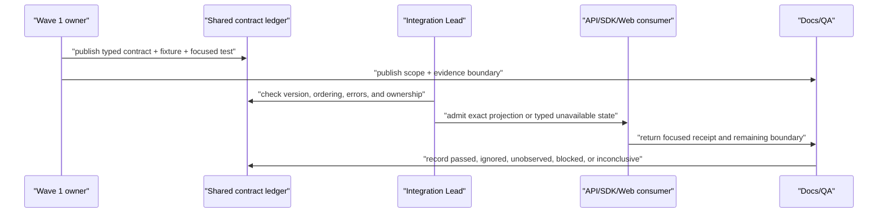

# Wave 1 Workspace User Flows / Wave 1 Workspace 用户流程

## Scope / 范围

These flows describe how a user or contributor moves through the current read-oriented workspace and how a Wave 1 contract becomes eligible for integration. They do not describe a public write, provider execution, deployment, or production workflow.

这些流程描述用户或贡献者如何经过当前以读取为中心的 workspace，以及 Wave 1 contract 如何获得集成准入。它们不描述 public write、provider execution、deployment 或 production workflow。

## Workspace Inspection Flow / Workspace 检查流程

1. **Select workspace / 选择 workspace:** The user starts with a workspace-scoped discovery surface. Workspace, project, Context, and commit identifiers remain explicit.
2. **Inspect Context / 检查 Context:** The user selects a Context and can inspect its graph, components, commit history, and admitted evaluation summaries through the current public or private-local read boundary.
3. **Select exact history scope / 选择精确历史作用域:** Benchmark evidence reads use exact project/Context/commit/decision identifiers. Wave 1 history is redacted, ordered, and cursor-paginated.
4. **Review through shared presentation / 通过共享呈现审阅:** Data enters a data boundary, then a presenter, then shared design-system primitives. The screen does not compute policy, diff, authorization, or storage behavior.
5. **Handle unavailable state / 处理 unavailable 状态:** Missing runtime, scope, or dependency is shown as a typed unavailable/error/empty state. A preview fixture is labeled as preview and is not presented as live data.

1. **选择 workspace：** 用户从 workspace 范围的 discovery surface 开始。Workspace、project、Context 与 commit identifier 保持显式。
2. **检查 Context：** 用户选择 Context，并通过当前 public 或 private-local read boundary 检查 graph、component、commit history 与已准入的 evaluation summary。
3. **选择精确历史作用域：** Benchmark evidence read 使用精确的 project/Context/commit/decision identifier。Wave 1 history 是脱敏、有序、cursor 分页的。
4. **通过共享呈现审阅：** 数据进入 data boundary，再进入 presenter，最后由共享 design-system primitive 渲染。screen 不计算 policy、diff、authorization 或 storage behavior。
5. **处理 unavailable 状态：** runtime、scope 或 dependency 缺失时显示类型化 unavailable/error/empty state。Preview fixture 必须标注 preview，不能被呈现为 live data。

## Private Workflow Binding Inspection Flow / 私有 Workflow Binding 检查流程

This is the implemented private, read-only flow for the exact Context-to-Workflow provenance boundary. The local source/test receipts verify the adapter boundary; authenticated service runtime, browser/visual E2E, and production readiness remain separate evidence questions.

这是精确 Context 到 Workflow provenance boundary 的私有只读实现流程。本地源码/test 回执验证了 adapter 边界；authenticated service runtime、browser/visual E2E 与 production readiness 仍是独立的证据问题。

1. **Select Context and commit / 选择 Context 与 commit：** The user selects one Context and one exact materialized `commit_id`; the client keeps both identifiers visible in the request scope.
2. **Request the protected read / 请求受保护读取：** The local client requests `GET /api/v1/local/contexts/{context_id}/commits/{commit_id}/workflow-bindings` with the caller's request-scoped credentials. It does not substitute current head, preview data, or a Workflow-only lookup.
3. **Authorize before repository access / 在 repository access 前授权：** The protected route authenticates, checks `ContextPermission::Read` for the path Context, and only then reads the binding repository with the unchanged Context/commit scope.
4. **Parse the redacted summary / 解析脱敏 summary：** The local SDK accepts only `contextlab.local-workflow-context-bindings.v1` and the exact response scope. Unknown schema, mismatched scope, raw fields, or invalid counts become a fail-closed error.
5. **Present through shared layers / 通过共享层呈现：** The Web path remains `data -> presenter -> screen`. The presenter formats stable IDs, revision, node count, and edge count; it does not infer Workflow state, authorization, graph diff, or execution readiness.
6. **Keep all five states explicit / 保持五种状态明确：** `loading` means the exact read is pending; `error` means transport/auth/schema validation failed; `empty` means a valid exact-scope response has no bindings; `available` means only the redacted ordered summaries are present; `unavailable` means the optional repository or required local capability is absent.

1. **选择 Context 与 commit：** 用户选择一个 Context 与一个精确的 materialized `commit_id`；client 在 request scope 中保持两个 identifier 可见。
2. **请求受保护读取：** local client 使用调用方 request-scoped credential 请求 `GET /api/v1/local/contexts/{context_id}/commits/{commit_id}/workflow-bindings`。它不替换为 current head、preview data，也不进行只按 Workflow 的查询。
3. **在 repository access 前授权：** protected route 先完成 authentication，再针对 path Context 检查 `ContextPermission::Read`，之后才使用未改变的 Context/commit scope 读取 binding repository。
4. **解析脱敏 summary：** local SDK 只接受 `contextlab.local-workflow-context-bindings.v1` 与精确 response scope。未知 schema、scope 不匹配、raw field 或无效 count 都会变成 fail-closed error。
5. **通过共享层呈现：** Web path 保持 `data -> presenter -> screen`。presenter 只格式化稳定 ID、revision、node count 与 edge count；不推断 Workflow state、authorization、graph diff 或 execution readiness。
6. **保持五种状态明确：** `loading` 表示精确 read 正在等待；`error` 表示 transport/auth/schema validation 失败；`empty` 表示精确 scope 的合法 response 没有 binding；`available` 只表示存在脱敏且有序的 summary；`unavailable` 表示 optional repository 或所需 local capability 不存在。

### Explicit Non-Flows / 明确不包含的流程

- No write, rebind, branch/merge, workflow execution, provider call, raw payload display, or public REST/OpenAPI/public SDK exposure.
- 不包含 write、rebind、branch/merge、Workflow execution、provider call、raw payload display 或 public REST/OpenAPI/public SDK exposure。
- No inference that a readable binding proves a runnable provider workflow, a production deployment, or a release.
- 不能从可读取 binding 推导 provider workflow 可运行、production deployment 或 release。

## Contract Handoff Flow / 契约交接流程

The integration handoff is complete only when the consumer can name its exact DTO/projection, scope, ordering, error mapping, and evidence boundary. A source file or preview screen by itself is not a handoff.

只有当 consumer 能够明确 DTO/projection、scope、ordering、error mapping 与 evidence boundary 时，集成交接才算完成。单独的源文件或 preview screen 不构成交接。

## Failure and Boundary Flow / 失败与边界流程

| Situation / 情况 | User/contributor result / 用户或贡献者结果 | Evidence state / 证据状态 |
| --- | --- | --- |
| Contract test passes locally | Continue to the named integration pair only. | `passed` for the named command and scope. |
| PostgreSQL prerequisite is absent | Keep the adapter test excluded; preserve compile-only or static evidence where recorded. | `ignored` and runtime `unobserved`. |
| Docker or authenticated browser runtime is absent | Keep the local contract boundary; do not infer runtime behavior. | `unobserved`. |
| Clippy baseline or Git binding prevents a claim | Record the concrete failure or unavailable metadata and continue independent docs/domain work. | `blocked`. |
| External receipt is incomplete or cannot bind to a snapshot | Do not promote the claim or overwrite the receipt. | `inconclusive`. |

## Explicit Non-Flows / 明确不包含的流程

- No public protected-write promotion.
- 不包含 public protected-write promotion。
- No benchmark/provider execution claim from a read-only evidence panel.
- 不从只读 evidence panel 推导 benchmark/provider execution claim。
- No Docker-backed PostgreSQL, authenticated browser, remote CI, operator-approved rehearsal, release, or production receipt is created by this documentation task.
- 本文档任务不会创建 Docker-backed PostgreSQL、authenticated browser、remote CI、operator-approved rehearsal、release 或 production 回执。
- No credential is stored, refreshed, logged, or copied into a fixture or document.
- 不会在 fixture 或文档中存储、刷新、记录或复制 credential。
